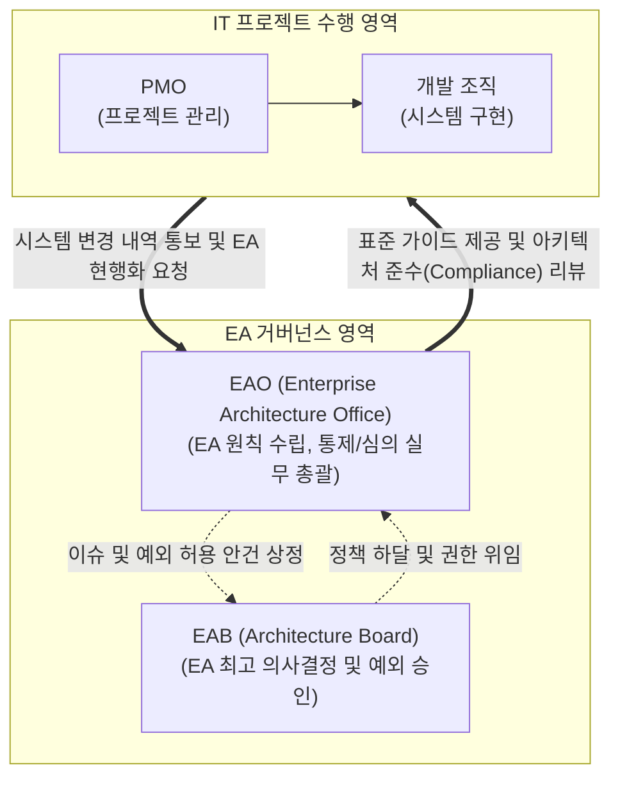

# EAO (Enterprise Architecture Office)

---

## I. 성공적인 EA 정착과 거버넌스 실현을 위한 전담 조직, EAO의 개요

* **정의**: 기업의 전사 아키텍처(EA) 체계를 기획 및 수립하고, IT 프로젝트의 아키텍처 원칙 준수 여부를 통제하며, 자산의 지속적인 유지보수를 실무적으로 총괄하는 상설 전담 조직
* **필요성 및 특징**:
* **지속 가능성(Sustainability) 확보**: 일회성 EA 구축 프로젝트로 방치되는 현상을 근절하고, As-Is와 To-Be 아키텍처의 지속적인 현행화 필요
* **중복 투자 방지 및 IT 최적화**: 부서별 사일로(Silo) 형태의 시스템 도입을 통제하여 전사 차원의 상호 운용성을 확보하고 비용 절감 달성
* **IT-비즈니스 얼라인먼트**: 비즈니스 목표의 변경을 신속하게 IT 아키텍처에 반영하고 변화 관리를 리딩할 강력한 거버넌스 주체 요구

---

## II. EAO의 개념도 및 핵심 기술 요소

### 가. EA 거버넌스 내 EAO의 역할 및 동작 개념도

* EAO는 최고 의사결정 기구인 EAB(Enterprise Architecture Board)의 실무를 지원하며, 신규 IT 프로젝트를 대상으로 아키텍처 가이드라인을 제공하고 엄격하게 통제함

### 나. EAO의 핵심 역할 및 구성 요소

| 구분 | 요소(역할) | 세부 설명 |
| --- | --- | --- |
| **전략/기획** | 비즈니스-IT 연계 (Alignment) | 기업의 전략적 목표 달성을 위한 아키텍처 이행계획(Transition Plan) 기획 및 로드맵 수립 |
| **정책/표준** | EA [[프레임워크]] [[테일러링]] | 조직 환경에 맞게 자크만(Zachman), TOGAF 등을 재단하고 핵심 아키텍처 원칙(Principle) 정의 |
| **정책/표준** | 참조모델(RM) 고도화 | PRM, BRM, SRM, [[DRM(Digital Right Management)|DRM]], TRM 등 전사 공통으로 재사용되는 참조모델의 주기적 갱신 및 관리 |
| **통제/심의** | 아키텍처 준수성 리뷰 (Compliance) | 신규 프로젝트의 설계가 EA 원칙 및 표준 플랫폼에 부합하는지 리뷰하고 시정 조치 요구 |
| **통제/심의** | 예외 사항 (Exception) 관리 | 신기술 도입 등 불가피한 비표준 기술 사용 시 타당성을 1차 검토하여 EAB 심의 안건으로 상정 |
| **자산 관리** | EAMS 현행화 | IT 시스템의 신규 구축 및 변경 완료 시 메타데이터와 산출물을 시스템(EAMS)에 즉각 최신화 |
| **자산 관리** | IT 포트폴리오 최적화 | 전사 애플리케이션 및 기술 스택을 모니터링하여 중복 투자되거나 노후된 레거시 시스템 통폐합 권고 |
| **변화 관리** | 전사 EA 내재화 및 교육 | IT 인력 및 현업 부서를 대상으로 아키텍처 인식 제고, 표준 가이드 배포 및 변화 관리 리딩 |

---

## III. EAO와 PMO 비교 및 최근 동향

### 가. 전사 IT 관리 전담 조직 비교 (EAO vs PMO)

| 비교 항목 | EAO (Enterprise Architecture Office) | [[PMO]] (Project Management Office) |
| --- | --- | --- |
| **관리 대상** | 전사 아키텍처 자산 (비즈니스, 데이터, 앱, 기술 등) | 개별/복수 프로젝트의 3대 제약 (일정, 비용, 품질) |
| **조직 성격** | 상설 조직 (전사 최적화 관점의 장기적, 영속적 운영) | 한시적 또는 상설 조직 (개별 프로젝트의 성공적 완수 중심) |
| **핵심 목표** | 비즈니스-IT 정렬, 시스템 복잡도 통제, 중복 투자 방지 | 할당된 자원 내 프로젝트의 적기 완료 및 목표 품질 달성 |
| **주요 활동** | 아키텍처 원칙 수립, 프로젝트 아키텍처 통제 및 리뷰 | 자원 할당, 진척 및 범위 관리, 이슈 및 리스크 대응 |
| **평가 지표** | IT 투자 대비 ROI 증대, 표준 아키텍처 준수율, 재사용률 | 납기 준수율, 예산 준수율, 산출물 결함률 |

### 나. EAO의 성공적 운영 방안 및 최신 동향

* **경영진의 강력한 스폰서십 확보**: EAO가 개별 프로젝트 조직(PMO)에 휘둘리지 않고 독립적인 통제권(Compliance)을 행사할 수 있도록 [[CIO]] 및 경영진의 제도적 뒷받침이 필수적임
* **[[Agile]] EA로의 진화**: 기존의 무겁고 정적인 통제 위주의 EA 조직에서 벗어나, [[클라우드 네이티브]] 및 [[MSA (Micro Service Architecture)|MSA]] 환경에 신속하게 대응하기 위해 마이크로 아키텍처 원칙을 자율적으로 적용하게 지원하는 **Agile EAO** 형태로 트렌드가 변화하고 있음

---

### 🔗 연관 토픽

- **소속 도메인**: [[00_경영전략_MOC|📈 경영전략]]
- **세부 분류**: `2. IT 거버넌스 & 엔터프라이즈 아키텍처 (EA/ISP)`
- **핵심 연관 토픽**:
  - [[프레임워크]]
  - [[클라우드 네이티브]]
  - [[MSA (Micro Service Architecture)]]
  - [[ITSM(Information Technology Service Management)]]
  - [[ISP 및 ISMP 수립 공통가이드 9판(2025.05)]]
