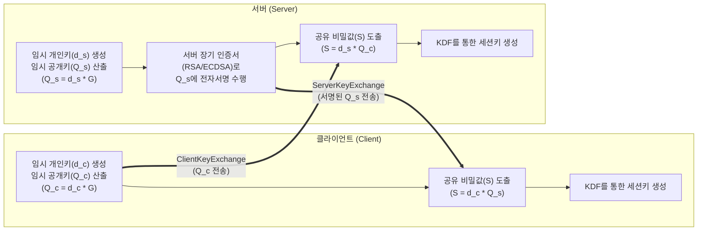

# ECDHE(Elliptic Curve Diffie-Hellman Ephemeral)

---

## I. 완벽한 전방향 정합성(PFS)을 보장하는 키 교환 프로토콜, ECDHE의 개요

* **정의**: 타원곡선 [[암호화]]([[ECC]])와 디피-헬만(DH) 알고리즘을 결합하되, 매 세션마다 임시(Ephemeral) 키 쌍을 생성하여 안전하게 대칭키(세션키)를 교환하는 암호화 통신 [[프로토콜]]
* **필요성 및 특징**:
* **전방향 정합성(PFS, Perfect Forward Secrecy) 보장**: 서버의 장기 개인키가 유출되더라도 과거에 암호화된 통신 데이터가 해독되는 보안 위협 원천 차단
* **경량화 및 고성능**: 기존 [[RSA (Rivest Shamir Adleman)|RSA]]나 일반 DHE 방식 대비 짧은 키 길이(예: 256bit)로도 동일한 보안성을 제공하여 모바일 및 IoT 환경에 최적화
* **표준 프로토콜 채택**: 보안성이 취약한 정적(Static) 키 교환 방식이 폐지된 최신 **TLS 1.3** 인터넷 통신 규격의 핵심 키 교환 표준으로 정착

---

## II. ECDHE의 개념도 및 핵심 기술 요소

### 가. ECDHE의 개념도 및 동작 원리

* 클라이언트와 서버는 해당 세션에서만 유효한 임시 키($d_c, d_s$)를 생성하고 교환하며, 서버는 중간자 공격(MITM) 방지를 위해 인증서의 장기 개인키로 임시 공개키($Q_s$)를 서명함
* 교환된 공개키와 자신의 개인키를 곱하여 동일한 공유 비밀값($S$)을 도출 후 암호화 통신 수행

### 나. ECDHE의 핵심 기술 및 구성 요소

| 구분 | 요소기술(키워드) | 세부 설명 |
| --- | --- | --- |
| **핵심 속성** | PFS (전방향 정합성) | 마스터 키(장기 인증서 키)가 손상되더라도 이전 세션의 암호문은 해독할 수 없는 보안 특성 |
| **키 관리** | Ephemeral Key (임시 키) | 각 통신 세션마다 새롭게 생성되고 통신 종료 시 즉각 메모리에서 폐기되는 일회성 키 쌍 |
| **기반 [[알고리즘]]** | 타원곡선 (ECC) / ECDLP | 타원곡선 이산대수 난제를 활용하여 효율적인 자원 소모로 강력한 키 교환 수학적 기반 제공 |
| **표준 곡선** | X25519 / secp256r1 | ECDHE에서 주로 사용되는 안전하고 성능이 검증된 표준 타원곡선 파라미터 |
| **인증 결합** | RSA / ECDSA 전자서명 | DH 알고리즘 자체는 신분 인증 기능이 없으므로, 장기 인증서를 활용한 전자서명 결합 필수 |
| **보안 위협 방어** | MITM (중간자 공격) 방어 | 서버의 전자서명 절차를 통해 네트워크 중간에서 공개키를 가로채어 변조하는 공격 차단 |
| **키 파생** | KDF (Key Derivation Func.) | 생성된 공유 비밀값(S)과 난수 등을 조합하여 실제 [[대칭키 암호화]]([[AES]] 등)에 쓸 세션키 추출 |

---

## III. ECDHE와 기존 키 교환 방식 비교 및 최신 동향

### 가. 주요 키 교환 알고리즘 비교 (ECDHE vs ECDH vs RSA)

| 비교 항목 | ECDHE (Ephemeral) | ECDH (Static) | RSA (정적 키 교환) |
| --- | --- | --- | --- |
| **키 생성 방식** | 매 세션마다 임시 키 생성 | 인증서에 고정된 정적 키 사용 | 인증서의 RSA 공개키/개인키 사용 |
| **전방향 정합성(PFS)** | **완벽히 보장함** | 보장하지 않음 | 보장하지 않음 |
| **개인키 유출 시 피해** | 해당 임시 세션만 위험 (과거 안전) | 과거 및 미래의 모든 [[세션]] 해독됨 | 과거 및 미래의 모든 세션 해독됨 |
| **인증 및 키교환 분리** | 분리됨 (키교환: ECDHE, 인증: 서명) | 결합됨 (인증서 키로 직접 교환) | 결합됨 (클라이언트가 프리마스터키 암호화) |
| **TLS 1.3 지원 여부** | **표준 채택 (권장)** | 보안 취약으로 폐기(Deprecated) | 보안 취약으로 폐기(Deprecated) |

### 나. ECDHE의 향후 전망 및 차세대 동향

* **TLS 1.3 기반 웹 표준 정착**: 정적 RSA 및 정적 DH 방식이 폐기됨에 따라 현재 인터넷 뱅킹, 전자상거래(e-Commerce) 등 민감 정보를 다루는 모든 HTTPS 프로토콜의 표준 키 교환 방식으로 확고히 자리매김함
* **[[양자내성암호]](PQC) 하이브리드 키 교환으로의 진화**: 쇼어 알고리즘(Shor's Algorithm) 등 양자 컴퓨팅에 의한 ECDLP 해독 위협에 대응하기 위해, 구글/클라우드플레어 등은 기존 **ECDHE(X25519)와 양자내성암호(ML-KEM/Kyber)를 융합한 하이브리드 키 교환(X25519Kyber768) 아키텍처**를 최신 웹 브라우저에 선제적으로 적용 중임

---

### 🔗 연관 토픽

- **소속 도메인**: [[00_보안_MOC|🛡️ 보안]]
- **세부 분류**: `2. 현대 암호학 & 키 관리 · 전자서명`
- **핵심 연관 토픽**:
  - [[암호화|암호화 (Encryption)]]
  - [[RSA (Rivest Shamir Adleman)]]
  - [[ECC|ECC(Elliptic Curve Cryptography)]]
  - [[양자내성암호]]
  - [[AES]]
