# EDI(Electronic Data Interchange)

---

## I. 종이 없는 비즈니스 환경 구현을 위한 B2B 통합의 근간, EDI의 개요

* **정의**: 비즈니스 파트너(기업) 간에 상호 합의된 문서 표준과 통신 규약을 바탕으로 구매 주문서, 송장 등의 상거래 서식을 컴퓨터 간에 전자적으로 교환하는 정보 전달 시스템
* **필요성 및 등장배경**:
* **수동 처리의 한계 극복**: 종이 문서의 우편/팩스 발송, 수기 데이터 재입력 등에 따른 지연 및 휴먼 에러(오입력 등) 방지
* **운영 비용 절감**: [[프로세스]] 자동화를 통해 문서 관리비, 인건비 등을 대폭 삭감하고 Paperless 업무 환경 실현
* **비즈니스 사이클 단축**: 실시간에 가까운 데이터 교환을 통해 조달-생산-판매-결제로 이어지는 공급망 주기(Lead Time) 고속화

---

## II. EDI의 개념도 및 핵심 구성 요소

### 가. EDI의 프로세스 개념도 및 동작 원리

```mermaid
flowchart LR
    subgraph 발신기업["발신 기업 (Company A)"]
        direction TB
        ERP_A["내부 비즈니스 시스템<br/>(ERP / SCM)"]
        Extract_A["데이터 추출"]
        Trans_A["EDI 변환기 (Translator)<br/>(내부 포맷 → 표준 포맷 변환)"]
        
        ERP_A --> Extract_A
        Extract_A --> Trans_A
    end

    subgraph 통신망["네트워크 통신 구간"]
        direction TB
        Network["통신망 매개체<br/>(VAN, AS2, SFTP 등)"]
    end

    subgraph 수신기업["수신 기업 (Company B)"]
        direction TB
        Trans_B["EDI 변환기 (Translator)<br/>(표준 포맷 → 내부 포맷 변환)"]
        Integrate_B["데이터 파싱 및 적재"]
        ERP_B["내부 비즈니스 시스템<br/>(ERP / SCM)"]
        
        Trans_B --> Integrate_B
        Integrate_B --> ERP_B
    end

    Trans_A == "표준화된 EDI 문서<br/>(PO, Invoice 등) 발송" ==> Network
    Network == "라우팅 및 도착 확인<br/>(MDN 반환)" ==> Trans_B

```

* 발신 기업의 내부 데이터를 EDI 변환기가 국제/산업 표준 문서 포맷으로 번역하여 보안 네트워크를 통해 전송함
* 수신 기업은 전달받은 표준 문서를 자체 시스템이 읽을 수 있는 포맷으로 재번역하여 내부 애플리케이션(ERP 등)에 자동 통합함

### 나. EDI의 핵심 기술 및 구성 요소

| 구분 | 요소기술(키워드) | 세부 설명 |
| --- | --- | --- |
| **문서 표준** | UN/EDIFACT | UN 주도로 개발된 범용 글로벌 EDI 표준으로 행정, 상업, 국제 무역 분야에서 널리 활용 |
| **문서 표준** | ANSI ASC X12 | 미국 국립표준협회에서 제정한 전자문서 표준으로 북미 지역 비즈니스 환경의 사실상 표준 |
| **문서 표준** | ebXML | EDI의 한계를 극복하기 위해 인터넷 환경에서 [[XML]]을 기반으로 제정된 개방형 e-비즈니스 표준 |
| **변환 엔진** | Translator (변환기) | 송수신 측의 고유한 내부 파일 형태(DB, CSV 등)를 합의된 EDI 표준 포맷으로 상호 변환 |
| **변환 엔진** | Data Mapper (매퍼) | 이기종 시스템 간 서로 다른 데이터 필드, 길이, 날짜 형식 등을 일치시키는 규칙 정의 및 매핑 로직 |
| **통신 인프라** | [[VAN]] (부가 가치 통신망) | EDI 전송을 위해 독립된 메일박스 기능과 문서 라우팅을 제공하는 제3자 전용 통신망 |
| **통신 인프라** | AS2 / AS4 [[프로토콜]] | 기존 VAN의 높은 비용을 대체하기 위해 인터넷(HTTP/S) 구간에서 문서를 안전하게 교환하는 프로토콜 |
| **보안 기술** | [[암호화]] 및 전자서명 | 전송 데이터의 기밀성을 보장하고, 부인 방지(Non-repudiation) 및 [[무결성]] 검증 수행 |

---

## III. 전통적 EDI와 개방형 웹 표준(ebXML) 비교 및 최신 동향

### 가. 전통적 EDI 방식과 ebXML(차세대 EDI) 비교

| 비교 항목 | 전통적 EDI (Legacy EDI) | ebXML (Electronic Business XML) |
| --- | --- | --- |
| **통신 인프라** | 주로 VAN (부가 가치 통신망) 폐쇄망 의존 | 개방형 인터넷 ([[TCP]]/IP, HTTP, SMTP 등) |
| **문서 데이터 형식** | EDIFACT, X12 (컴퓨터 친화적 가변장 포맷) | XML 기반 (인간과 컴퓨터 모두 가독성 높음) |
| **시스템 도입 비용** | 초기 구축비 및 전용망 [[유지보수]] 비용 높음 | 오픈 표준 및 인터넷망 활용으로 상대적 저비용 |
| **비즈니스 참여도** | 대기업 및 고정된 1차 벤더(공급망) 위주 | 중소기업을 포함한 다대다 개방형 비즈니스 협업 가능 |

### 나. B2B 통합 아키텍처의 패러다임 변화 및 향후 전망

* **API 및 iPaaS 중심의 하이브리드 통합**: 전통적인 EDI의 안정성은 유지하되, 실시간 데이터 동기화와 클라우드 애플리케이션(SaaS) 연동을 위해 RESTful API와 EDI가 결합된 통합 플랫폼(iPaaS) 형태로 진화 중임
* **[[인공지능]] 및 공급망 가시성 결합**: 단순한 문서 전달을 넘어, 수집된 EDI [[트랜잭션]] 데이터를 AI로 분석하여 재고 부족 예방, 배송 지연 예측 등 지능형 공급망 관리([[SCM (Supply Chain Management)|SCM]]) 시스템의 핵심 데이터 파이프라인으로 활용 범위를 넓히고 있음

---

### 🔗 연관 토픽

- **소속 도메인**: [[00_경영전략_MOC|📈 경영전략]]
- **세부 분류**: `3. 비즈니스 프로세스 혁신 & 디지털 전환 (DX)`
- **핵심 연관 토픽**:
  - [[VAN]]
  - [[XML]]
  - [[무결성]]
  - [[CALS]]
  - [[트랜잭션]]
