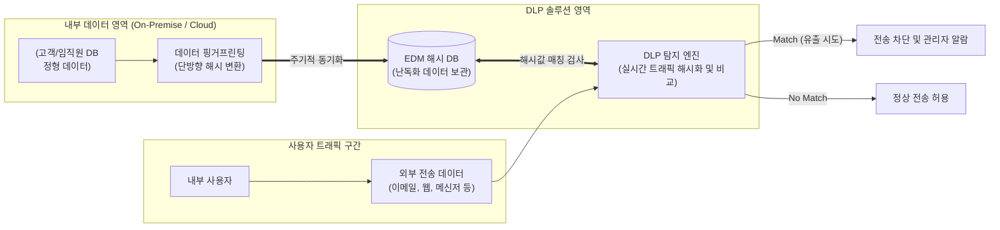

# EDM (Exact Data Match)

---

## I. 오탐률(False Positive) 최소화를 위한 정밀 데이터 유출 방지 기술, EDM의 개요

* **정의**: 사전에 지정된 정형 데이터(고객 정보, 임직원 DB 등)를 해시(Hash) 형태로 핑거프린팅하여, 외부로 유출되는 데이터와 정확히 일치하는 경우에만 차단하는 차세대 데이터 유출 방지([[DLP]]) 기술
* **필요성 및 등장배경**:
* **기존 패턴 매칭의 한계**: 정규표현식(Regex) 기반의 기존 DLP는 형태만 유사해도 탐지하여 보안 부서의 경고 피로도(Alert Fatigue) 유발 및 업무 효율성 저하
* **보안성 및 프라이버시 보호**: 원본 데이터를 평문으로 저장하지 않고 단방향 해시로 변환하여 보관하므로, DLP 시스템 자체가 타겟이 되는 2차 정보 유출 방지
* **강화된 규제 준수**: [[개인정보보호법]], GDPR, HIPAA 등 컴플라이언스 요건 충족을 위해 기업이 보유한 '실제' 민감 데이터에 대한 강력하고 입증 가능한 통제 필요

---

## II. EDM의 개념도 및 핵심 기술 요소

### 가. EDM의 아키텍처 및 동작 원리

* 내부 데이터베이스의 민감 정보를 해시 알고리즘으로 난독화하여 DLP 시스템에 핑거프린트로 등록함
* 아웃바운드 네트워크 트래픽을 실시간으로 분석하여 동일한 해시값이 검출될 경우, 이를 실제 사내 데이터의 유출 시도로 간주하고 즉각 차단함

### 나. EDM의 핵심 기술 및 구성 요소

| 구분 | 요소기술(키워드) | 세부 설명 |
| --- | --- | --- |
| **데이터 추출** | 정형 데이터 연동 | RDBMS, CSV, AD(Active Directory) 등에서 보호 대상이 되는 고유 식별 데이터(주민번호, 카드번호 등) 추출 |
| **데이터 보호** | Fingerprinting ([[핑거프린팅]]) | 원본 데이터를 유추할 수 없도록 특정 알고리즘을 통해 고유한 서명(Hash)값으로 변환하는 과정 |
| **데이터 보호** | Hashing (단방향 [[암호화]]) | SHA-256 등 단방향 해시 함수를 사용하여 DLP 시스템 내부에 평문 데이터가 저장되는 것을 방지 |
| **탐지 기술** | Real-time Inspection | 웹, 이메일, 클라우드 저장소로 향하는 트래픽을 실시간으로 캡처하여 검사 대상 데이터를 추출 |
| **탐지 기술** | 고속 매칭 [[알고리즘]] | 수백만~수십억 건의 해시 레코드와 트래픽의 해시값을 딜레이 없이 비교하여 네트워크 병목 최소화 |
| **보안 통제** | Policy Enforcement | 일치(Match)가 확인될 경우 사전 정의된 보안 정책에 따라 격리(Quarantine), 차단(Block) 또는 경고 수행 |
| **운영 최적화** | 주기적 동기화 (Sync) | 원본 DB의 데이터 추가/수정/삭제 시 이를 주기적으로 해시 변환하여 EDM DB를 최신 상태로 유지 |
| **운영 최적화** | 다중 조건 결합 | "이름 + 계좌번호" 등 복합적인 필드 조건이 동시에 만족될 때만 알람을 발생시켜 정확도 극대화 |

---

## III. EDM과 패턴 매칭 DLP 비교 및 활용 전략

### 가. 전통적 패턴 매칭(Regex)과 EDM 기반 DLP 비교

| 비교 항목 | 전통적 패턴 매칭 (Pattern/Regex) | EDM (Exact Data Match) |
| --- | --- | --- |
| **탐지 기준** | 데이터의 '형식' (16자리 숫자 등) | 회사가 실제 보유한 데이터의 '값' |
| **오탐률 (False Positive)** | 높음 (업무상 송금, 택배 송장 번호 등도 신용카드로 오인) | **매우 낮음** (실제 보유 데이터와 일치할 때만 탐지) |
| **초기 구축 및 관리** | 정규식 룰 작성 및 튜닝에 긴 시간 소요 | 내부 DB 연동 및 핑거프린팅 파이프라인 구축 필요 |
| **유출 데이터 인지** | 어떤 고객/직원의 정보인지 즉각적 파악 불가 | 일치된 레코드를 기반으로 **정확한 유출 출처 파악 가능** |
| **주요 적용 대상** | 불특정 다수의 잠재적 민감 데이터 (범용적 발견) | 고객 명부, 인사 데이터 등 명확히 정의된 핵심 자산 (고강도 통제) |

### 나. EDM의 한계점 및 하이브리드 DLP 구축 전략

* **미등록 데이터 탐지 불가**: EDM은 사전에 해시화되어 등록된 데이터만 탐지할 수 있으므로, 신규 생성 후 아직 동기화되지 않은 문서나 비정형 데이터에 대해서는 탐지 사각지대가 발생함
* **다계층(Layered) DLP 아키텍처 적용**: EDM 단일 기술에 의존하기보다는, 넓은 범위의 데이터 디스커버리를 수행하는 **패턴 매칭 기술과 EDM을 하이브리드로 결합**하여 탐지 커버리지(Coverage)와 정확성(Confidence)을 동시에 확보하는 전략이 권장됨

---

### 🔗 연관 토픽

- **소속 도메인**: [[00_데이터베이스_MOC|🗄️ 데이터베이스]]
- **세부 분류**: `6. SQL 표준 문법 & 쿼리 성능 튜닝`
- **핵심 연관 토픽**:
  - [[DLP]]
  - [[개인정보보호법]]
  - [[핑거프린팅|핑거프린팅(Fingerprinting)]]
  - [[암호화|암호화 (Encryption)]]
  - [[알고리즘]]
