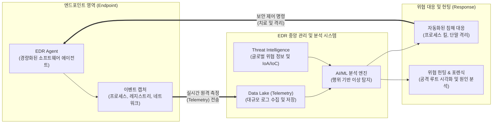

# EDR (Endpoint Detection and Response)

---

## I. 엔드포인트 보안의 최후 방어선, EDR의 개요

* **정의**: 엔드포인트(PC, 서버 등)에서 발생하는 악의적 행위를 실시간으로 탐지(Detection)하고, 이를 분석하여 신속하게 대응(Response)하는 사후 조치 중심의 차세대 엔드포인트 보안 솔루션
* **필요성 및 등장배경**:
* **기존 백신의 한계 극복**: 시그니처 기반의 안티바이러스(EPP)를 우회하는 파일리스(Fileless), 제로데이(Zero-day), APT 공격 증가에 따른 행위 기반 방어 체계 필요
* **엔드포인트 가시성 확보**: 침해 사고 발생 시 원인 규명을 위한 상세 로그 수집 및 공격 흐름 파악(Telemetry) 요구 증대
* **MTTD / MTTR 단축**: 보안 위협의 평균 탐지 시간(MTTD)과 평균 대응 시간(MTTR)을 최소화하여 공격의 측면 이동(Lateral Movement) 및 피해 확산 조기 차단

---

## II. EDR의 아키텍처 및 핵심 구성 요소

### 가. EDR의 아키텍처 및 동작 원리

* 엔드포인트에 설치된 에이전트가 단말의 모든 시스템 활동 이벤트를 수집하여 중앙 서버로 전송함
* 분석 엔진은 위협 인텔리전스(TI)와 행위 기반 분석을 통해 위협을 식별하고, 자동화된 단말 격리 및 보안 담당자의 포렌식 분석을 지원함

### 나. EDR의 핵심 기술 및 구성 요소

| 구분 | 요소기술(키워드) | 세부 설명 |
| --- | --- | --- |
| **데이터 수집** | Lightweight Agent | 시스템 성능 부하를 최소화하면서 [[커널]] 및 유저 레벨의 상세 이벤트를 캡처하는 단말 에이전트 |
| **데이터 수집** | Telemetry (원격 측정) | 엔드포인트에서 발생한 파일 생성, [[프로세스]] 실행, 네트워크 연결 등의 방대한 데이터를 실시간 스트리밍 |
| **위협 탐지** | Behavioral Analysis | 기존 시그니처 대신 시스템과 사용자의 '행위 패턴'을 분석하여 알려지지 않은 비정상적 악성 행위 식별 |
| **위협 탐지** | IoA (Indicator of Attack) | 단순한 침해 지표(IoC)를 넘어, 공격자의 전술과 목적을 파악할 수 있는 실시간 공격 지표 기반 탐지 |
| **위협 탐지** | [[MITRE ATT&CK (Adversarial Tactics, Techniques & Common Knowledge)|MITRE ATT&CK]] 맵핑 | 글로벌 사이버 공격 전술/기법 프레임워크와 연동하여 공격의 현재 단계 및 위험도를 직관적으로 시각화 |
| **사고 대응** | Endpoint Isolation | 감염된 단말이 사내 네트워크를 통해 웜이나 랜섬웨어를 전파하지 못하도록 즉각적으로 논리적 망 분리 수행 |
| **사고 대응** | Automated Response | 사전 정의된 플레이북(Playbook)에 따라 악성 프로세스 종료, 파일 삭제 등을 자동화하여 신속하게 조치 |
| **위협 분석** | Threat Hunting | 침해 경고가 울리기 전이라도, 능동적으로 시스템 내부에 잠복한 보안 위협을 탐색하고 식별하는 지원 도구 |

---

## III. EDR과 EPP 비교 및 향후 보안 트렌드

### 가. 엔드포인트 보안 솔루션 비교 (EDR vs EPP)

| 비교 항목 | EPP (Endpoint Protection Platform) | EDR (Endpoint Detection and Response) |
| --- | --- | --- |
| **핵심 목적** | 위협의 '사전 예방 및 실행 차단' (Prevention) | 위협의 '사후 탐지, 원인 분석 및 대응' (Detection/Response) |
| **보안 가정** | 안티바이러스 룰에 따라 위협을 100% 막을 수 있음 | 어떠한 방어벽이든 뚫릴 수 있음 (Assume Breach) |
| **주요 기술** | 시그니처 기반(AV), [[샌드박스]], [[방화벽]] 통제 | 머신러닝, 행위 기반 분석, 포렌식, 텔레메트리 |
| **방어 대상** | [[랜섬웨어]], 트로이목마 등 기 알려진 악성코드 중심 | APT(지능형 지속 위협), 제로데이, 파일리스 공격 중심 |
| **가시성 제공** | 차단된 파일명 등 단편적 로그 제공에 그침 | 파일/네트워크/프로세스 트리 등 공격의 전체 흐름(Context) 가시화 |

### 나. 엔드포인트 보안의 향후 전망 및 동향

* **[[XDR]](Extended Detection and Response)로의 진화**: 단일 엔드포인트 범위를 넘어 클라우드, 네트워크, 이메일, 애플리케이션 등 IT 인프라 전 영역에서 발생하는 텔레메트리 데이터를 통합 분석하여 탐지 커버리지의 한계를 극복하는 XDR로 패러다임이 전환 중임
* **MDR(Managed Detection and Response) 서비스 부상**: EDR 운영에 필수적인 '[[위협 헌팅]]' 및 '로그 분석'을 수행할 내부 보안 인력과 전문성이 부족한 기업들을 위해, 보안 관제 센터(SOC) 전문가가 EDR 운영과 사고 대응을 대행하는 아웃소싱 모델(MDR)이 시장의 주류로 성장하고 있음

---

### 🔗 연관 토픽

- **소속 도메인**: [[00_보안_MOC|🛡️ 보안]]
- **세부 분류**: `3. 네트워크 & 엔드포인트 · 인프라 보안`
- **핵심 연관 토픽**:
  - [[샌드박스|샌드박스 (Sandbox)]]
  - [[위협 헌팅|위협 헌팅(Threat Hunting)]]
  - [[랜섬웨어]]
  - [[XDR|XDR(eXtended Detection Response)]]
  - [[SIEM]]
