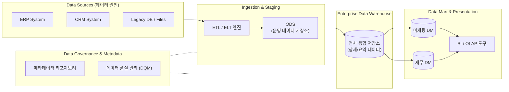

# EDW(Enterprise Data Warehouse)

---

## I. 전사적 단일 진실 공급원(SSOT) 확보를 위한 통합 저장소, EDW의 개요

* **정의**: 전사 조직 내 분산된 이기종 시스템의 데이터를 추출(Extract), 변환(Transform), 적재(Load)하여 의사결정 지원 및 분석에 활용할 수 있도록 중앙 집중화한 전사적 데이터 저장소
* **필요성 및 4대 특징**:
* **필요성**: 부서별 데이터 사일로(Silo) 현상 제거, 전사적 [[데이터 거버넌스]] 확립, 일관된 BI 및 분석 환경(Single Source of Truth) 제공
* **4대 특징 (Inmon 모델)**:
* 주제 지향적(Subject-oriented): 특정 업무가 아닌 고객, 제품, 매출 등 핵심 주제 중심으로 데이터 구성
* 통합적(Integrated): 다양한 이기종 소스에서 추출된 데이터를 일관된 포맷과 규칙으로 정제 및 통합
* 시계열적(Time-variant): 과거부터 현재까지의 데이터를 스냅샷 형태로 보유하여 이력 추적 가능
* 비휘발성(Non-volatile): 최초 적재 후 갱신이나 삭제 없이 일괄 조회(Read-only) 위주로 운영됨

---

## II. EDW의 개념도 및 핵심 기술 요소

### 가. EDW의 아키텍처 개념도 및 동작 원리

* 운영 시스템(Source)에서 생성된 데이터를 ETL 프로세스를 통해 정제하여 ODS(임시 저장소)를 거쳐 EDW에 통합 적재함
* 중앙 집중화된 EDW는 전사 표준을 유지하며, 각 부서별 목적에 맞게 분할된 데이터 마트(Data Mart)를 통해 최종 사용자에게 분석 환경을 제공함

### 나. EDW의 핵심 기술 및 구성 요소

| 구분 | 요소기술(키워드) | 세부 설명 |
| --- | --- | --- |
| **데이터 수집** | ETL / ELT | 소스 시스템에서 데이터를 추출(Extract), 비즈니스 룰에 맞게 정제/변환(Transform), 웨어하우스에 적재(Load)하는 파이프라인 엔진 |
| **데이터 수집** | CDC (Change Data Capture) | 소스 데이터베이스의 [[트랜잭션]] 로그를 기반으로 변경된 데이터만 식별하여 실시간 또는 주기적으로 동기화하는 기술 |
| **임시 저장** | ODS (Operational Data Store) | EDW로 데이터를 이관하기 전, 원천 시스템의 데이터를 임시로 보관하고 통합/정제 작업을 수행하는 전처리 버퍼 영역 |
| **데이터 모델링** | Star / Snowflake Schema | 분석 질의에 최적화된 다차원 데이터 모델링 기법 (중심의 Fact 테이블과 주변의 Dimension 테이블 구조) |
| **분석 및 활용** | [[OLAP]] / BI | 다차원 데이터를 다각도(Roll-up, Drill-down, Slicing, Dicing)로 분석하여 경영진의 의사결정을 돕는 도구 |
| **데이터 분배** | Data Mart (데이터 마트) | 전사 데이터를 부서별 또는 특정 분석 주제(예: 영업, 인사) 목적에 맞게 분리하여 구축한 소규모 데이터 저장소 |
| **품질 제어** | DQM (Data Quality Mgt.) | 데이터의 완전성, 유효성, 일관성을 보장하기 위해 [[데이터 프로파일링]], 정제, 모니터링을 수행하는 품질 관리 체계 |
| **자산 관리** | Metadata (메타데이터) | '데이터에 대한 데이터'로, 테이블 구조, 매핑 룰, 데이터 리니지(Lineage), 소유권 등 EDW 내 모든 데이터 자산의 명세서 |

---

## III. EDW와 Data Lake 비교 및 최신 동향

### 가. EDW와 Data Lake (데이터 레이크) 비교

| 비교 항목 | EDW (Enterprise Data Warehouse) | Data Lake (데이터 레이크) |
| --- | --- | --- |
| **핵심 목적** | 확정된 비즈니스 요구사항에 따른 정형 리포팅 및 분석 | 미정의된 요구사항 및 데이터 탐색, 머신러닝 모델 학습 |
| **[[데이터 유형]]** | 엄격하게 구조화된 정형 데이터 (Structured) | 정형, 반정형, 비정형 데이터 (모든 형태의 원시 데이터) |
| **[[스키마]] 적용** | Schema on Write (적재 시점에 스키마 정의 및 정제) | Schema on Read (읽는 시점(분석 시)에 스키마 적용) |
| **주요 사용자** | 비즈니스 현업, 경영진, BI 분석가 | 데이터 과학자 (Data Scientist), 데이터 엔지니어 |
| **처리 성능** | 복잡한 다차원 집계 및 [[조인]] 쿼리에 최적화됨 (고성능) | 방대한 데이터 볼륨과 유연한 분산 처리에 최적화됨 |

### 나. 클라우드 기반 모던 EDW의 발전 및 최신 동향

* **컴퓨팅과 스토리지의 완전 분리 (Decoupling)**: Snowflake, AWS Redshift 등 [[클라우드 네이티브]] EDW 플랫폼은 데이터 저장소(Storage)와 연산 자원(Compute)을 분리하여, 서로 독립적으로 확장(Scale-out)할 수 있는 비용 효율적이고 탄력적인 아키텍처를 제공함
* **데이터 레이크하우스([[데이터 레이크하우스|Data Lakehouse]])로의 패러다임 전환**: 전통적 EDW의 거버넌스와 트랜잭션(ACID) 지원 기능, 그리고 Data Lake의 비정형 데이터 처리 및 유연성을 단일 플랫폼으로 결합한 개방형 아키텍처(예: Databricks, Apache Iceberg/Hudi 기반)가 차세대 전사 데이터 플랫폼의 표준으로 빠르게 자리매김하고 있음

---

### 🔗 연관 토픽

- **소속 도메인**: [[00_데이터베이스_MOC|🗄️ 데이터베이스]]
- **세부 분류**: `4. 물리 저장 구조 & 인덱스 최적화`
- **핵심 연관 토픽**:
  - [[조인|조인(Join)]]
  - [[데이터 프로파일링|데이터 프로파일링 (Data Profiling)]]
  - [[데이터 레이크하우스|데이터 레이크하우스(Data Lakehouse)]]
  - [[OLAP]]
  - [[스키마]]
