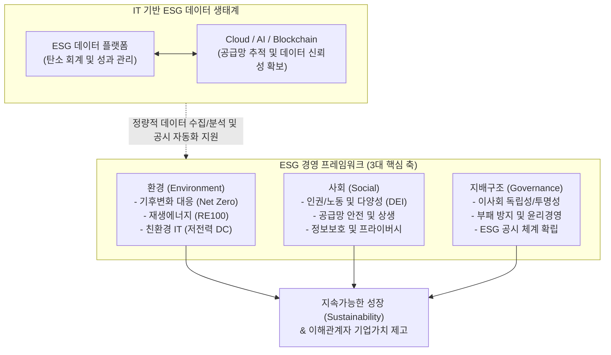

# ESG 경영 (Environmental, Social, Governance)

---

## I. 기업의 지속가능성 확보를 위한 비재무적 성과 지표, ESG 경영의 개요

* **정의**: 기업이 재무적 성과만을 추구하던 전통적 관점에서 벗어나, 장기적 생존과 성장을 위해 환경(Environment), 사회(Social), 지배구조(Governance) 등 비재무적 요소를 핵심 비즈니스 전략에 통합하는 경영 패러다임
* **필요성 및 주요 특징**:
* **이해관계자 자본주의(Stakeholder Capitalism)**: 주주 중심주의를 넘어 고객, 임직원, 협력사, 지역사회 등 모든 이해관계자의 가치를 창출하고 보호
* **투자 지표 및 기업 평가 기준**: 블랙록(BlackRock) 등 글로벌 투자 기관들이 투자 배제(Negative Screening) 및 투자 결정의 최우선 기준으로 ESG 성과를 적용
* **규제 대응 및 공시 의무화**: 기후 변화 대응 및 투명성 제고를 위해 글로벌 규제 기관(EU, SEC 등)과 표준화 기구(ISSB)의 주도로 ESG 공시 의무화 가속

---

## II. ESG 경영의 개념도 및 핵심 기술 요소

### 가. ESG 경영 체계 및 IT 지원 구조의 개념도

* 환경, 사회, 지배구조 전반의 비재무적 활동이 유기적으로 결합하여 최종적으로 기업의 지속가능한 가치를 창출함
* 데이터의 투명성과 신뢰성을 확보하기 위해 탄소 회계(Carbon Accounting) 솔루션 및 [[01_IT Tech/블록체인]] 등 IT 인프라의 역할이 필수적으로 요구됨

### 나. ESG 경영의 핵심 요소 및 IT 연계 기술

| 구분 | 요소 (키워드) | 세부 설명 및 IT 관점의 연계 |
| --- | --- | --- |
| **E (환경)** | 탄소 중립 (Net Zero) | 온실가스 배출량과 흡수량을 같게 하여 순 배출량을 '0'으로 만드는 넷제로 달성 목표 |
| **E (환경)** | 온실가스 Scope 1, 2, 3 | 직접 배출(1), 간접 배출(2)뿐만 아니라 협력사, 물류, 제품 사용 등 [[가치사슬]] 전체의 간접 배출(3)까지 산정 및 관리 (공급망 데이터 연계 필수) |
| **S (사회)** | 다양성 (DEI) | 다양성(Diversity), 형평성(Equity), 포용성(Inclusion) 확보를 통한 조직 문화 개선 |
| **S (사회)** | 정보보호 및 프라이버시 | 디지털 환경에서 고객의 개인정보 보호 및 사이버 보안 강화를 기업의 핵심 사회적 책임으로 규정 |
| **G (지배구조)** | 투명성 (Transparency) | 경영진 감시 및 이사회 독립성 확보, 주주 권리 보호, 부패 방지 체계 등 거버넌스 투명성 강화 |
| **IT 기술** | ESG 데이터 플랫폼 | 기업 내 ERP, [[SCM (Supply Chain Management)|SCM]] 시스템과 연동하여 ESG 지표를 정량적으로 수집, 분석, 모니터링하는 SaaS 기반 솔루션 |
| **IT 기술** | Green IT (그린 IT) | 데이터센터의 PUE(전력효율지수) 개선, 고효율 쿨링(액침냉각 등), 클라우드 마이그레이션을 통한 IT 탄소 발자국 저감 |

---

## III. 전통적 기업의 사회적 책임(CSR)과 ESG 비교 및 최근 동향

### 가. 전통적 CSR과 ESG 경영 비교

| 비교 항목 | CSR (Corporate Social Responsibility) | ESG (Environmental, Social, Governance) |
| --- | --- | --- |
| **관점 및 성격** | 기업의 도덕적, 윤리적 책임 / 정성적 성격 | 기업의 투자 가치 및 장기적 생존 지표 / 정량적 성격 |
| **추진 동인** | 평판 관리, 자발적인 사회공헌 활동(기부, 봉사) | 투자자의 요구, 글로벌 규제 컴플라이언스 준수 |
| **평가 지표** | 추상적이고 내부 기준에 따른 성과 측정 | 명확한 [[프레임워크]](GRI, SASB 등)에 기반한 객관적 지표 |
| **비즈니스 통합도** | 주력 비즈니스와 분리된 부수적 활동 성향 | 전사 전략, 공급망, 제품 개발 등 비즈니스 코어와 직결 |

### 나. ESG 공시 표준화 및 최신 산업 동향

* **글로벌 공시 표준의 통합 및 의무화 (ISSB 주도)**: 과거 GRI, SASB, TCFD 등 난립하던 ESG 공시 기준이 국제지속가능성기준위원회(ISSB)의 IFRS S1(일반 요구사항), S2(기후 관련 공시)로 통합 수렴되고 있으며, 유럽연합(EU)은 CSRD(기업지속가능성 보고지침)를 통해 역내외 기업에 대한 공시 의무화를 강력히 추진 중임
* **그린워싱(Greenwashing) 규제 강화와 데이터 감사**: 위장 환경주의인 그린워싱을 막기 위해 각국 규제 당국이 모니터링을 강화하고 있으며, 공시 데이터에 대해 재무제표에 준하는 외부 감사인 인증(Assurance)이 요구됨에 따라, **'데이터 정합성 보장을 위한 전사 ESG 시스템 통합(ESG ERP)'** 구축이 기업 IT 부서의 핵심 과제로 대두되고 있음

---

### 🔗 연관 토픽

- **소속 도메인**: [[00_경영전략_MOC|📈 경영전략]]
- **세부 분류**: `1. 경영 환경 분석 & 전략 수립 프레임워크`
- **핵심 연관 토픽**:
  - [[SCM (Supply Chain Management)]]
  - [[가치사슬|가치사슬(Value Chain)]]
  - [[Backcasting|Backcasting (백캐스팅)]]
  - [[PEST 분석]]
  - [[프레임워크]]
