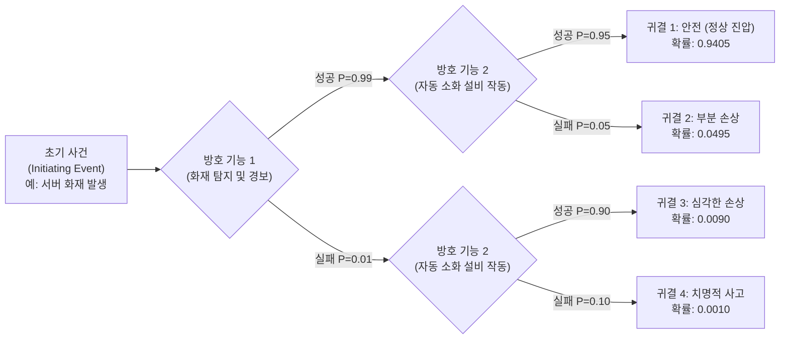

# ETA (Event Tree Analysis)

---

## I. 시나리오 기반의 전향적 위험성 평가 기법, ETA의 개요

* **정의**: 시스템에 이상을 유발하는 초기 사건(Initiating Event) 발생 시, 후속되는 방호장치 및 대응 기능의 성공 또는 실패 여부를 나뭇가지 형태로 전개하여 최종 귀결(Consequence)과 확률을 분석하는 전향적/귀납적 위험성 평가 기법
* **필요성 및 등장배경/특징**:
* **사고 시나리오 시각화**: 원인(초기 사건)에서 시작하여 결과(최종 사고)로 이어지는 시간적 흐름과 경로를 명확히 모델링 (Forward-logic)
* **정량적 확률 산출**: 각 대응 시스템의 신뢰도(성공/실패 확률)를 기반으로 최종 사고의 발생 확률을 계산하여 정량적 리스크 평가(PSA) 지원
* **복합 시스템 대응**: 원자력, 우주항공 인프라뿐만 아니라 현대의 IT 시스템 장애 복구 및 [[Smart Car(자율주행)|자율주행]] 안전성 평가(SOTIF)에 필수적으로 적용

---

## II. ETA의 개념도 및 핵심 구성 요소

### 가. ETA의 개념도 및 동작 원리

* 왼쪽의 초기 사건에서 시작하여, 각 방호 기능(대응 시스템)의 성공(상단) 및 실패(하단) 분기를 거쳐 우측의 최종 귀결로 도달함
* 각 경로 상의 확률을 곱연산(AND 조건)하여 최종 귀결의 발생 확률을 정량적으로 산출하고 위험도를 평가함

### 나. ETA의 핵심 기술 및 구성 요소

| 구분 | 요소기술(키워드) | 세부 설명 |
| --- | --- | --- |
| **기본 요소** | 초기 사건 (Initiating Event) | 분석의 시발점이 되는 비정상 상태나 장애로, 시스템의 안전 기능을 유발하는 최초의 사건 |
| **기본 요소** | 방호 기능 (Safety Barrier) | 초기 사건 발생 시 피해를 완화하거나 차단하기 위해 설계된 물리적, 논리적 대응 시스템 |
| **분석 구조** | 분기 (Branching) | 각 방호 기능의 작동 여부를 '성공(Success)' 또는 '실패(Failure)'의 이진(Binary) 상태로 전개 |
| **분석 결과** | 최종 귀결 (Consequence) | 사건과 방호 장치들의 상호작용 결과로 도출되는 최종 시스템 상태 (안전, 경미한 손상, 파국 등) |
| **논리 모델** | 귀납적 분석 (Inductive) | 특정 원인(초기 사건)이 주어졌을 때 발생 가능한 모든 결과를 탐색하는 Bottom-Up / Forward 로직 |
| **정량화** | 확률 연산 (Probability) | 조건부 확률을 적용하여 분기별 확률의 곱을 통해 최종 귀결 경로(Sequence)의 발생 가능성 산출 |
| **시계열 특성** | Sequence (사건 경로) | 방호 장치의 작동 순서 및 시간적 선후 관계를 반영하여 사고의 전개 과정을 시나리오화 |
| **확장 기법** | Bow-Tie (나비넥타이) 모델 | 중앙의 '위험 사건(Top Event)'을 기준으로 좌측은 원인 분석(FTA), 우측은 결과 분석(ETA)을 결합 |

---

## III. ETA와 FTA 비교 및 최근 동향

### 가. 위험성 평가 기법 비교 (ETA vs FTA)

| 비교 항목 | ETA (Event Tree Analysis) | [[FTA (Fault Tree Analysis)]] |
| --- | --- | --- |
| **분석 방향** | 원인 $\rightarrow$ 결과 탐색 (Forward-looking) | 결과 $\rightarrow$ 원인 탐색 (Backward-looking) |
| **논리적 접근** | 귀납적 (Inductive), 시계열적 흐름 반영 | 연역적 (Deductive), 논리 게이트 중심 |
| **시작점** | 단일 초기 사건 (Initiating Event) | 단일 최종 사고 (Top Event) |
| **결과물** | 다수의 귀결(Multiple Consequences) 시나리오 | 최상위 사건을 유발하는 단일/복합 원인(Cut Set) 규명 |
| **주요 목적** | 사고 발생 시 시스템 대응 능력 및 피해 규모 평가 | 특정 사고가 발생하게 된 근본 원인(RCA) 및 취약점 식별 |

### 나. ETA의 향후 전망 및 활용 동향

* **Dynamic ETA (동적 사건수 분석) 도입**: 정적인 확률론적 안전성 평가를 넘어, 시스템의 상태 변화와 시간 흐름에 따른 변수(예: 배터리 온도 변화, 네트워크 지연)를 실시간으로 반영하여 연속적인 리스크를 계산하는 동적 분석 체계로 발전 중임
* **자율주행 및 AI 시스템의 SOTIF(의도된 기능의 안전성) 평가 적용**: 하드웨어 고장이 아닌 AI 인지/판단 오류에 의한 자율주행(ISO 21448) 및 [[UAM]](도심항공교통) 시나리오에서, 기상 악화나 센서 오작동 등 초기 사건 발생 시 자율 제어 시스템의 회피(Fallback) 경로를 검증하는 핵심 아키텍처로 적극 활용되고 있음

---

### 🔗 연관 토픽

- **소속 도메인**: [[00_소프트웨어공학_MOC|🏗️ 소프트웨어공학]]
- **세부 분류**: `6. 소프트웨어 테스팅 & 품질 보증 (QA/QC)`
- **핵심 연관 토픽**:
  - [[FTA (Fault Tree Analysis)]]
  - [[기능안전 표준|기능안전 표준 (Functional Safety Standards)]]
  - [[SW 안전성(SW Safety) 및 분석 개념]]
  - [[Smart Car(자율주행)]]
  - [[UAM|UAM (Urban Air Mobility)]]
