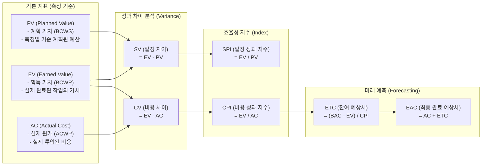

# EVM (Earned Value Management)

---

## I. 프로젝트 성과 통합 관리 기법, EVM의 개요

* **정의**: 프로젝트의 일정(Schedule)과 비용(Cost)을 '획득 가치(Earned Value)'라는 공통의 화폐 단위로 통합하여, 현재의 진척 성과를 정량적으로 측정하고 최종 완료 시점의 비용과 일정을 예측하는 프로젝트 성과 관리 기법
* **필요성 및 특징**:
* **기존 비용 관리의 한계 극복**: 단순 계획 예산(PV) 대비 실제 투입 비용(AC)의 비교만으로는 물리적 업무 달성도(EV)를 파악할 수 없는 문제 해결
* **조기 경보(Early Warning)**: 프로젝트의 지연 및 예산 초과 징후를 초기에 정량적 지수(SPI, CPI)로 식별하여 선제적 통제 지원
* **객관적 예측**: 기준선(PMB, Performance Measurement Baseline) 기반으로 남은 작업에 대한 예측치(ETC, EAC) 산출 가능

---

## II. EVM의 개념도 및 핵심 지표 요소

### 가. EVM의 성과 측정 개념도 및 동작 원리

* 프로젝트의 [[WBS]](작업분류체계)를 바탕으로 현재 시점(Data Date)에서 달성한 가치(EV)를 측정하고, 이를 계획(PV) 및 실 투입원가(AC)와 비교하여 성과를 분석함

### 나. EVM의 8대 핵심 기술 요소

| 구분 | 요소기술(키워드) | 세부 설명 및 산출 공식 |
| --- | --- | --- |
| **기본 지표** | PV (Planned Value) | 특정 시점까지 완료되기로 계획된 작업의 승인된 예산 (BCWS) |
| **기본 지표** | EV (Earned Value) | 특정 시점까지 실제로 완료된 작업에 할당된 예산 가치 (BCWP) |
| **기본 지표** | AC (Actual Cost) | 특정 시점까지 수행된 작업에 대해 실제로 발생한 총 원가 (ACWP) |
| **차이 분석** | SV (Schedule Variance) | 일정 달성 정도를 금액으로 표시 **[SV = EV - PV]** |
| **차이 분석** | CV (Cost Variance) | 예산 대비 비용 효율을 금액으로 표시 **[CV = EV - AC]** |
| **효율성 지수** | SPI (Schedule Perf. [[RDBMS 인덱스(index)|Index]]) | 계획 대비 일정 달성 비율, 1보다 크면 일정 단축 **[SPI = EV / PV]** |
| **효율성 지수** | CPI (Cost Perf. Index) | 투입 비용 대비 달성 가치 비율, 1보다 크면 비용 절감 **[CPI = EV / AC]** |
| **미래 예측** | EAC (Estimate at Completion) | 현재의 성과(CPI)가 지속된다는 가정하에 산출한 최종 프로젝트 예상 비용 |

---

## III. EVM 성과 지표 해석 및 최신 적용 동향

### 가. EVM 지표 해석 기준 및 조치 방향

| 지표 상태 | 의미 (상태) | 프로젝트 현황 분석 | 통제 및 조치 방향 |
| --- | --- | --- | --- |
| **CV > 0, CPI > 1** | Under Budget | 예산 내 수행 중 (비용 절감) | 원가 절감 요인 분석 및 유지 전략 수립 |
| **CV < 0, CPI < 1** | Over Budget | 예산 초과 (적자 상태) | 불필요 원가 제거, 원가 통제 강화, 재설계 |
| **SV > 0, SPI > 1** | Ahead of Schedule | 일정 단축 (조기 달성) | 여유 자원 식별 및 타 지연 태스크로 자원 재할당 |
| **SV < 0, SPI < 1** | Behind Schedule | 일정 지연 | Crashing(자원 추가), Fast Tracking(병행 수행) 적용 |

### 나. 성공적 EVM 적용 방안 및 최신 동향

* **WBS 기반의 명확한 통제 계정(Control Account) 설정**: 객관적인 EV 산출을 위해서는 프로젝트 착수 시점에 WBS 단위로 정확한 예산 배분 및 100% Rule 기반의 기준선(Baseline) 수립이 필수적임
* **[[Agile]] EVM (AEVM)의 확산**: 최근 애자일 방법론의 확산에 따라, 전통적인 금액(Cost) 중심의 통제에서 벗어나 백로그(Backlog)의 **스토리 포인트(Story Point)를 EV의 척도로 활용**하고 번다운 차트(Burndown Chart)와 결합하여 스프린트 단위의 성과를 추적하는 형태로 진화하고 있음

---

### 🔗 연관 토픽

- **소속 도메인**: [[00_프로젝트관리_MOC|📋 프로젝트관리]]
- **세부 분류**: `1. PMBOK 표준 & 프로젝트 거버넌스`
- **핵심 연관 토픽**:
  - [[PMBOK 프로세스 그룹 (5단계)]]
  - [[프로젝트 관리 계획서]]
  - [[SCRUM]]
  - [[WBS|WBS (Work Breakdown Structure)]]
  - [[연동계획|연동계획 (Rolling Wave Planning)]]
