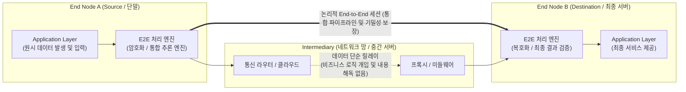

# End-to-End (E2E)

---

## I. IT 시스템 전반의 무결성과 최적화를 위한 패러다임, E2E (End-to-End)의 개요

* **정의**: 네트워크, 보안, SW 공학 및 AI 분야에서 중간(Intermediary) 매개체의 개입이나 논리적 분할 없이, 데이터의 발생지(Source)부터 최종 목적지(Destination)까지의 전체 흐름을 단일 파이프라인으로 통합하여 신뢰성을 보장하는 설계 원칙 및 아키텍처
* **필요성 및 등장배경/특징**:
* **네트워크 및 보안 (E2E Principle / E2EE)**: 중간 노드의 부하를 최소화하고, 해킹이나 데이터 유출을 방지하기 위해 복잡한 보안 및 제어 로직을 통신망 양 끝단(End) 기기로 집중시킴
* **[[인공지능]] 및 테스트 (E2E Learning / Testing)**: 여러 단계로 분절된 파이프라인 구조가 유발하는 누적 오차를 제거하고, 원시 입력부터 최종 출력까지 하나의 모델이나 시나리오로 최적화하여 시스템 효율성 극대화

---

## II. E2E의 개념도 및 도메인별 핵심 기술 요소

### 가. E2E 기반 아키텍처의 논리적 동작 개념도

* 네트워크의 중심망(Core)이나 중간 매개체는 단순한 데이터 전달 역할만 수행하며, 복잡한 검증, 암복호화, 상태 관리 및 비즈니스 로직은 양 끝단(End Node)이 전담하는 구조임

### 나. 주요 IT 도메인별 E2E 핵심 기술 및 구성 요소

| 도메인 | 요소기술(키워드) | 세부 설명 |
| --- | --- | --- |
| **네트워크** | E2E Principle (종단 간 원칙) | "통신의 [[신뢰성]] 제어는 양 끝단에 구현하고 코어 망은 단순해야 한다"는 인터넷 설계의 근본 아키텍처 철학 |
| **보안** | E2EE (종단 간 [[암호화]]) | 송신 단말에서 암호화된 메시지가 수신 단말에 도달할 때까지 중간 서버에서도 절대 복호화할 수 없는 암호 기술 |
| **보안** | PFS (Perfect Forward Secrecy) | E2EE 구현 시 세션마다 임시 키(Ephemeral Key)를 사용하여, 장기 키가 탈취되어도 과거의 데이터를 해독할 수 없도록 보장 |
| **AI/ML** | E2E Learning (종단 간 학습) | 전처리, 특징 추출(Feature Extraction) 등 다단계 파이프라인을 거치지 않고, 원시 데이터를 입력해 즉시 최종 결과값을 출력하는 단일 신경망 모델 |
| **AI/ML** | Differentiable Pipeline | 전체 신경망이 미분 가능(Differentiable)하도록 설계되어 [[역전파]](Backpropagation)를 통해 네트워크가 한 번에 글로벌 최적화(Global Optimization) 됨 |
| **SW 테스트** | E2E Testing (종단 간 테스트) | 프론트엔드 UI부터 백엔드 DB 및 외부 API까지 실제 사용자가 경험하는 애플리케이션의 전체 비즈니스 시나리오를 통합 검증 |
| **SW 테스트** | Selenium / Cypress / Playwright | 사용자 브라우저 환경을 시뮬레이션하여 UI/UX 레벨부터 서버 통신까지 E2E 자동화 테스트를 지원하는 대표적 [[프레임워크]] |
| **5G/6G 통신** | E2E Network Slicing | 단말(UE)부터 무선접속망(RAN), 코어망(Core) 전체 구간을 논리적으로 분리하여 초저지연(URLLC) 등 특정 서비스의 E2E 품질 보장([[QoS]]) |

---

## III. E2E 아키텍처의 비교 분석 및 최신 산업 동향

### 가. 전통적 분할(중간 매개) 방식과 E2E 방식 비교

| 비교 항목 | 파이프라인 / 중간 매개 방식 (Intermediary) | 종단 간 방식 (End-to-End) |
| --- | --- | --- |
| **아키텍처 구조** | 다단계 [[모듈화]] 및 중간 서버 집중형 구조 | 단일 통합 모델 및 양 종단 기기 분산형 구조 |
| **시스템 복잡도** | 각 단계/모듈별 독립적 개발 및 디버깅 용이 | 단일 시스템 통합으로 인한 블랙박스(Black-box)화 우려 |
| **[[기밀성]] 및 보안** | 중간 노드(DB, 릴레이 서버) 해킹 시 평문 데이터 유출 위험 | 양 종단 외 구간에서는 완벽한 기밀성 보장 (MITM 차단) |
| **처리 지연(Latency)** | 단계별 변환, 복호화 처리로 인한 오버헤드 및 지연 발생 | 중간망은 단순 릴레이만 수행하여 네트워크/연산 지연 최소화 |
| **AI 모델 성능** | 각 서브 모듈의 누적 오차 발생 (Error Propagation) | 목표 지표에 맞춘 전체 동시 최적화로 성능 극대화 |

### 나. E2E 패러다임의 최신 동향 및 전망

* **[[Smart Car(자율주행)|자율주행]] 분야의 E2E AI 대세화**: 과거 자율주행은 '인지(Vision) → 판단(Planning) → 제어(Control)'로 모듈이 엄격히 분리되었으나, 최근 테슬라 FSD(Full Self-Driving) v12 등을 필두로 카메라 원시 영상이 입력되면 조향/가속 신호를 직접 출력하는 **End-to-End Neural Net** 방식이 자율주행의 핵심 패러다임으로 자리매김함
* **멀티모달 AI의 E2E 통합**: 텍스트, 음성, 비전을 별도의 모듈(STT/TTS 변환 등)로 분리 처리하던 방식에서 벗어나, GPT-4o와 같이 음성 입력의 감정과 톤을 그대로 인식하여 즉각 답변을 생성하는 E2E 멀티모달 모델 시대로 진화 중임
* **[[양자내성암호]](PQC) 기반의 E2EE 전환**: 차세대 메신저 및 클라우드 서비스들은 양자 컴퓨터에 의한 기존 암호 체계 무력화에 대비하기 위해, Signal [[프로토콜]] 등 기존 E2EE 아키텍처에 PQC(Post-Quantum Cryptography) 알고리즘을 하이브리드로 결합하는 보안 고도화를 서두르고 있음

---

### 🔗 연관 토픽

- **소속 도메인**: [[00_네트워크_MOC|🌐 네트워크]]
- **세부 분류**: `2. 네트워크 계층 & 라우팅 프로토콜 (L3)`
- **핵심 연관 토픽**:
  - [[프로토콜]]
  - [[MQTT (Message Queuing Telemetry Transport)]]
  - [[네트워크 슬라이싱]]
  - [[IP]]
  - [[Network(3) 레이어]]
