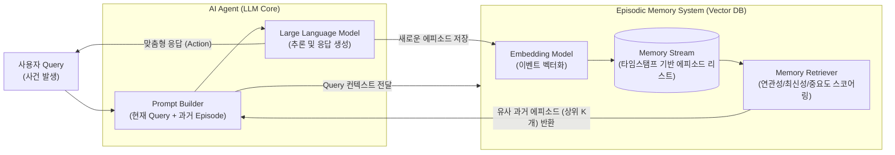

# Episodic Memory (일화 기억)

---

## I. 자율 AI 에이전트의 개인화 및 연속성 보장의 핵심, Episodic Memory의 개요

* **정의**: 인간의 인지심리학적 자전적 기억 모델을 차용하여, AI 에이전트가 사용자와의 과거 상호작용 내역(시간, 장소, 사건 등)을 이벤트 단위로 저장하고 문맥에 맞게 인출(Retrieval)하는 장기 메모리 아키텍처
* **필요성 및 등장배경/특징**:
* **문맥 길이(Context Window) 한계 극복**: [[초거대 언어 모델|LLM]]이 처리할 수 있는 토큰 제약을 넘어 무한에 가까운 장기적 대화 이력 유지
* **자아 연속성(Continuity) 및 개인화**: 에이전트가 과거의 경험을 기억하여 사용자 맞춤형 반응과 고유한 [[페르소나]](Persona)를 지속적으로 유지 (Agentic AI의 핵심 요소)
* **RAG 기반 동적 인출**: 단순 전체 대화 이력 주입이 아닌, 현재의 쿼리와 연관성이 높은 과거 에피소드만 선별적으로 검색하여 환각(Hallucination) 최소화

---

## II. Episodic Memory의 개념도 및 핵심 기술 요소

### 가. AI 에이전트의 Episodic Memory 아키텍처 개념도 및 동작 원리

* 사용자의 입력 및 에이전트의 행동 이력은 타임스탬프와 함께 임베딩되어 Memory Stream(Vector DB)에 지속적으로 누적됨
* 새로운 쿼리 입력 시, **연관성(Relevance), 최신성(Recency), 중요도(Importance)** 기반의 스코어링을 통해 가장 적합한 과거 에피소드를 인출하여 프롬프트에 동적으로 주입함

### 나. Episodic Memory의 핵심 기술 및 구성 요소

| 구분 | 요소기술(키워드) | 세부 설명 |
| --- | --- | --- |
| **기억 저장소** | Memory Stream | 모든 상호작용과 이벤트를 시간 순서대로 기록하는 확장 가능한 아카이브 (리스트 구조) |
| **기억 변환** | Text Embedding | 비정형 자연어(에피소드)를 다차원 벡터값으로 변환하여 기계적 연산이 가능하도록 처리 |
| **기억 영속성** | Vector Database | 대규모 임베딩 벡터를 고속으로 저장 및 검색할 수 있는 인프라 (Pinecone, Milvus, Chroma 등) |
| **메타데이터** | Timestamp & Location | 언제(When), 어디서(Where) 일어난 사건인지 식별하기 위한 시간 및 공간 속성 태깅 |
| **인출 메커니즘** | Retrieval-Augmented Generation (RAG) | LLM이 응답을 생성하기 전, 외부 메모리 저장소에서 관련된 과거 에피소드를 먼저 검색하는 기법 |
| **인출 가중치** | Recency / Importance / Relevance | 에피소드 검색 시 단순히 의미적 유사성(연관성)뿐만 아니라, 발생 시점(최신성)과 사건의 비중(중요도)을 종합하여 점수화 (Generative Agents 논문 기준) |
| **기억 고도화** | Reflection (반추/회고) | 단편적인 일화(Episodic)들을 주기적으로 종합하여 상위 수준의 인사이트나 성향(Semantic)으로 요약 및 승격시키는 과정 |
| **[[프레임워크]]** | Mem0 / LangChain Memory | Agentic AI를 위해 계층화된 장단기 메모리 통합 관리 기능을 제공하는 최신 메모리 오케스트레이션 도구 |

---

## III. Episodic Memory와 Semantic Memory 비교 및 최신 동향

### 가. AI 메모리 시스템 비교 (Episodic vs Semantic)

| 비교 항목 | Episodic Memory (일화 기억) | Semantic Memory (의미 기억) |
| --- | --- | --- |
| **개념/정의** | 특정한 시간, 장소와 결합된 **과거의 개인적 경험/사건** | 시간/맥락과 독립적으로 획득된 **일반적인 지식/사실** |
| **저장 형태** | 시간 순서의 로그 (Memory Stream) | 지식 그래프(Knowledge Graph) 또는 범용 문서/DB |
| **검색 기준** | 시간(Timestamp), 상황(Context), 사용자 ID | 개념(Concept), [[엔티티|엔티티(Entity)]], 키워드 |
| **주요 질문 예시** | "지난주 회의에서 내가 어떤 피드백을 주었지?" | "파이썬에서 리스트를 정렬하는 방법은?" |
| **AI 구현 목적** | 에이전트의 페르소나 유지 및 초개인화(Hyper-personalization) | 범용적인 정보 제공 및 도메인 지식(Domain Knowledge) 보완 |

### 나. Episodic Memory의 향후 전망 및 Agentic AI 적용 동향

* **다중 에이전트 시스템(Multi-Agent System) 확산**: 스탠퍼드 대학의 'Generative Agents' 연구 이후, 다수의 AI 에이전트가 각자의 Episodic Memory를 바탕으로 사회적 상호작용을 자율적으로 수행하는 시뮬레이션 및 복합 업무 분업 환경이 현실화됨
* **하이브리드 메모리 계층화(Hierarchical Memory)**: 인간의 뇌 구조와 유사하게 워킹 메모리(단기), 일화 기억(경험), 의미 기억(지식)을 통합 관리하고, 일화 기억을 주기적으로 압축(Reflection)하여 지식으로 변환하는 지능형 [[메모리 관리]] 프레임워크(예: Mem0 등)가 Agentic AI의 표준 아키텍처로 자리매김하고 있음

---

### 🔗 연관 토픽

- **소속 도메인**: [[00_인공지능_MOC|🤖 인공지능]]
- **세부 분류**: `4. 거대언어모델 (LLM) & 생성형 AI`
- **핵심 연관 토픽**:
  - [[GraphRAG (Graph Retrieval-Augmented Generation)]]
  - [[초거대 언어 모델|초거대 언어 모델(Large Language Model)]]
  - [[엔티티|엔티티(Entity)]]
  - [[메모리 관리]]
  - [[프롬프트 엔지니어링|프롬프트 엔지니어링(Prompt Engineering)]]
