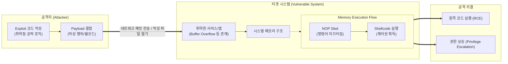

# Exploit (익스플로잇)

---

## I. 시스템의 취약점을 악용하는 공격 코드, Exploit의 개요

* **정의**: 소프트웨어, 하드웨어 또는 네트워크의 보안 취약점(Vulnerability)을 파고들어, 설계자가 의도하지 않은 비정상적인 동작을 유발하거나 시스템 제어 권한을 탈취하는 공격 코드 또는 명령어 집합
* **필요성 및 주요 특징**:
* **침투 운반체 역할**: 타겟 시스템의 방어막을 무력화하여, 실질적인 악성 행위를 수행하는 페이로드(Payload)를 시스템 내부에 주입하고 실행시킴
* **타겟 종속성**: 특정 [[OS(운영체제)|운영체제]], 애플리케이션, 아키텍처 버전에 존재하는 특정 결함(버퍼 오버플로우 등)에 맞춤화되어 동작함
* **보안 위협의 고도화**: 제로데이(Zero-day) 및 지능형 지속 위협(APT) 공격의 초기 침투 단계(Initial Access) 핵심 무기로 활용됨

---

## II. Exploit의 동작 메커니즘 및 핵심 기술 요소

### 가. Exploit의 공격 실행 메커니즘 개념도

* 공격자는 타겟의 메모리 취약점을 트리거하는 익스플로잇 코드에 악성 페이로드(쉘코드)를 탑재하여 전송함
* 취약한 서비스가 비정상 종료되는 대신, 조작된 메모리 주소(NOP Sled 경유)로 점프하여 공격자의 쉘코드를 실행함으로써 시스템 제어권을 탈취함

### 나. Exploit의 핵심 기술 및 구성 요소

| 구분 | 요소기술(키워드) | 세부 설명 |
| --- | --- | --- |
| **공격 기반** | Vulnerability (취약점) | 익스플로잇의 표적이 되는 SW/HW의 논리적 결함 (버퍼 오버플로우, UAF, SQLi 등) |
| **공격 목적물** | Payload (페이로드) | 익스플로잇 성공 직후 실행되어 실질적인 악성 행위(백도어 설치, 정보 유출 등)를 수행하는 코드 |
| **제어권 획득** | Shellcode (쉘코드) | 페이로드의 대표적 형태로, 타겟 시스템의 쉘(Command Shell)을 획득하기 위한 작은 기계어 코드 |
| **메모리 조작** | NOP Sled (놉 슬레드) | 메모리 주소가 미세하게 빗나가도 쉘코드가 정상 실행되도록 유도하는 빈 명령어(No Operation) 패딩 구간 |
| **발생 시점** | 0-Day (제로데이) Exploit | SW 제조사의 공식 보안 패치가 발표되기 전, 취약점이 방치된 상태를 노리는 치명적인 익스플로잇 |
| **발생 시점** | 1/N-Day Exploit | 패치가 발표되었으나 해당 패치를 아직 적용하지 않은 레거시 시스템을 대상으로 하는 익스플로잇 |
| **공격 위치** | Remote Exploit | 네트워크를 통해 외부에서 타겟 시스템의 취약한 서비스(웹, SMB 등)를 공략하여 접근 권한을 획득 |
| **공격 위치** | Local Exploit | 시스템에 이미 낮은 권한으로 접속한 상태에서, 관리자 권한(Root/System)을 탈취하기 위한 권한 상승 기법 |

---

## III. Exploit과 Payload 비교 및 최근 보안 방어 동향

### 가. 사이버 공격 요소 비교 (Exploit vs Payload)

| 비교 항목 | Exploit (익스플로잇) | Payload (페이로드) |
| --- | --- | --- |
| **보안 역할 비유** | 잠긴 문을 부수거나 따는 **침투 도구 (운반체)** | 문을 열고 들어가서 터뜨리는 **폭탄 (목적물)** |
| **주요 목적** | 시스템 취약점 악용 및 침투 경로(통로) 개척 | 실질적인 악성 행위([[랜섬웨어]] 감염, 데이터 파괴) 수행 |
| **타겟 의존성** | 매우 높음 (특정 OS, 특정 버전에만 동작) | 상대적으로 낮음 (침투만 성공하면 동일 페이로드 실행 가능) |
| **방어 기술** | ASLR, DEP/NX, 취약점 패치 관리(Patch Management) | 백신(EPP/[[EDR(Endpoint Detection and Response)|EDR]]), 행위 기반 탐지, [[샌드박스|샌드박스 (Sandbox)]] |

### 나. Exploit의 진화 및 사이버 보안 대응 전망

* **EaaS (Exploit-as-a-Service)의 지하 경제화**: 다크웹을 통해 제로데이 익스플로잇 코드가 서비스 형태로 거래되며, 전문 지식이 없는 범죄자도 자본만 있으면 고도화된 타겟형 해킹을 수행할 수 있게 되어 위협이 가중됨
* **생성형 AI(GenAI) 기반 취약점 탐색 및 Exploit 자동 생성**: [[초거대 언어 모델|LLM]]을 활용하여 방대한 소스코드의 취약점을 단시간에 찾아내고 맞춤형 익스플로잇을 자동 생성하는 공격 기법이 등장함
* **선제적 방어 체계([[CTI]] & [[XDR]]) 구축 필수**: 기업은 단순 백신 방어를 넘어 위협 인텔리전스(CTI) 기반의 최신 취약점 동향 파악, ASLR/DEP 등 메모리 보호 기법의 강제 적용, 그리고 XDR을 통한 엔드포인트-네트워크 통합 행위 분석으로 익스플로잇 시도를 조기에 차단해야 함

---

### 🔗 연관 토픽

- **소속 도메인**: [[00_보안_MOC|🛡️ 보안]]
- **세부 분류**: `4. 웹 & 애플리케이션 보안 · 취약점 점검`
- **핵심 연관 토픽**:
  - [[드라이브 바이 다운로드|드라이브 바이 다운로드(Drive By Download)]]
  - [[EDR(Endpoint Detection and Response)]]
  - [[샌드박스|샌드박스 (Sandbox)]]
  - [[랜섬웨어]]
  - [[XDR|XDR(eXtended Detection Response)]]
