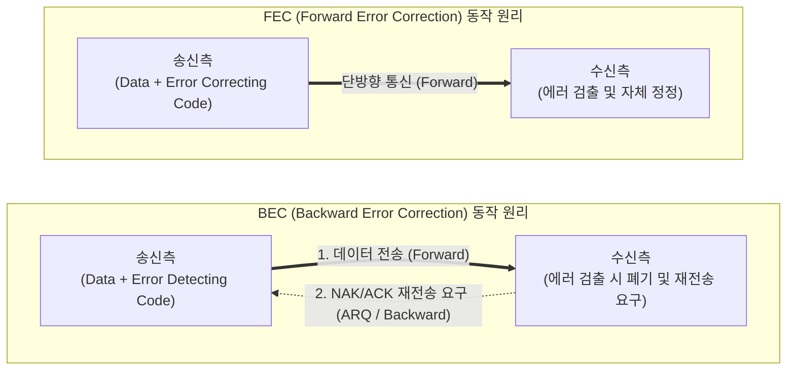

# FEC(Forward Error Correction) 및 BEC(Backward Error Correction)

---

## I. 신뢰성 있는 데이터 통신을 위한 오류 제어 기법, FEC와 BEC의 개요

* **정의**: 데이터 통신 과정에서 발생하는 오류를 제어하기 위해, 수신측이 잉여 비트를 통해 오류를 스스로 수정하는 전진 에러 수정(FEC) 기법과 재전송을 요구하는 후진 에러 수정(BEC) 기법
* **필요성 및 등장배경/특징**:
* **FEC (Forward Error Correction)**: 송신측이 오류 정정용 잉여 비트를 대량 부가하여 전송하며, 역방향 채널(Reverse Channel)이 필요 없어 실시간/단방향 통신에 유리하지만 대역폭 낭비가 발생함
* **[[BEC (Backward Error Correction)]]**: 오류 검출용 비트만 부가하여 전송하고 오류 발생 시 송신측에 재전송(ARQ)을 요구하며, 전송 효율이 높고 정확성이 보장되나 실시간 처리에 취약함

---

## II. FEC와 BEC의 동작 개념도 및 핵심 기술 요소

### 가. FEC와 BEC의 동작 원리 개념도

* **FEC**: 수신측 자체적으로 잉여 비트를 해석하여 오류를 정정하므로, 송신측으로 피드백을 보내는 역채널(Backward Channel)이 불필요함
* **BEC**: 수신측은 오류의 유무만 판별하며, 오류 발견 시 피드백(NAK)을 보내 송신측이 데이터를 다시 보내도록 통제(ARQ)함

### 나. FEC와 BEC의 핵심 기술 및 구성 요소

| 구분 | 요소기술(키워드) | 세부 설명 |
| --- | --- | --- |
| **FEC (정정 코드)** | 해밍 코드 (Hamming Code) | 데이터 비트에 잉여 비트(패리티)를 추가하여 1비트의 에러를 검출하고 위치를 찾아 스스로 정정하는 기법 |
| **FEC (정정 코드)** | 리드-솔로몬 (Reed-Solomon) | 블록 단위로 에러를 정정하며, 버스트 에러(Burst Error, 연속된 오류) 복구에 탁월한 인코딩 방식 |
| **FEC (정정 코드)** | LDPC / 터보 코드 (Turbo) | 5G 통신 등 고속/대용량 전송 환경에서 섀넌 한계(Shannon Limit)에 근접하는 우수한 오류 정정 능력을 제공 |
| **BEC (검출 코드)** | [[CRC]] (순환 중복 검사) | 다항식 기반의 나눗셈 연산을 통해 프레임 단위의 오류를 매우 높은 확률로 검출하는 BEC의 핵심 기법 |
| **BEC (검출 코드)** | 패리티 검사 (Parity Check) | 데이터 블록 끝에 1비트(홀수/짝수)를 추가하여 오류 발생 여부를 검출 (위치 파악 불가) |
| **BEC (제어 기법)** | Stop-and-Wait ARQ | 송신측이 하나의 프레임을 전송한 후, ACK 수신 시까지 대기하다가 타임아웃/NAK 발생 시 재전송 |
| **BEC (제어 기법)** | Go-Back-N ARQ | 연속으로 프레임을 전송하다가 오류 발생 프레임 이후의 모든 프레임을 일괄 재전송하는 기법 |
| **BEC (제어 기법)** | Selective Repeat ARQ | 오류가 발생한 특정 프레임(NAK 수신)만 선택적으로 재전송하여 통신 대역폭 낭비를 최소화 |

---

## III. FEC와 BEC 비교 및 최신 동향 (HARQ)

### 가. 오류 제어 기법 비교 (FEC vs BEC)

| 비교 항목 | FEC (전진 에러 수정) | BEC (후진 에러 수정) |
| --- | --- | --- |
| **핵심 원리** | 수신측에서 오류 검출 및 스스로 정정 | 수신측에서 오류 검출 후 송신측에 재전송(ARQ) 요구 |
| **부가 데이터 량** | 잉여 비트가 많음 (오버헤드 큼) | 잉여 비트가 적음 (오류 검출용만 포함) |
| **역방향 채널(피드백)** | 불필요 (단방향 통신 환경 가능) | **반드시 필요 (양방향 통신 환경 필수)** |
| **지연 시간 / 실시간성** | 낮음 / 우수함 (재전송 대기 없음) | 높음 / 취약함 (재전송 및 타임아웃 대기 발생) |
| **적용 분야** | 위성 통신, VOD 스트리밍, 광통신 | 인터넷 파일 전송, [[TCP]] [[프로토콜]] 기반 통신 |

### 나. 오류 제어 기술의 발전 및 최신 동향

* **HARQ (Hybrid ARQ)의 대세화**: 최근 LTE, 5G 무선 통신 환경에서는 FEC의 실시간성과 BEC의 높은 신뢰성을 결합한 **HARQ (FEC + ARQ)** 방식이 표준으로 채택됨. 수신측이 우선 FEC로 오류 정정을 시도하고, 정정 불가능한 심각한 오류에 대해서만 ARQ로 재전송을 요구함
* **초저지연 통신을 위한 FEC 알고리즘의 진화**: 5G/6G 및 [[Smart Car(자율주행)|자율주행]], 원격 수술 등 URLLC(초고신뢰 초저지연 통신) 환경에서는 재전송(BEC)에 따른 지연(Latency)이 치명적이므로, **Polar Code 및 고효율 LDPC(Low-Density Parity-Check)** 기반의 진보된 FEC [[알고리즘]] 적용이 필수적으로 요구되고 있음

---

### 🔗 연관 토픽

- **소속 도메인**: [[00_네트워크_MOC|🌐 네트워크]]
- **세부 분류**: `1. OSI 7계층 & 데이터링크 계층 (L1/L2)`
- **핵심 연관 토픽**:
  - [[BEC (Backward Error Correction)]]
  - [[프로토콜]]
  - [[CRC|CRC(Cyclic Redundancy Check)]]
  - [[TCP]]
  - [[BGP|BGP(Border Gateway Protocol)]]
