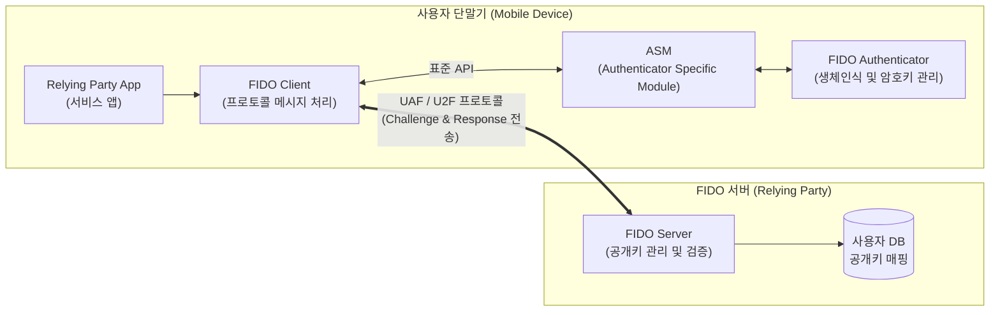

# FIDO 1.0 (Fast IDentity Online 1.0)

---

## I. 생체 기반 패스워드리스 인증 표준, FIDO 1.0의 개요

* **정의**: 기존 패스워드 방식의 보안 취약점과 불편함을 해결하기 위해, 지문·홍채 등 생체 정보와 공개키(PKI) 암호 방식을 융합하여 기기 로컬에서 안전하게 사용자를 인증하는 글로벌 개방형 인증 표준
* **필요성 및 주요 특징**:
* **패스워드 대체(Passwordless)**: 사용자 기억에 의존하는 비밀번호를 제거하여 피싱, 사전 대입 공격 등 네트워크 기반 자격증명 탈취 원천 차단
* **프라이버시 보호(Local Authentication)**: 민감한 생체 정보는 서버로 전송하지 않고 개인 단말기 내 안전 영역(TEE/SE)에만 저장하여 유출 방지
* **강력한 암호학적 인증**: 단말과 서버 간 인증은 비대칭키(공개키/개인키) 기반의 Challenge-Response 프로토콜을 사용하여 재전송 공격 방어

---

## II. FIDO 1.0의 아키텍처 및 핵심 기술 요소

### 가. FIDO 1.0의 아키텍처 및 동작 원리

* 사용자 단말에서는 앱, [[FIDO]] 클라이언트, [[공격 표면 관리|ASM]], 인증기가 계층적으로 연동하여 로컬 생체 인증과 서명(Sign)을 수행함
* 인증기가 생성한 '개인키'는 단말 보안 구역에 저장되고, '공개키'만 네트워크(UAF/U2F [[프로토콜]])를 통해 서버로 전달되어 서명 값 검증에 사용됨

### 나. FIDO 1.0의 핵심 기술 및 구성 요소

| 구분 | 요소기술(키워드) | 세부 설명 |
| --- | --- | --- |
| **핵심 프로토콜** | UAF (Universal Auth. Framework) | 패스워드를 완전히 배제하고 생체 인식(지문, 음성 등)만으로 1차 인증을 수행하는 프로토콜 |
| **핵심 프로토콜** | U2F (Universal 2nd Factor) | 기존 아이디/패스워드 로그인 후 하드웨어 보안 키(USB, [[NFC]] 등)를 이용해 2차 인증을 수행하는 프로토콜 |
| **단말 구성요소** | FIDO Client | 서비스 앱(Relying Party)과 FIDO 서버 간의 메시지를 중계하고 FIDO 프로토콜 통신을 제어 |
| **단말 구성요소** | ASM (Authenticator Specific Module) | 다양한 제조사의 인증기와 FIDO 클라이언트 간의 통신을 추상화하여 연결하는 표준 인터페이스 모듈 |
| **단말 구성요소** | Authenticator (인증기) | 사용자의 생체 정보를 확인하고, [[암호화]] 키 쌍(Key Pair) 생성 및 전자서명을 수행하는 핵심 모듈 |
| **서버 구성요소** | FIDO Server | 인증기에서 생성된 공개키를 사용자 계정과 연결하여 저장하고, 전달받은 서명 값의 유효성 검증 |
| **보안 기술** | Challenge & Response | 서버가 전송한 임의의 난수(Challenge)를 단말이 개인키로 서명(Response)하여 인증하는 서명 프로토콜 |
| **보안 환경** | TEE / SE (TrustZone) | 생체 특징(Template) 데이터와 개인키가 탈취되지 않도록 격리된 하드웨어 보안 실행 환경 |

---

## III. FIDO 1.0 프로토콜 비교 및 차세대 인증(FIDO2) 진화 동향

### 가. FIDO 1.0의 두 가지 핵심 프로토콜 비교 (UAF vs U2F)

| 비교 항목 | UAF (Universal Authentication Framework) | U2F (Universal Second Factor) |
| --- | --- | --- |
| **핵심 목적** | **패스워드 대체 (Passwordless)** | **2단계 인증 (2FA) 강화** |
| **인증 방식** | 생체 정보(지문, 안면 등), PIN 입력 등 (1-Factor) | ID/PW 입력 후 + 하드웨어 보안키 (2-Factor) |
| **주요 적용 환경** | 스마트폰 등 모바일 네이티브 앱 환경 | PC 웹 브라우저 환경 (USB, NFC 동글 등 활용) |
| **사용자 경험(UX)** | 아이디 입력조차 필요 없는(Local Discovery) 간편 로그인 | 패스워드 로그인 후 하드웨어 키 터치 등 추가 행동 요구 |

### 나. FIDO 1.0의 한계점 및 FIDO2로의 발전 전망

* **플랫폼 확장성 한계**: FIDO 1.0은 주로 모바일 앱(App) 환경에 종속적이었으며, PC 기반의 웹 브라우저나 데스크톱 [[OS(운영체제)|운영체제]] 환경을 완벽하게 지원하지 못하는 구조적 한계가 존재함
* **FIDO2 및 WebAuthn으로의 표준 통합**: 이러한 한계를 극복하기 위해 W3C와 공동으로 제정한 **FIDO2**가 등장하였음. 브라우저 내장 자바스크립트 API인 **WebAuthn**과 외부 인증기 연동 표준인 **[[CTAP]]**를 통해 윈도우, 안드로이드, iOS 및 주요 브라우저에서 플러그인 없이 네이티브 기반 패스워드리스 인증 환경이 정착되고 있음

---

### 🔗 연관 토픽

- **소속 도메인**: [[00_보안_MOC|🛡️ 보안]]
- **세부 분류**: `2. 현대 암호학 & 키 관리 · 전자서명`
- **핵심 연관 토픽**:
  - [[FIDO]]
  - [[CTAP]]
  - [[FIDO 2.0 (Fast IDentity Online 2.0)]]
  - [[패스키|패스키(Passkey)]]
  - [[암호화|암호화 (Encryption)]]
