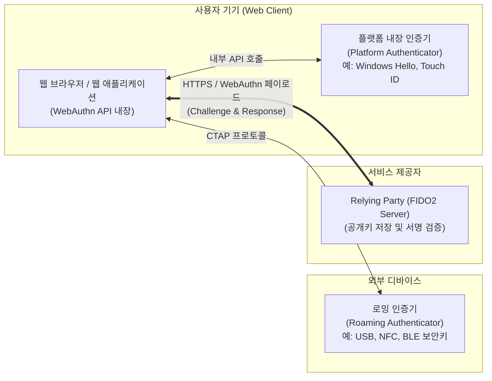

# FIDO2 (Fast IDentity Online 2.0)

---

## I. 웹과 데스크톱으로 확장된 패스워드리스 인증 표준, FIDO2의 개요

* **정의**: [[FIDO]] 얼라이언스와 W3C(World Wide Web Consortium)가 공동으로 제정하여, 모바일 환경을 넘어 웹 브라우저 및 PC 운영체제에서도 패스워드 없이 생체인식 및 보안키로 안전하게 인증할 수 있는 차세대 글로벌 개방형 인증 표준
* **필요성 및 등장배경/특징**:
* **웹(Web) 환경으로의 확장**: 모바일 앱에 국한되었던 기존 [[FIDO 1.0 (Fast IDentity Online 1.0)|FIDO 1.0]]의 한계를 극복하고, 자바스크립트 API(WebAuthn)를 통해 웹 브라우저에서 네이티브 인증 환경 구현
* **플랫폼 비종속성 및 편의성**: 별도의 플러그인이나 프로그램 설치 없이 주요 브라우저(크롬, 엣지, 사파리) 및 [[OS(운영체제)|운영체제]](Windows Hello, macOS Touch ID)에 기본 통합됨
* **피싱 저항성(Phishing-resistant)**: 비대칭키 기반 암호화와 강력한 도메인 바인딩(Origin Binding)을 적용하여 중간자 공격(MITM) 및 크리덴셜 스터핑 원천 차단

---

## II. FIDO2의 개념도 및 핵심 기술 요소

### 가. FIDO2의 개념도 및 동작 원리

* 웹 브라우저(WebAuthn)를 중계자로 하여, 단말 내장형 플랫폼 인증기 또는 외부 로밍 인증기([[CTAP]] 연동)가 생성한 전자서명을 서비스 제공자(RP) 서버로 전송함
* 인증기가 생성한 개인키는 기기의 보안 영역(TrustZone/[[TPM]])에 안전하게 격리되며, 인증 시마다 서버가 보낸 난수(Challenge)를 서명하여 검증함

### 나. FIDO2의 핵심 기술 및 구성 요소

| 구분 | 요소기술(키워드) | 세부 설명 |
| --- | --- | --- |
| **웹 표준 API** | WebAuthn (Web Authentication) | W3C에서 제정한 표준 자바스크립트 API로, 웹 애플리케이션이 브라우저를 통해 인증기와 통신할 수 있도록 지원 |
| **외부 연동 표준** | CTAP (Client to Auth. Protocol) | FIDO 클라이언트(PC 등)와 외부 인증기(스마트폰, 보안 USB 등) 간에 USB, [[NFC]], BLE를 통해 통신하는 [[프로토콜]] |
| **인증기 유형** | Platform Authenticator | 스마트폰의 지문 인식기나 노트북의 TPM 등 사용자 단말 운영체제에 내장되어 분리할 수 없는 일체형 인증기 |
| **인증기 유형** | Roaming Authenticator | YubiKey 등과 같이 다른 여러 기기(PC, 태블릿 등)에 연결하여 이동하며 사용할 수 있는 휴대형 외부 인증 장치 |
| **보안 메커니즘** | Origin Binding (도메인 바인딩) | 생성된 크리덴셜(키 쌍)을 특정 서비스의 도메인(RP ID)과 강력하게 결합하여 피싱 사이트에서의 서명 유출을 방지 |
| **보안 메커니즘** | [[비대칭키 암호화]] (PKI) | 사용자의 기기(안전 영역)에 개인키를 보관하고, 서버에는 공개키만 등록하여 해킹 시에도 패스워드 대량 유출 방지 |
| **보안 메커니즘** | Challenge-Response | 서버가 매 요청마다 생성하는 일회성 난수(Challenge)를 서명함으로써 네트워크 패킷을 가로채는 재전송 공격 방어 |
| **기기 [[신뢰성]]** | Attestation (증명) | 등록 시 사용된 인증기가 FIDO 규격을 준수하는 신뢰할 수 있는 기기인지 서버가 제조사 서명을 통해 확인하는 절차 |

---

## III. FIDO 1.0과 FIDO2 비교 및 최신 동향 (Passkeys)

### 가. 인증 패러다임 진화 비교 (FIDO 1.0 vs FIDO2)

| 비교 항목 | FIDO 1.0 (UAF / U2F) | FIDO2 (WebAuthn + CTAP) |
| --- | --- | --- |
| **주요 적용 대상** | 모바일 네이티브 앱 중심 | **웹 브라우저 및 데스크톱 OS 확장** |
| **표준화 주도** | FIDO 얼라이언스 | FIDO 얼라이언스 + **W3C 연합** |
| **주요 프로토콜** | UAF (비밀번호 없음), U2F (비밀번호 + 2차 인증) | **WebAuthn** (웹 환경 지원), **CTAP** (기기 간 연동) |
| **소프트웨어 요구사항** | 별도의 FIDO 클라이언트 및 [[공격 표면 관리|ASM]] 앱 설치 필요 | 브라우저 및 OS 레벨에서 **네이티브(Native) 지원** |
| **인증기 활용성** | 기기 내장형 인증기 단독 사용 중심 | 스마트폰을 PC의 외부 인증기로 활용하는 범용성 확보 |

### 나. FIDO2의 진화 방향 및 패스키(Passkeys) 확산 동향

* **멀티 디바이스 크리덴셜(Multi-device FIDO Credential), [[패스키]](Passkey)의 부상**: FIDO2의 단점이었던 '인증기(기기) 종속성 및 기기 분실 시의 복구 어려움'을 해결하기 위해, 애플, 구글, 마이크로소프트 주도로 FIDO 개인키를 클라우드(iCloud Keychain, Google Password Manager 등)를 통해 사용자의 여러 기기에 안전하게 동기화(Sync)하는 패스키 기술이 글로벌 표준으로 급부상함
* **엔터프라이즈 제로 트러스트([[제로 트러스트 보안모델|Zero Trust]])의 핵심 기반**: 최근 해커들의 다중 요소 인증(MFA) 우회 공격(MFA Fatigue 등)이 증가함에 따라, 미국 CISA 및 글로벌 기업들은 최고 수준의 피싱 저항성을 제공하는 FIDO2 기반의 하드웨어 보안키 및 패스키 도입을 전사적 의무 규정으로 강화하고 있음

---

### 🔗 연관 토픽

- **소속 도메인**: [[00_보안_MOC|🛡️ 보안]]
- **세부 분류**: `2. 현대 암호학 & 키 관리 · 전자서명`
- **핵심 연관 토픽**:
  - [[FIDO]]
  - [[CTAP]]
  - [[패스키|패스키(Passkey)]]
  - [[FIDO 1.0 (Fast IDentity Online 1.0)]]
  - [[IAM]]
