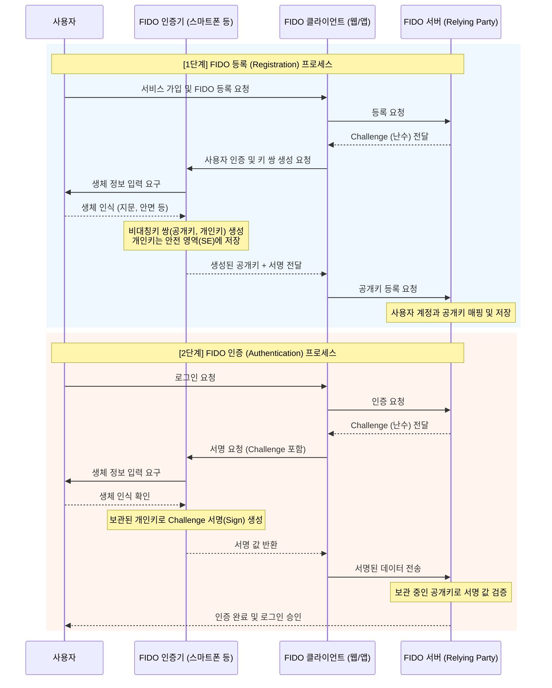

# FIDO (Fast Identity Online)

---

## I. 비밀번호 없는 안전하고 편리한 차세대 인증 표준, FIDO의 개요

* **정의**: 기존 패스워드 방식의 취약점을 극복하기 위해, 지문/얼굴 등 생체정보나 하드웨어 보안키를 활용하여 기기 로컬에서 인증하고 서버와는 비대칭키(공개키) 기반으로 상호 인증하는 글로벌 개방형 인증 표준
* **필요성 및 주요 특징**:
* **패스워드 리스 (Passwordless)**: 사용자 기억에 의존하는 비밀번호를 제거하여 피싱(Phishing), 크리덴셜 스터핑(Credential Stuffing) 등 공격 원천 차단
* **프라이버시 보호 (로컬 인증)**: 사용자의 민감한 생체정보는 서버로 전송되지 않고 개인 단말기(TEE/SE 영역)에만 안전하게 저장됨
* **비대칭키 기반 서버 인증**: 개인키는 단말에 보관하고 서버에는 공개키만 등록하여 서명(Challenge-Response)을 검증하는 강력한 보안 구조

---

## II. FIDO의 개념도 및 핵심 기술 요소

### 가. FIDO의 인증 메커니즘 개념도 및 동작 원리

* 사용자의 생체 정보는 인증기(Authenticator) 내부에서만 처리되며, 네트워크 구간으로는 오직 암호학적 서명(Signature)과 공개키(Public Key)만 전송됨

### 나. FIDO의 핵심 구성 및 기술 요소

| 구분 | 요소기술(키워드) | 세부 설명 |
| --- | --- | --- |
| **인증 개체** | Authenticator (인증기) | 생체정보/PIN 등을 통해 사용자를 식별하고 [[암호화]] 키 쌍(Key Pair)을 생성/관리하는 H/W 또는 S/W 모듈 |
| **인터페이스** | [[공격 표면 관리|ASM]] (Authenticator Specific Module) | 다양한 제조사의 인증기(지문, 홍채 등)와 FIDO 클라이언트 간의 통신을 돕는 표준 API 인터페이스 |
| **중계 모듈** | FIDO Client | 사용자 단말(스마트폰 앱, 브라우저)에 탑재되어 서버와의 메시지 송수신 및 FIDO 프로토콜을 처리 |
| **서버 검증** | FIDO Server | 서비스 제공자(Relying Party) 쪽에 위치하며 사용자의 공개키를 등록하고 Challenge-Response 검증 수행 |
| **FIDO2 웹 표준** | WebAuthn (Web Authentication) | W3C와 FIDO 얼라이언스가 공동 제정한 표준으로, 웹 브라우저에서 FIDO 인증을 가능하게 하는 자바스크립트 API |
| **FIDO2 연동** | [[CTAP]] (Client to Auth. Protocol) | PC(클라이언트)와 외부 스마트폰/USB 보안키(인증기) 간을 블루투스, [[NFC]], USB 등으로 연결하는 [[프로토콜]] |
| **보안 기술** | 비대칭키 / TEE (Trusted Execution Env.) | 개인키 유출 방지를 위해 하드웨어 기반의 신뢰 실행 환경(TrustZone 등)에 키와 생체 템플릿을 격리 보관 |
| **보안 검증** | Challenge-Response | 서버가 매번 다른 난수(Challenge)를 보내고 단말이 이를 서명(Response)하여 재전송 공격(Replay Attack) 방어 |

---

## III. FIDO 아키텍처의 발전 과정 및 최근 동향

### 가. FIDO 버전별 표준 비교 (FIDO 1.0 vs FIDO2)

| 비교 항목 | [[FIDO 1.0 (Fast IDentity Online 1.0)|FIDO 1.0]] (UAF / U2F) | FIDO2 |
| --- | --- | --- |
| **주요 목적** | 모바일 앱 중심의 패스워드 대체(UAF) 및 2차 인증(U2F) | **웹 브라우저 및 PC [[OS(운영체제)|운영체제]]**로의 인증 환경 확장 |
| **핵심 프로토콜** | UAF (비밀번호 없음), U2F (비밀번호 + 보안키) | **WebAuthn** (웹 API) + **CTAP** (외부 기기 연동) |
| **지원 환경** | 모바일 네이티브 앱 중심 | 모바일 웹, PC 데스크톱 웹, 주요 OS (Windows, macOS) |
| **표준화 주체** | FIDO Alliance 단독 | FIDO Alliance + **W3C (World Wide Web Consortium)** |
| **기기 연동성** | 단일 기기 내 인증기 종속적 | PC에서 스마트폰을 외부 인증기로 활용 가능 (CTAP2) |

### 나. FIDO의 최근 발전 동향 및 패스키(Passkeys) 확산

* **멀티 디바이스 크리덴셜, [[패스키]](Passkeys)의 도입**: 기존 FIDO는 단말기에 개인키가 종속되어 기기 분실 시 복구가 어려운 단점이 있었으나, 애플, 구글, MS가 주도하는 **패스키(Passkeys)** 도입으로 클라우드 인프라 기반 자격 증명 동기화(Sync)가 가능해짐
* **운영체제 및 브라우저의 기본(Native) 지원 강화**: Windows Hello, Apple FaceID/TouchID, Android 생체인증이 WebAuthn과 완벽하게 통합되어, 별도의 앱 설치나 플러그인 없이도 인터넷 뱅킹 및 e-Commerce 환경에서 완전한 패스워드 리스(Passwordless) 사용자 경험(UX)과 제로 트러스트([[제로 트러스트 보안모델|Zero Trust]]) 보안이 구현되고 있음

---

### 🔗 연관 토픽

- **소속 도메인**: [[00_보안_MOC|🛡️ 보안]]
- **세부 분류**: `2. 현대 암호학 & 키 관리 · 전자서명`
- **핵심 연관 토픽**:
  - [[CTAP]]
  - [[패스키|패스키(Passkey)]]
  - [[FIDO 1.0 (Fast IDentity Online 1.0)]]
  - [[FIDO 2.0 (Fast IDentity Online 2.0)]]
  - [[IAM]]
