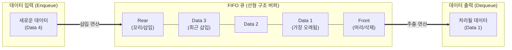

# FIFO (First-In, First-Out)

---

## I. 순서 보장과 선입선출 기반의 데이터 처리 방식, FIFO의 개요

* **정의**: 가장 먼저 삽입(Input)된 데이터나 프로세스가 가장 먼저 처리되고 출력(Output)되는 '선입선출(先入先出)' 원칙을 따르는 자료구조([[Queue]]) 및 [[스케줄링]] [[알고리즘]]
* **필요성 및 주요 특징**:
* **엄격한 순서 보장(Strict Ordering)**: 데이터가 유입된 순서대로 처리되어야 하는 [[트랜잭션]], 메시징 시스템, 스트리밍 환경에서 데이터의 정합성 유지
* **구현의 단순성**: 알고리즘과 자료구조(배열, 연결 리스트) 구현이 직관적이며 연산 오버헤드가 적음
* **다양한 도메인 적용**: OS의 [[프로세스]] 스케줄링(FCFS), 가상 메모리의 페이지 교체, 네트워크 [[라우터]] 버퍼, 클라우드 메시지 큐 등 IT 전반의 핵심 아키텍처로 활용

---

## II. FIFO의 동작 메커니즘 및 도메인별 응용 기술 요소

### 가. FIFO 자료구조(Queue)의 동작 개념도

* 데이터의 삽입은 큐의 한쪽 끝인 Rear(Tail)에서만 발생하고, 삭제 및 추출은 반대쪽 끝인 Front(Head)에서만 발생하는 양방향 개방형 구조를 가짐

### 나. 주요 IT 도메인별 FIFO 응용 기술 및 구성 요소

| 적용 도메인 | 요소기술(키워드) | 세부 설명 및 한계점 |
| --- | --- | --- |
| **자료 구조** | Queue (큐) | Enqueue(삽입)와 Dequeue(추출) 연산을 통해 데이터의 순차적 처리를 지원하는 선형 자료구조 |
| **자료 구조** | Circular Queue (원형 큐) | 1차원 배열 기반 선형 큐의 메모리 낭비(가짜 포화) 문제를 해결하기 위해 처음과 끝을 논리적으로 연결한 구조 |
| **OS 스케줄링** | FCFS (First-Come First-Served) | 준비 큐에 도착한 순서대로 [[CPU]]를 할당하는 비선점형 스케줄링 기법 |
| **OS 스케줄링** | Convoy Effect (호위 효과) | FCFS 환경에서 실행 시간이 긴 프로세스가 CPU를 독점하여 짧은 프로세스들의 대기 시간이 급증하는 현상 |
| **페이지 교체** | FIFO Page Replacement | 메모리에 가장 먼저 적재된 페이지를 우선적으로 교체하는 [[메모리 관리]] 기법 (구현이 쉬움) |
| **페이지 교체** | [[Belady's Anomaly]] (모순) | 할당된 페이지 프레임 수를 늘려도 오히려 페이지 부재(Page Fault)가 증가하는 FIFO 알고리즘의 구조적 한계 |
| **네트워크** | FIFO 버퍼링 | 라우터/스위치에서 패킷이 도착한 순서대로 큐잉 및 전송하는 가장 기본적인 [[QoS]] 처리 메커니즘 |
| **클라우드/아키텍처** | FIFO Message Queue | AWS SQS FIFO 등에서 분산 애플리케이션 간 메시지의 **정확히 1회 전송(Exactly-once)**과 **순차 처리**를 보장 |

---

## III. FIFO와 LIFO 비교 및 최신 분산 환경 적용 동향

### 가. 기초 자료구조 처리 방식 비교 (FIFO vs LIFO)

| 비교 항목 | FIFO (First-In, First-Out) | LIFO (Last-In, First-Out) |
| --- | --- | --- |
| **대표 자료구조** | 큐 (Queue) | 스택 ([[Stack]]) |
| **핵심 원리** | 먼저 들어온 데이터가 먼저 나감 | 가장 나중에 들어온 데이터가 먼저 나감 |
| **삽입/삭제 위치** | 양방향 (삽입: Rear, 삭제: Front) | 단방향 (삽입 및 삭제 모두 Top에서 발생) |
| **접근 속도** | Front와 Rear 포인터를 통해 $O(1)$ 속도 보장 | Top 포인터를 통해 $O(1)$ 속도 보장 |
| **주요 활용 분야** | 버퍼링, 메시지 큐, BFS(너비우선탐색), 인쇄 대기 | 함수 호출(Call Stack), 브라우저 뒤로가기, DFS탐색 |

### 나. 분산 시스템 환경에서의 FIFO 적용 동향 및 전망

* **분산 이벤트 주도 아키텍처([[EDA]])의 핵심**: 마이크로서비스([[MSA (Micro Service Architecture)|MSA]]) 간 비동기 통신에서 주문 처리, 재고 차감 등 순서가 엄격하게 지켜져야 하는 트랜잭션의 정합성을 보장하기 위해 **Apache Kafka의 [[파티셔닝|파티션]](Partition) 순서 보장** 및 **AWS SQS FIFO 큐**가 표준 인프라로 널리 채택됨
* **[[처리량]](Throughput) 한계 극복 기법 적용**: 엄격한 FIFO를 적용할 경우 분산 처리의 이점(병렬성)이 제한되어 병목이 발생할 수 있으므로, 최근에는 **메시지 그룹화(Message Group ID)** 및 Sharding([[샤딩]])을 통해 논리적 그룹 내에서만 FIFO를 보장하고, 그룹 간에는 병렬 처리를 수행하여 순서 보장과 고가용성을 동시에 달성하는 아키텍처로 고도화되고 있음

---

### 🔗 연관 토픽

- **소속 도메인**: [[00_운영체제_MOC|⚙️ 운영체제]]
- **세부 분류**: `1. 프로세스 & 스레드 관리`
- **핵심 연관 토픽**:
  - [[스케줄링]]
  - [[Belady's Anomaly]]
  - [[Queue]]
  - [[Stack]]
  - [[처리량]]
