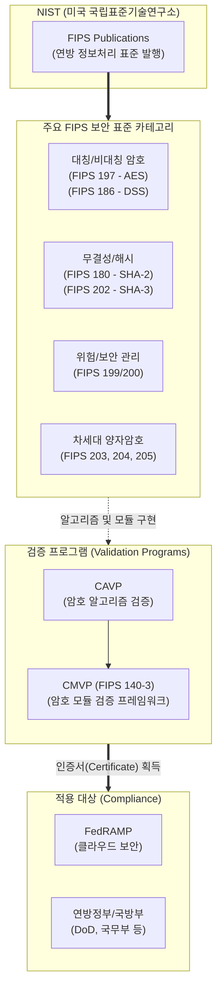

# FIPS (Federal Information Processing Standards)

---

## I. 미국 연방 정보처리 표준, FIPS의 개요

* **정의**: 미국 국립표준기술연구소(NIST)가 연방정부 및 정부 계약업체의 정보 시스템 보안, 상호운용성, 데이터 품질을 보장하기 위해 제정한 정보처리 표준 규격
* **필요성 및 주요 특징**:
* **강력한 보안 기준 제공**: 군사 목적 외의 중요 민감 데이터(CUI: 비분류 통제 정보) 보호를 위한 필수 [[암호화]] 및 보안 관리 지침 제공
* **글로벌 사실상 표준(De Facto Standard)**: 미국 정부용 표준이지만, 글로벌 IT 기업([[CSP]], 보안 솔루션 등)들이 준수함으로써 전 세계 사이버 보안 산업의 실질적 표준으로 기능
* **[[신뢰성]] 검증 체계 확립**: CMVP(암호 모듈 검증), CAVP([[암호 알고리즘]] 검증) 등의 프로그램을 통해 상용 암호 제품에 대한 객관적인 신뢰성 검증 기준 역할 수행

---

## II. FIPS의 개념도 및 주요 표준 구성 요소

### 가. FIPS 기반 암호 및 보안 검증 체계 개념도

* NIST는 데이터 암호화, 해시, 전자서명 등의 개별 [[알고리즘]] 표준을 제정하고, 이를 융합한 암호 모듈의 물리적/논리적 보안성을 CMVP(FIPS 140 시리즈)를 통해 검증함
* 인증을 통과한 모듈은 미국 연방정부 인프라 및 FedRAMP(클라우드 인증) 환경에서 필수적으로 사용됨

### 나. FIPS의 핵심 기술 및 구성 요소

| 구분 | 주요 규격/요소 (키워드) | 세부 설명 |
| --- | --- | --- |
| **모듈 검증** | FIPS 140-3 (CMVP) | 하드웨어 및 소프트웨어 암호 모듈의 보안 요구사항 (Security Level 1~4 단계로 차등 검증) |
| **대칭키 암호** | FIPS 197 (AES) | [[DES]]를 대체하는 고급 암호화 표준([[AES|Advanced Encryption Standard]])으로 128, 192, 256비트 키 길이 지원 |
| **[[전자 서명]]** | FIPS 186 (DSS) | [[RSA (Rivest Shamir Adleman)|RSA]], [[DSA]], ECDSA 등 디지털 서명 생성 및 검증을 위한 표준 규격 |
| **해시 함수** | FIPS 180-4 / 202 | 데이터 [[무결성]] 검증을 위한 SHA-1, SHA-2(180-4) 및 스펀지 구조 기반의 SHA-3(202) 표준 |
| **보안 관리** | FIPS 199 / 200 | 연방 정보 시스템의 보안 범주화([[기밀성]], 무결성, [[HA(High Availability)|가용성]] 영향도 평가) 및 최소 보안 통제 요구사항 |
| **차세대 암호** | FIPS 203 (ML-KEM) | 양자 컴퓨팅 공격에 내성을 갖는 격자(Lattice) 기반의 키 [[캡슐화]] 메커니즘(KEM) 표준 (2024년 8월 확정) |
| **차세대 암호** | FIPS 204 (ML-DSA) | 양자 컴퓨터의 해독을 방어하는 격자 기반의 차세대 디지털 서명 알고리즘 표준 |
| **국제 부합성** | ISO/IEC 19790 | 기존 미국 독자 기준이었던 FIPS 140-2를 국제 표준(ISO)과 조화시켜 FIPS 140-3으로 개정 반영 |

---

## III. 암호 모듈 검증 표준 비교 및 최신 동향

### 가. FIPS 140-2와 FIPS 140-3 비교

| 비교 항목 | FIPS 140-2 | FIPS 140-3 |
| --- | --- | --- |
| **제정 및 적용 기한** | 2001년 제정 (2021년 신규 검증 중단) | 2019년 승인 (현재 모든 신규 검증의 기준) |
| **국제 표준 부합성** | 미국 NIST 독자적 요구사항 기반 | **ISO/IEC 19790 및 24759 국제 표준 수용** |
| **물리적 보안 요구** | 보안 등급별로 다소 완화된 기준 적용 | 침입 탐지/대응 등 물리적 변조 방지 요구사항 대폭 강화 |
| **소프트웨어 보안** | 제한적인 실행 환경 검증 | 최신 모바일, 클라우드 [[가상화]] 및 [[컨테이너]] 환경의 보안 요소 반영 |
| **[[부채널 공격]] 대응** | 선택적/부가적 요구 사항 | 타이밍, 전력 분석 등 비침투적(Non-invasive) 부채널 공격 방어 의무화 |

### 나. FIPS의 최신 보안 동향 및 향후 전망

* **[[양자내성암호]](PQC) FIPS 표준화 완료**: 양자 컴퓨터의 '쇼어 알고리즘'에 의한 기존 암호 체계 붕괴를 막기 위해, NIST는 2024년 8월 **FIPS 203, 204, 205** 등 양자내성암호 최종 표준을 공식 확정하였으며, 글로벌 IT 기업들의 암호 민첩성(Crypto Agility) 확보 및 전환이 본격화됨
* **제로 트러스트([[제로 트러스트 보안모델|Zero Trust]]) 인프라의 근간**: 미국 행정명령(EO 14028)에 따른 제로 트러스트 아키텍처 의무화로 인해, 모든 데이터의 이동(in-transit) 및 저장(at-rest) 시 반드시 **FIPS 140-3 검증을 필한 암호 모듈 사용이 강제**되고 있으며, 이는 공공 시장에 진입하려는 민간 클라우드 서비스(CSP)의 필수 컴플라이언스로 확고히 자리매김함

---

### 🔗 연관 토픽

- **소속 도메인**: [[00_보안_MOC|🛡️ 보안]]
- **세부 분류**: `2. 현대 암호학 & 키 관리 · 전자서명`
- **핵심 연관 토픽**:
  - [[양자내성암호]]
  - [[암호화|암호화 (Encryption)]]
  - [[암호 알고리즘]]
  - [[DSA]]
  - [[RSA (Rivest Shamir Adleman)]]
