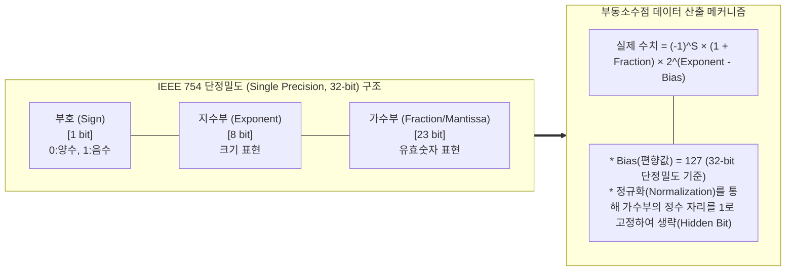

# Float Type (부동소수점 자료형)

---

## I. 광범위한 실수 표현을 위한 컴퓨터 수치 데이터, Float Type의 개요

* **정의**: 컴퓨터 시스템에서 매우 크거나 미세한 실수를 효율적으로 메모리에 저장하기 위해, 숫자를 부호(Sign), 지수부(Exponent), 가수부(Mantissa)로 분할하여 근사값으로 표현하는 자료형 (IEEE 754 표준)
* **필요성 및 주요 특징**:
* **광범위한 동적 범위(Dynamic Range)**: 고정소수점(Fixed-point) 방식 대비 한정된 비트(예: 32bit, 64bit) 공간 안에서 표현할 수 있는 수치 범위가 기하급수적으로 넒음
* **메모리 최적화 및 범용성**: 유효숫자 중심의 데이터 저장 방식을 통해 과학 기술 연산, 그래픽 렌더링, 시뮬레이션 등 범용적 IT 환경의 표준 수치 체계로 활용
* **정밀도 한계 및 오차 내재**: 무한소수나 순환소수를 유한한 비트로 저장하는 과정에서 절단(Truncation) 및 반올림(Rounding)이 발생하여 태생적인 정밀도 오차 존재

---

## II. Float Type의 개념도 및 핵심 기술 요소

### 가. Float Type(IEEE 754 단정밀도)의 메모리 구조 개념도

* 부동소수점은 소수점의 위치를 고정하지 않고, 유효숫자를 나타내는 가수부와 소수점의 위치를 나타내는 지수부를 곱하는 과학적 기수법(Scientific Notation)을 이진수로 구현한 체계임

### 나. Float Type의 핵심 기술 및 구성 요소

| 구분 | 요소기술(키워드) | 세부 설명 |
| --- | --- | --- |
| **국제 표준** | IEEE 754 | 컴퓨터 부동소수점 연산에 관한 글로벌 표준 (단정밀도 32bit, 배정밀도 64bit 규정) |
| **메모리 구성** | Sign Bit (부호) | 최상위 1비트로 구성되며, 값의 양수(0)와 음수(1) 상태를 결정 |
| **메모리 구성** | Exponent (지수부) | 소수점의 위치를 나타내며, 음수 지수 표현을 위해 **Bias(편향값)**를 더하여 저장 (2의 보수 미사용) |
| **메모리 구성** | Mantissa (가수부) | 실질적인 유효숫자를 저장하는 공간으로, 비트 수가 많을수록 정밀도(Precision)가 높아짐 |
| **처리 메커니즘** | Normalization (정규화) | 이진수 형태에서 첫 번째 유효숫자가 항상 1이 되도록 소수점을 이동시켜 표현을 단일화하는 과정 |
| **처리 메커니즘** | Hidden Bit (숨은 비트) | 정규화된 이진수는 항상 '1.xxx'로 시작하므로, 정수부 '1'을 메모리에 저장하지 않고 생략하여 1비트를 절약 |
| **예외 상태** | NaN (Not a Number) | 0/0이나 $\sqrt{-1}$과 같이 수학적으로 정의할 수 없는 연산 결과 (지수부 111...1, 가수부 $\neq$ 0) |
| **예외 상태** | Infinity (무한대) | 0으로 나누기 등 표현 범위를 초과한 오버플로우 상태 (지수부 111...1, 가수부 = 0) |

---

## III. 고정소수점과의 비교 및 AI 패러다임에 따른 최신 동향

### 가. 데이터 타입 비교 (Fixed-point vs Floating-point)

| 비교 항목 | 고정소수점 (Fixed-point) | 부동소수점 (Floating-point) |
| --- | --- | --- |
| **메모리 구조** | 정수부와 소수부의 비트 길이를 고정 | 부호, 지수부, 가수부로 가변적(동적) 구성 |
| **표현 범위 / 정밀도** | 좁은 동적 범위 / **오차 없는 정확한 연산** | **넓은 동적 범위** / 근사값으로 인한 미세 오차 발생 |
| **연산 속도 / H/W** | 구조가 단순하여 정수 연산기(ALU)로 고속 처리 | 복잡한 정규화 과정으로 인해 전용 FPU(부동소수점 연산 장치) 필요 |
| **주요 활용 분야** | 금융/회계(정확도 필수), 임베디드, IoT 센서 | AI/[[딥러닝]], 3D 그래픽스, 과학 시뮬레이션, 범용 애플리케이션 |

### 나. AI 모델 경량화를 위한 차세대 Float Type 활용 동향

* **초거대 AI 학습/추론의 병목 해소**: [[초거대 언어 모델|LLM]](대규모 언어 모델) 등 딥러닝 모델의 파라미터 폭증에 따른 VRAM([[GPU]] 메모리) 한계 및 연산 지연을 극복하기 위해, 전통적인 FP32(32비트) 대신 **FP16, Bfloat16(Brain Floating Point), FP8** 등의 경량 부동소수점 포맷이 업계 표준으로 급부상 중임
* **Bfloat16 (BF16)의 대세화**: 구글이 제안한 Bfloat16은 16비트만 사용하되, 지수부(8비트)를 FP32와 동일하게 유지하여 **동적 범위를 보존**하고 가수부(7비트)만 축소함. 딥러닝에서는 소수점 아래 미세한 정밀도보다, 언더플로우/오버플로우를 막는 넓은 동적 범위가 가중치(Weight) 학습에 훨씬 유리하므로 최신 AI 반도체([[NPU]], [[TPU (Tensor Processing Unit)|TPU]], 최신 GPU)의 핵심 연산 포맷으로 채택됨

---

### 🔗 연관 토픽

- **소속 도메인**: [[00_소프트웨어공학_MOC|🏗️ 소프트웨어공학]]
- **세부 분류**: `2. 애자일(Agile) & 지속적 통합/배포(CI/CD)`
- **핵심 연관 토픽**:
  - [[초거대 언어 모델|초거대 언어 모델(Large Language Model)]]
  - [[딥러닝]]
  - [[GPU]]
  - [[TPU (Tensor Processing Unit)]]
  - [[STPA|STPA (System-Theoretic Process Analysis)]]
