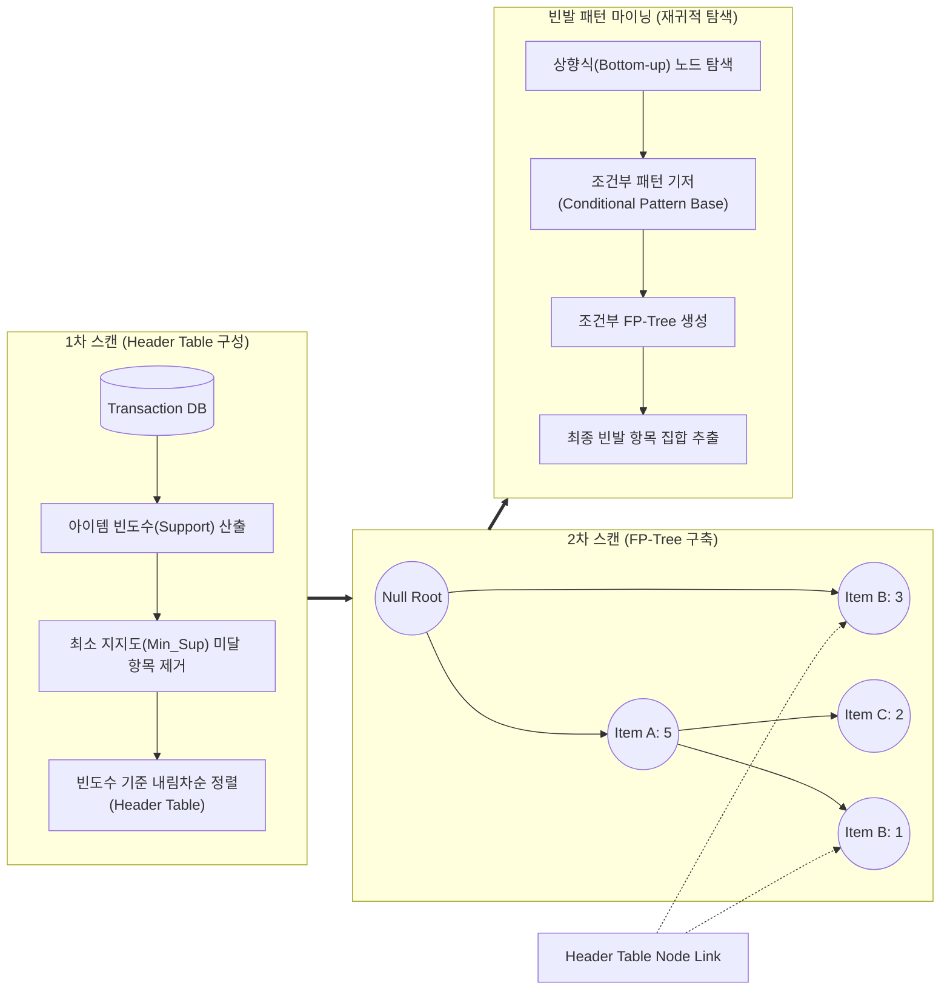

# FP-Growth (Frequent Pattern Growth)

---

## I. Apriori 한계 극복을 위한 고속 연관 규칙 마이닝, FP-Growth 알고리즘의 개요

* **정의**: [[트랜잭션]] 데이터베이스를 스캔하여 빈발 항목 집합을 FP-Tree라는 고도로 압축된 트리 자료구조로 메모리에 구축한 후, 후보 생성(Candidate Generation) 과정 없이 연관 규칙을 추출하는 [[데이터 마이닝]] [[알고리즘]]
* **필요성 및 주요 특징**:
* **후보 생성 배제 (Candidate-free)**: 기존 Apriori 알고리즘의 막대한 후보 집합 생성 및 검증에 따른 병목 현상과 메모리 오버헤드를 원천적으로 제거
* **DB 스캔 최소화**: 전체 [[데이터베이스]] 스캔 횟수를 단 2회로 제한하여 대규모 트랜잭션 처리 속도를 비약적으로 향상
* **분할 정복 (Divide and Conquer)**: 전체 트리를 조건부 트리로 쪼개어 탐색 공간을 재귀적으로 축소해가며 빠르게 빈발 패턴을 발굴

---

## II. FP-Growth 알고리즘의 개념도 및 핵심 기술 요소

### 가. FP-Growth 알고리즘의 동작 개념도

* 트랜잭션 DB를 2회 스캔하여 'Header Table'과 접두사 공유 기반의 압축된 'FP-Tree'를 메모리에 생성함
* Header Table의 역순(상향식)으로 노드를 쫓아가며 '조건부 패턴 기저'를 추출하고, 이를 기반으로 '조건부 FP-Tree'를 재귀적으로 구축하여 빈발 패턴을 완성함

### 나. FP-Growth의 핵심 기술 및 구성 요소

| 구분 | 요소기술(키워드) | 세부 설명 |
| --- | --- | --- |
| **기준 지표** | Minimum Support (최소 [[지지도]]) | 특정 아이템이 빈발 패턴으로 인정받기 위해 만족해야 하는 최소한의 출현 빈도 기준 |
| **자료 구조** | Header Table (헤더 테이블) | 1차 스캔 결과로 아이템 이름, 전체 빈도수, FP-Tree 내 동일 아이템을 연결하는 포인터를 내림차순으로 저장 |
| **자료 구조** | FP-Tree (Frequent Pattern Tree) | 2차 스캔을 통해 트랜잭션 데이터를 Prefix-Tree 형태로 압축하여 메모리에 상주시키는 핵심 데이터 구조 |
| **탐색 지원** | Node Link (노드 링크) | 헤더 테이블에서 시작하여 트리 내에 흩어져 있는 동일한 아이템 노드들을 연결된 리스트 형태로 이어주는 포인터 |
| **패턴 추출** | Conditional Pattern Base | 특정 아이템(Suffix)을 기준으로 FP-Tree를 역추적하여, 해당 아이템과 함께 발생한 접두사 경로(Prefix Path)들의 집합 |
| **패턴 추출** | Conditional FP-Tree | 추출된 조건부 패턴 기저를 바탕으로, 지지도 기준을 충족하는 아이템들만으로 새롭게 구축한 소규모 FP-Tree |
| **알고리즘 원리** | Divide and Conquer (분할 정복) | 거대한 FP-Tree를 여러 개의 독립적인 조건부 FP-Tree로 나누어 병렬 및 재귀적으로 연산을 수행하는 메커니즘 |
| **알고리즘 원리** | Recursive Mining (재귀적 탐색) | 조건부 FP-Tree에서 더 이상 빈발 아이템이 나오지 않을 때까지 서브 트리를 반복 탐색하여 최종 패턴 집합 도출 |

---

## III. 연관 규칙 마이닝 알고리즘 비교 및 최신 동향

### 가. Apriori와 FP-Growth 알고리즘 비교

| 비교 항목 | [[Apriori 알고리즘]] | FP-Growth 알고리즘 |
| --- | --- | --- |
| **주요 탐색 원리** | 후보 집합 생성 후 검증 (Generate and Test) | 압축 트리 구축 후 분할 정복 (Divide and Conquer) |
| **DB 스캔 횟수** | 트랜잭션 최대 길이만큼 **다중 스캔 발생 (최대 $k$번)** | 항목 집합 크기와 무관하게 **단 2회 고정 스캔** |
| **메모리 소모량** | 방대한 후보 집합(Candidate Sets) 생성으로 메모리 낭비 | 후보 생성이 없으며, Prefix 공유로 트리 고압축 저장 |
| **실행 속도** | 처리 속도가 매우 느림 | 구조 탐색만으로 연산하므로 **속도가 비약적으로 빠름** |
| **주요 적용 환경** | 소규모 데이터셋, 이해하기 쉬운 단순 연관규칙 | 대형 커머스의 방대한 트랜잭션, 빅데이터 환경 |

### 나. FP-Growth의 발전 및 최신 적용 동향

* **분산/병렬 처리 기반의 PFP (Parallel FP-Growth)**: 넷플릭스, 아마존 등 대규모 유통/콘텐츠 플랫폼에서는 단일 머신의 메모리 한계를 극복하기 위해, MapReduce나 Apache Spark [[프레임워크]] 기반으로 FP-Tree 연산을 분산 처리하는 PFP 구조를 개인화 추천 시스템(Recommendation System)의 핵심 엔진으로 활용하고 있음
* **실시간 스트리밍 환경 대응**: 끊임없이 유입되는 스트리밍 데이터 환경에 대응하기 위해, 전체 DB를 재스캔하지 않고 FP-Tree의 구조를 동적으로 갱신(Incremental Update)하는 FP-Stream 형태의 스트리밍 데이터 마이닝 기법으로 발전 중임

---

### 🔗 연관 토픽

- **소속 도메인**: [[00_데이터베이스_MOC|🗄️ 데이터베이스]]
- **세부 분류**: `2. 트랜잭션 & 동시성 제어 (Concurrency)`
- **핵심 연관 토픽**:
  - [[Apriori 알고리즘]]
  - [[트랜잭션]]
  - [[데이터베이스]]
  - [[지지도]]
  - [[데이터 마이닝|Data Mining (데이터 마이닝)]]
