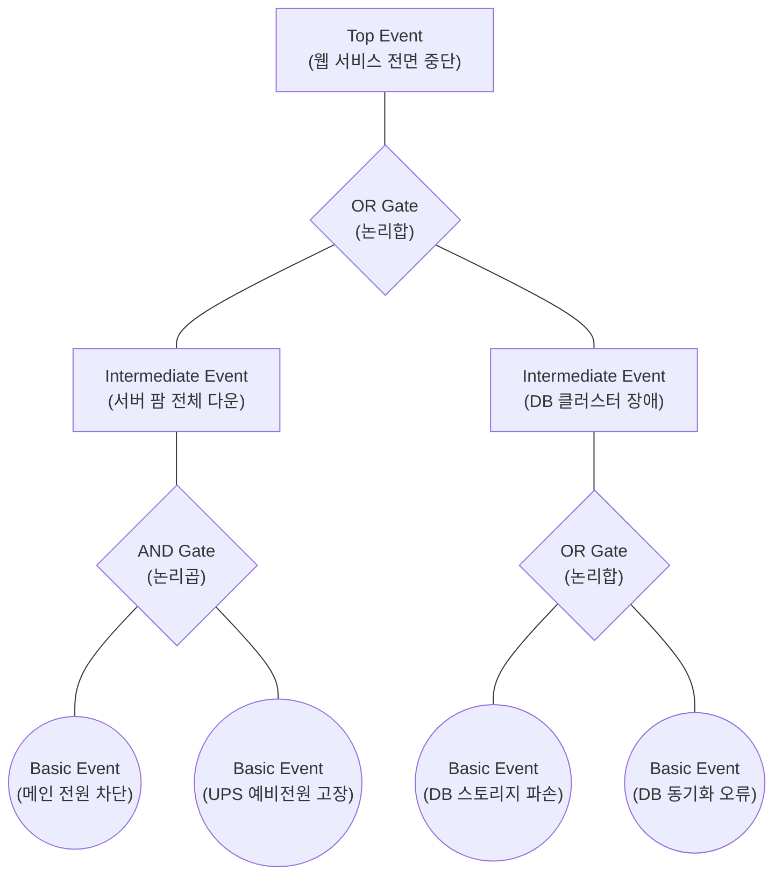

# FTA (Fault Tree Analysis)

---

## I. 하향식, 연역적 시스템 결함 분석 기법, FTA의 개요

* **정의**: 시스템의 원하지 않는 최종 상태(Top Event)를 먼저 정의하고, 이를 유발하는 하위 결함 원인들을 논리 게이트(Boolean Logic)를 통해 하향식(Top-Down)으로 분석하는 귀납적/연역적 위험성 평가 기법
* **필요성 및 주요 특징**:
* **근본 원인 식별(RCA)**: 복잡한 시스템에서 특정 사고를 유발하는 치명적인 결함 경로(Cut Set) 및 단일 장애점(SPOF) 식별
* **정량적/정성적 분석**: 논리 기호를 통한 고장 메커니즘의 구조적 파악(정성적) 및 기본 사건 발생 확률을 조합한 최상위 사고 발생 확률 산출(정량적)
* **연역적 접근**: 결과(사고)에서 출발하여 원인(부품 고장, 인적 오류 등)을 역추적하는 하향식 논리 전개 (Deductive Logic)

---

## II. FTA의 개념도 및 핵심 구성 요소

### 가. FTA의 아키텍처 개념도 및 동작 원리

* 분석 대상인 최상위 사건(Top Event)을 도출한 후, AND/OR 등의 논리 게이트를 사용하여 더 이상 쪼갤 수 없는 기본 사건(Basic Event)에 도달할 때까지 트리 형태로 분해함
* AND 게이트 하위의 사건들은 모두 발생해야 상위 사건을 유발하며(확률 곱), OR 게이트 하위 사건들은 하나만 발생해도 상위 사건을 유발함(확률 합)

### 나. FTA의 핵심 기술 및 구성 요소

| 구분 | 요소기술(키워드) | 세부 설명 |
| --- | --- | --- |
| **사건 요소** | Top Event (최상위 사건) | 분석의 최종 목적이 되는 시스템의 치명적인 고장이나 사고 상태 (트리의 최상단) |
| **사건 요소** | Basic Event (기본 사건) | 더 이상 원인을 규명할 필요나 데이터가 없는 시스템 결함의 최소 단위 (트리의 단말 노드) |
| **사건 요소** | Intermediate Event (중간 사건) | 기본 사건들의 조합으로 발생하여 상위 사건을 유발하는 논리적 중간 단계의 결함 상태 |
| **논리 기호** | AND Gate (논리곱) | 입력되는 하위 사건들이 **동시에 모두 발생**해야만 상위 사건이 발생 ($P = P_A \times P_B$) |
| **논리 기호** | OR Gate (논리합) | 입력되는 하위 사건 중 **어느 하나라도 발생**하면 상위 사건이 발생 ($P \approx P_A + P_B$) |
| **핵심 지표** | Cut Set (컷 셋) | 정상 사건(Top Event)을 발생시키기 위해 필요한 기본 사건들의 집합 |
| **핵심 지표** | Minimal Cut Set (최소 컷셋) | 상위 사건을 일으키기 위한 **최소한의 필요충분 조건**을 갖춘 기본 사건의 집합 (시스템의 취약 경로 식별) |
| **분석 기법** | Boolean Algebra (불 대수) | 논리 게이트로 연결된 결함 트리의 수식을 간소화하고 정량적 확률을 연산하는 수학적 기법 |

---

## III. 위험성 평가 기법 비교 및 최근 동향

### 가. 시스템 결함 분석 기법 비교 (FTA vs ETA)

| 비교 항목 | FTA (Fault Tree Analysis) | [[ETA (Event Tree Analysis)]] |
| --- | --- | --- |
| **분석 방향** | 결과 $\rightarrow$ 원인 (Backward-looking) | 원인 $\rightarrow$ 결과 (Forward-looking) |
| **논리 전개** | 하향식(Top-Down), 연역적(Deductive) | 상향식(Bottom-Up)/순방향, 귀납적(Inductive) |
| **구조 형태** | 논리 게이트(AND, OR) 중심의 트리 구조 | 사건 발생 유무(Success/Fail) 분기 중심의 트리 구조 |
| **시작 및 귀결** | 단일 사고(Top)에서 복수 원인 규명 | 단일 원인(초기 사건)에서 복수 귀결 시나리오 예측 |
| **주요 목적** | 고장/사고의 근본 원인(RCA) 및 취약점 도출 | 사고 발생 시 방호 시스템의 작동 및 피해 규모 예측 |

### 나. FTA의 최신 활용 동향 및 발전 방향

* **동적 결함 트리 분석(DFTA, Dynamic FTA) 도입**: 기존의 정적인 Boolean 논리로는 시스템 부품 간의 고장 순서나 시간적 의존성(예: 대기-예비 시스템, 고장 복구 시간)을 표현하기 어려움. 이를 극복하기 위해 마르코프 체인(Markov Chain)과 결합하여 시간에 따른 고장 전이 상태를 모델링하는 DFTA가 원전 및 [[Smart Car(자율주행)|자율주행]] 안전 분석에 도입됨
* **MBSE(모델 기반 시스템 엔지니어링)와의 결합**: 시스템 아키텍처가 점차 복잡해짐에 따라, 수작업 기반의 FTA 작성을 탈피하여 SysML 등으로 설계된 디지털 모델에서 시스템 고장 트리를 자동 생성하고 시뮬레이션하는 **자동화된 결함 주입 및 트리 모델링** 기술이 우주항공 및 국방 도메인의 핵심 안전 분석 기법으로 부상하고 있음

---

### 🔗 연관 토픽

- **소속 도메인**: [[00_소프트웨어공학_MOC|🏗️ 소프트웨어공학]]
- **세부 분류**: `6. 소프트웨어 테스팅 & 품질 보증 (QA/QC)`
- **핵심 연관 토픽**:
  - [[ETA (Event Tree Analysis)]]
  - [[기능안전 표준|기능안전 표준 (Functional Safety Standards)]]
  - [[SW 안전성(SW Safety) 및 분석 개념]]
  - [[위험 기반 테스트]]
  - [[STPA|STPA (System-Theoretic Process Analysis)]]
