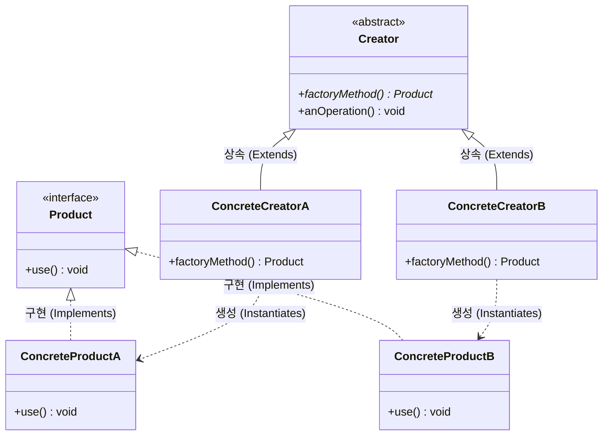

# Factory Method (생성 위임)

---

## I. 객체 생성의 캡슐화와 유연성 확장을 위한, Factory Method의 개요

* **정의**: 상위 [[클래스]](Creator)에서 객체 생성을 위한 인터페이스를 정의하고, 어떤 클래스의 인스턴스를 생성할지에 대한 결정은 하위 클래스(Subclass)에게 위임하는 GoF 생성 [[디자인 패턴]]
* **필요성 및 등장배경/특징**:
* **[[결합도]] 감소(Decoupling)**: 객체 생성 로직을 클라이언트 코드에서 분리하여 캡슐화함으로써, 구체 클래스(Concrete Class)에 대한 의존성 최소화
* **OCP(개방-폐쇄 원칙) 준수**: 기존 코드를 수정하지 않고 새로운 종류의 제품 클래스를 시스템에 원활하게 추가 가능 (확장에는 열려있고 변경에는 닫힘)
* **[[다형성]] 기반 인스턴스화**: 상속과 메서드 오버라이딩(Overriding)을 활용하여 런타임 시점에 적합한 인스턴스를 동적으로 생성

---

## II. Factory Method의 개념도 및 핵심 구성 요소

### 가. Factory Method의 클래스 다이어그램 및 동작 원리

* `Creator`의 `anOperation()`(비즈니스 로직) 내에서 객체가 필요할 때, 직접 객체를 생성(new)하지 않고 추상 메서드인 `factoryMethod()`를 호출함
* 하위 클래스인 `ConcreteCreator`가 `factoryMethod()`를 오버라이딩하여 자신에게 맞는 구체적인 객체(`ConcreteProduct`)를 생성하여 반환함

### 나. Factory Method의 핵심 기술 및 구성 요소

| 구분 | 구성 요소 (키워드) | 세부 설명 및 역할 |
| --- | --- | --- |
| **제품 인터페이스** | Product | 팩토리 메서드에 의해 생성될 객체들이 공통으로 가져야 할 인터페이스나 추상 클래스 정의 |
| **구체적 제품** | ConcreteProduct | Product 인터페이스를 실제로 구현한 구체적인 서브 클래스 (실제 생성되는 객체) |
| **생성자 [[추상화]]** | Creator | Product 타입의 객체를 반환하는 팩토리 메서드(`factoryMethod()`)를 선언하는 상위 클래스 |
| **구체적 생성자** | ConcreteCreator | 부모 클래스의 팩토리 메서드를 오버라이딩하여 실제 ConcreteProduct의 인스턴스를 반환 |
| **핵심 메커니즘** | 생성 위임 (Delegation) | 상위 클래스는 인스턴스를 만드는 방법만 선언하고, 실제 생성은 하위 클래스에게 책임을 넘김 |
| **핵심 메커니즘** | Virtual Constructor | C++ 등의 언어에서 가상 함수(Virtual Function)를 이용해 런타임에 다형성으로 생성자를 호출하는 효과 |
| **설계 원칙** | OCP (개방-폐쇄 원칙) | 신규 제품(Product C)이 추가되어도 상위 Creator나 클라이언트 코드는 변경 없이 하위 팩토리만 추가 |
| **설계 원칙** | DIP (의존성 역전 원칙) | 구상 클래스가 아닌 추상화된 Product 인터페이스에 의존하도록 유도하여 시스템 유연성 향상 |

---

## III. Factory Method와 Abstract Factory 비교 및 활용 전략

### 가. 유사 생성 패턴 간 비교 (Factory Method vs Abstract Factory)

| 비교 항목 | Factory Method (팩토리 메서드) | Abstract Factory (추상 팩토리) |
| --- | --- | --- |
| **생성 목적** | **단일 객체(Product)**의 생성 위임 | 관련된 **여러 객체 군(Family)**의 통합 생성 |
| **구현 방식** | 상속(Inheritance) 및 오버라이딩 기반 | 객체 합성(Composition) 및 인터페이스 기반 |
| **초점 (Focus)** | 객체 생성의 책임을 하위 클래스로 분리 | 일관된 객체 군을 함께 묶어서 생성하도록 강제 |
| **복잡도** | 구조가 상대적으로 단순하고 적용이 쉬움 | 제품군이 늘어날수록 클래스 수와 계층 구조가 복잡해짐 |
| **적용 사례** | 프레임워크의 특정 템플릿 로직 내 객체 생성 | 크로스 플랫폼 UI(Windows/[[MAC|Mac]]) 컴포넌트 일괄 생성 |

### 나. Factory Method의 한계점 및 최신 활용 동향

* **클래스 폭발(Class Explosion) 주의**: 제품(Product)의 종류가 증가할 때마다 그에 대응하는 구체 팩토리(ConcreteCreator) 클래스도 1:1로 함께 만들어야 하므로 전체 클래스 개수가 기하급수적으로 늘어나는 단점 존재
* **[[프레임워크]] 핵심 아키텍처로 정착**: Spring 프레임워크의 `BeanFactory` 및 안드로이드의 `ViewModelProvider.Factory` 등, 현대의 IoC(제어의 역전) 기반 컨테이너와 DI(의존성 주입) 환경에서 유연한 객체 생성을 위한 근간 패턴으로 널리 활용되고 있음

---

### 🔗 연관 토픽

- **소속 도메인**: [[00_소프트웨어공학_MOC|🏗️ 소프트웨어공학]]
- **세부 분류**: `4. 아키텍처 스타일 & 객체지향 설계 원리`
- **핵심 연관 토픽**:
  - [[디자인 패턴|디자인 패턴 (Design Pattern)]]
  - [[프레임워크]]
  - [[Design Pattern (23개 패턴)]]
  - [[다형성|다형성 (Polymorphism)]]
  - [[결합도]]
