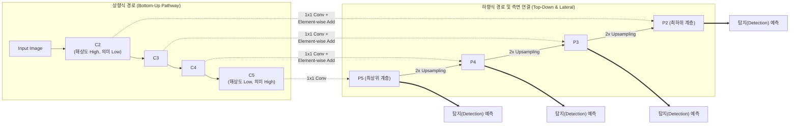

# Feature Pyramid Network (FPN)

---

## I. 다양한 크기의 객체 탐지를 위한 특징 추출 아키텍처, Feature Pyramid Network의 개요

* **정의**: 컴퓨터 비전 모델에서 하향식 경로(Top-down)와 측면 연결(Lateral Connection)을 활용하여, 높은 공간 해상도(Spatial Resolution)와 강력한 의미 정보(Semantic Information)를 결합한 다중 스케일 특징 맵을 구축하는 [[딥러닝]] 아키텍처 기술
* **필요성 및 등장배경/특징**:
* **작은 객체 탐지(Small Object Detection) 한계 극복**: 기존 [[CNN]]의 최상위 계층만 사용할 경우 공간 정보가 유실되어 작은 객체 탐지율이 저하되는 문제 해결
* **연산 효율성 확보**: 여러 해상도의 이미지를 입력하는 이미지 피라미드(Image Pyramid) 방식의 막대한 컴퓨팅 연산 오버헤드 해소
* **풍부한 의미망 구성**: 상위 계층의 강한 의미적 특징을 하위 계층으로 전달하여, 모든 해상도의 특징 맵이 강력한 문맥(Context) 정보를 보유하도록 아키텍처 개선

---

## II. Feature Pyramid Network의 개념도 및 핵심 기술 요소

### 가. Feature Pyramid Network의 개념도 및 동작 원리

* 상향식 경로에서 크기가 감소하며 추출된 특징맵을 하향식 경로에서 업샘플링하여 크기를 복원함
* 이후 1x1 합성곱을 거친 상향식 특징맵과 요소별 덧셈(Element-wise Addition)으로 병합하여, 각 피라미드 레벨마다 독립적인 객체 탐지(Prediction)를 수행함

### 나. Feature Pyramid Network의 핵심 기술 및 구성 요소

| 구분 | 요소기술(키워드) | 세부 설명 |
| --- | --- | --- |
| **아키텍처 경로** | Bottom-up Pathway | 입력 이미지로부터 특징을 추출하며, 공간 차원은 1/2씩 감소시키고 의미적 특징은 심화시키는 전방향 네트워크(ResNet 등) |
| **아키텍처 경로** | Top-down Pathway | 최상위 특징 맵이 가진 고차원 의미 정보(Semantic)를 하위 계층으로 전파하기 위해 해상도를 복원하는 경로 |
| **핵심 결합망** | Lateral Connection | 상향식 경로의 정확한 위치 정보(Spatial)와 하향식 경로의 의미 정보를 동일한 해상도에서 결합하는 측면 연결망 |
| **[[차원 축소]]** | 1x1 Convolution | 측면 연결 시, 하향식 특징 맵의 채널 수와 맞추기 위해 상향식 특징 맵의 차원을 축소시키는 연산 |
| **크기 복원** | 2x Upsampling | Nearest Neighbor 방식 등을 사용하여 상위 계층의 특징 맵 가로/세로 해상도를 2배로 확대 |
| **연산 기법** | Element-wise Addition | 해상도와 채널이 동일해진 두 특징 맵(상향/하향)의 동일한 위치 값을 더하여 하나로 융합(Merge) |
| **후처리 최적화** | 3x3 Convolution | 병합된 특징 맵에서 업샘플링으로 인해 발생할 수 있는 앨리어싱(Aliasing) 효과를 완화하기 위한 추가 합성곱 연산 |
| **탐지 메커니즘** | Multi-scale Prediction | 융합이 완료된 개별 피라미드 레벨(P2~P5) 계층마다 각각 독립적인 Classifier 및 Bounding Box Regressor 적용 |

---

## III. FPN과 기존 다중 스케일 탐지 기법 비교 및 최신 동향

### 가. 다중 스케일 객체 탐지 아키텍처 비교

| 비교 항목 | Image Pyramid | Pyramidal Feature Hierarchy (SSD) | Feature Pyramid Network (FPN) |
| --- | --- | --- | --- |
| **특징 맵 생성 방식** | 이미지를 다양한 해상도로 리사이징하여 각각 네트워크 입력 | 단방향(Bottom-up) 네트워크의 각 합성곱 계층에서 특징맵 추출 | 양방향(Bottom-up + Top-down) 경로 결합을 통한 다중 특징맵 생성 |
| **의미 정보 (Semantic)** | 모든 스케일에서 우수함 | 하위 계층일수록 의미 정보가 얕고 부족함 | **하위 계층에도 상위의 깊은 의미 정보 전달** |
| **연산량 (속도)** | 연산량 매우 큼 (가장 느림) | 연산량 적음 (속도 빠름) | 측면 연결 오버헤드 수준으로 연산량 적음 |
| **작은 객체 탐지율** | 우수함 | 매우 취약함 | **매우 우수함** |

### 나. FPN의 산업 활용 및 차세대 발전 동향

* **객체 탐지 모델의 표준 백본(Backbone)화**: FPN은 그 자체로 단독 모델이 아니며, Faster R-CNN, Mask R-CNN, RetinaNet 등의 2-Stage 및 1-Stage 객체 탐지 네트워크의 특징 추출기로 결합되어 성능을 비약적으로 향상하는 업계 표준으로 자리잡음
* **양방향 특징 피라미드(BiFPN)로의 진화**: 기존 FPN의 단순한 하향식 연결을 개선하여, 구글의 EfficientDet 등에서는 상향식과 하향식 경로를 양방향으로 교차 연결하고 가중치를 부여하는 **BiFPN(Bi-directional FPN)** 및 **PANet(Path Aggregation Network)** 등 차세대 피라미드 아키텍처로 고도화되고 있음

---

### 🔗 연관 토픽

- **소속 도메인**: [[00_인공지능_MOC|🤖 인공지능]]
- **세부 분류**: `5. 컴퓨터 비전 · 음성 & 에이전트`
- **핵심 연관 토픽**:
  - [[CNN|CNN (Convolutional Neural Network)]]
  - [[딥러닝]]
  - [[차원 축소|차원 축소(Dimensionality Reduction)]]
  - [[AutoML (Automated Machine Learning)]]
  - [[LDA(Linear Discriminant Analysis)]]
