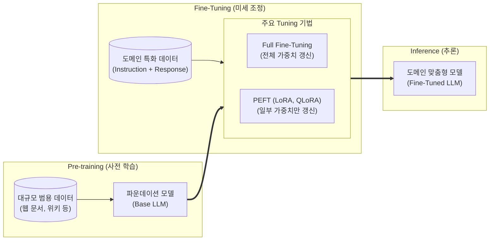

# Fine-Tuning

---

## I. 사전 학습된 AI 모델의 도메인 특화 및 성능 최적화 기법, Fine-Tuning의 개요

* **정의**: 대규모 말뭉치로 사전 학습(Pre-training)된 [[파운데이션 모델]](Foundation Model)의 가중치를 특정 작업(Task)이나 도메인 데이터에 맞게 추가 학습하여 모델의 성능을 최적화하는 전이 학습(Transfer Learning) 기법
* **필요성 및 등장배경/특징**:
* **학습 비용 및 시간 절감**: 수백~수천 장의 [[GPU]]가 필요한 사전 학습(학습 바닥부터 시작) 대신, 이미 형성된 지식망을 바탕으로 적은 리소스만 투입하여 빠른 최적화 달성
* **도메인 특화 성능 향상**: 범용 모델을 의료, 법률, 금융, 사내 규정 등 특정 업무 환경의 문체(Tone & Manner)와 복잡한 추론 패턴에 맞게 맞춤화(Customization)
* **자원 효율성 극대화**: 과거 모델의 전체 가중치를 변경하던 방식에서 벗어나, 최근에는 최소한의 파라미터만 학습하여 GPU 메모리를 극도로 절약하는 [[PEFT]](LoRA 등)가 주류로 부상

---

## II. Fine-Tuning의 개념도 및 핵심 기술 요소

### 가. Fine-Tuning의 개념도 및 동작 원리

* 사전 학습된 Base 모델을 기반으로 특정 도메인 데이터셋을 입력하여 전체 가중치(Full) 또는 일부 가중치(PEFT)만 갱신하는 미세 조정을 수행함
* 이를 통해 범용적인 언어 이해 능력을 유지하면서도 목표 Task(분류, 요약, 사내 챗봇 등)에 최적화된 맞춤형 모델을 산출함

### 나. Fine-Tuning의 핵심 기술 및 구성 요소

| 구분 | 요소기술(키워드) | 세부 설명 |
| --- | --- | --- |
| **방식 분류** | Full Fine-Tuning | 베이스 모델의 **모든 파라미터 가중치를 새롭게 업데이트**하는 방식으로 성능은 가장 우수하나 막대한 GPU 자원 소모 |
| **방식 분류** | PEFT (Parameter-Efficient FT) | 사전 학습된 가중치는 동결(Freeze)하고 **소수의 추가 파라미터만 학습**하여 컴퓨팅 자원 효율성을 극대화한 튜닝 모델 |
| **PEFT 기법** | LoRA ([[LoRA(Low-rank adaptation)|Low-Rank Adaptation]]) | 거대한 가중치 행렬을 두 개의 **저차원(Low-Rank) 행렬 곱으로 분해**하여 학습 연산량과 메모리 사용량을 획기적으로 감소 |
| **PEFT 기법** | QLoRA (Quantized LoRA) | 베이스 모델을 4-bit 등 저정밀도로 양자화(Quantization)한 상태에서 LoRA를 적용하여 단일 GPU로도 [[초거대 언어 모델|LLM]] 튜닝 가능 |
| **학습 데이터** | Instruction Tuning | '지시어(Instruction)-정답' 쌍으로 구성된 프롬프트를 학습하여, 모델이 인간의 명령을 정확히 이해하고 제로샷(Zero-shot) 성능 향상 |
| **정렬(Alignment)** | RLHF (인간 피드백 기반 [[강화학습]]) | 인간의 선호도 데이터를 기반으로 보상 모델(Reward Model)을 구축하고 강화학습을 통해 모델의 윤리성 및 유용성을 정렬 |
| **정렬(Alignment)** | DPO (Direct Preference Optimization) | 복잡한 보상 모델 생성 및 강화학습 단계 없이, 선호/비선호 데이터 쌍을 직접 학습하여 RLHF 대비 직관적이고 가벼운 최신 정렬 기법 |
| **경량 튜닝** | Prompt Tuning | 모델의 내부 가중치는 완전히 고정하고 입력 프롬프트의 **임베딩 벡터(Soft Prompt)값 만을 미세 조정**하는 극경량 기법 |

---

## III. LLM 최적화 기법 비교 및 향후 트렌드

### 가. 도메인 맞춤형 AI 구현 기법 비교 (Fine-Tuning vs RAG)

| 비교 항목 | Fine-Tuning ([[파인 튜닝]]) | RAG (검색 증강 생성) |
| --- | --- | --- |
| **핵심 목적** | 모델의 특정 **어조, 스타일, 도메인 추론 방식 내재화** | 외부 지식 베이스를 검색하여 **최신/정확한 정보 제공** |
| **지식 업데이트** | 새로운 지식 반영 시 **모델 재학습(Re-training)** 필요 | 모델 재학습 없이 **벡터 DB(Vector DB)만 갱신**하여 즉각 반영 |
| **컴퓨팅 비용** | 구축(학습) 단계에서 GPU 등 막대한 컴퓨팅 인프라 비용 발생 | 학습 불필요, 인덱싱 및 추론 단계의 리소스만 소모 (저비용) |
| **환각 (Hallucination)** | 모델 내부에 지식을 압축하므로 사실 관계에 대한 환각 가능성 존재 | 명확한 외부 출처(Source)를 기반으로 답변을 생성하여 환각 최소화 |

### 나. 향후 전망 및 엔터프라이즈 AI 도입 동향

* **하이브리드 아키텍처, RAFT(Retrieval Augmented Fine Tuning) 부상**: 기업들은 도메인 특유의 뉘앙스와 복잡한 문서 양식(포맷)을 모델에 내재화하기 위해 Fine-Tuning을 수행하고, 수시로 변하는 최신 사내 규정이나 데이터는 RAG로 보완하는 두 기술의 상호보완적 융합(RAFT)을 엔터프라이즈 AI의 핵심 표준으로 채택하고 있음
* **오픈소스 기반 [[sLLM (Smaller Large Language Model)|sLLM]] 프라이빗 튜닝 확산**: 데이터 유출 등 보안 문제로 외부 API(OpenAI 등) 사용을 꺼리는 기업들이 Llama 3, Mistral 등 고성능 오픈소스 모델을 온프레미스(On-premise) 환경에 구축하고 QLoRA 기법으로 자체 튜닝(sLLM)하여, 보안을 유지하면서도 빅테크 모델 수준의 맞춤형 성능을 확보하는 트렌드가 가속화됨

---

### 🔗 연관 토픽

- **소속 도메인**: [[00_인공지능_MOC|🤖 인공지능]]
- **세부 분류**: `4. 거대언어모델 (LLM) & 생성형 AI`
- **핵심 연관 토픽**:
  - [[sLLM (Smaller Large Language Model)]]
  - [[파인 튜닝|파인 튜닝(Fine-tuning)]]
  - [[PEFT|PEFT(Parameter-Efficient Fine-Tuning)]]
  - [[파운데이션 모델|파운데이션 모델(Foundation Model)]]
  - [[LoRA(Low-rank adaptation)]]
