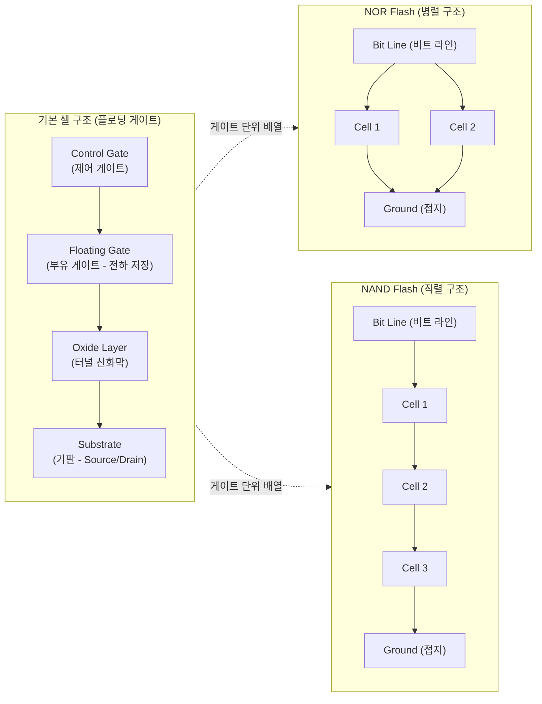

# 플래시 메모리 (Flash Memory)

---

## I. 비휘발성 고속 저장장치의 핵심, 플래시 메모리(Flash Memory)의 개요

* **정의**: 전기적으로 데이터를 지우고 다시 기록할 수 있으며(EEPROM 기반), 전원이 끊겨도 데이터가 보존되는 플로팅 게이트(Floating Gate) 또는 CTF(Charge Trap Flash) 기반의 반도체 기억장치
* **필요성 및 특징**:
* **비휘발성 및 내구성**: 전원 공급 없이도 데이터를 안전하게 유지하며, 기계적 구동부(HDD 모터 등)가 없어 물리적 충격에 강하고 저전력으로 구동됨
* **셀 구조에 따른 목적 분리**: 트랜지스터 셀의 배열 방식에 따라 코드 실행에 유리한 병렬 구조의 NOR형과 대용량 데이터 저장에 최적화된 직렬 구조의 NAND형으로 분화됨
* **초고집적화 한계 돌파**: 2D 미세화 공정의 물리적 한계를 극복하기 위해 셀을 수직으로 쌓아 올리는 3D V-NAND 기술로 진화하여 기가/테라바이트 시대를 견인

---

## II. 플래시 메모리의 개념도 및 핵심 기술 요소

### 가. 플래시 메모리(NOR / NAND)의 구조 개념도 및 동작 원리

* 컨트롤 게이트에 고전압을 가하면 **파울러-노드하임(F-N) 터널링** 효과에 의해 전자가 산화막을 뚫고 부유 게이트로 이동하여 데이터가 기록(Write)되거나 지워짐(Erase)
* **NOR**는 각 셀이 비트 라인에 병렬로 연결되어 특정 셀에 즉시 접근 가능하고, **NAND**는 셀이 직렬로 연결되어 순차적 접근만 가능하지만 좁은 면적에 많은 셀을 배치할 수 있음

### 나. 플래시 메모리의 핵심 기술 및 구성 요소

| 구분 | 요소기술(키워드) | 세부 설명 |
| --- | --- | --- |
| **물리 구조** | Floating Gate (부유 게이트) | 전자를 가두어 데이터를 기억하는 핵심 구역으로, 도체 기반 저장 방식 |
| **물리 구조** | CTF (Charge Trap Flash) | 부유 게이트 대신 부도체(질화막)에 전자를 가두어 인접 셀 간의 전파 간섭(Cross-talk)을 최소화한 구조 |
| **물리 현상** | F-N 터널링 (Fowler-Nordheim) | 양자 역학적 터널링 현상을 이용하여 전자를 절연막(산화막) 너머로 주입 또는 방출시키는 쓰기/지우기 메커니즘 |
| **집적 기술** | 3D V-NAND (수직 적층) | 평면(2D) 셀 배치의 미세화 한계를 극복하기 위해 셀을 3차원 원통형으로 수십~수백 단 겹겹이 쌓아 올린 대용량 설계 기술 |
| **저장 방식** | SLC (Single Level Cell) | 하나의 셀에 1비트(0 또는 1)의 정보만 저장하여 읽기/쓰기 속도가 가장 빠르고 제품 수명이 긺 |
| **저장 방식** | MLC / TLC / QLC | 하나의 셀에 전압 단계를 세분화하여 2비트(MLC), 3비트(TLC), 4비트(QLC)를 저장하는 고집적·저비용 기술 (속도/수명은 저하) |
| **제어 계층** | FTL (Flash Translation Layer) | 덮어쓰기가 불가능한(Erase-before-write) 플래시의 물리적 특성을 논리적 섹터 주소로 매핑하여 HDD처럼 쓰게 해주는 S/W |
| **수명 관리** | Wear Leveling (마모 평준화) | 메모리의 특정 블록에만 쓰기/지우기가 집중되어 해당 셀이 조기 파괴되는 것을 막기 위해 데이터를 골고루 분산 배치하는 [[알고리즘]] |

---

## III. NOR 및 NAND 플래시 비교와 최근 산업 동향

### 가. NOR 플래시와 NAND 플래시의 구조 및 특성 비교

| 비교 항목 | NOR Flash (노어 플래시) | NAND Flash (낸드 플래시) |
| --- | --- | --- |
| **셀 연결 구조** | **병렬 구조** (각 셀이 비트 라인에 직접 연결) | **직렬 구조** (여러 셀이 직렬 스트링 형태로 연결) |
| **접근 방식** | 바이트(Byte) 단위의 임의 접근 (Random Access) | 페이지(Page) / 블록(Block) 단위 순차 접근 |
| **읽기 (Read) 속도** | **매우 빠름** | 상대적으로 느림 |
| **쓰기/지우기 속도** | 느림 | **매우 빠름** |
| **집적도 및 단가** | 낮음 (대용량화 곤란, GB당 단가 높음) | **매우 높음** (대용량화 유리, GB당 단가 낮음) |
| **주요 활용 분야** | BIOS, 펌웨어 저장, XIP(eXecute In Place), [[라우터]] | SSD, 스마트폰 내장 메모리(UFS), SD 카드, USB |

### 나. 플래시 메모리 기술의 향후 전망 및 트렌드

* **초고다단 적층 기술의 극한 경쟁**: 낸드 플래시는 200단~300단을 넘어 400단 이상의 초고다단 3D 적층 기술로 발전하고 있으며, 주변 회로(Peri)를 셀 아래로 배치하는 COP(Cell On Peri) 기술을 통해 웨이퍼 당 칩 생산 효율을 극대화하고 있음
* **[[CXL]](Compute Express Link) 기반의 계층형 메모리 확장**: AI 및 빅데이터 연산 환경에서 DRAM의 용량 한계를 극복하기 위해, 고속 CXL 인터페이스를 통해 NAND 기반의 ZNS(Zoned Namespace) SSD를 메인 메모리의 확장 풀(Memory Pool)처럼 활용하는 차세대 아키텍처 연구가 활발히 진행 중임

---

### 🔗 연관 토픽

- **소속 도메인**: [[00_컴퓨터구조_MOC|💻 컴퓨터구조]]
- **세부 분류**: `2. 캐시 & 메모리 계층 구조 · 스토리지`
- **핵심 연관 토픽**:
  - [[알고리즘]]
  - [[CXL|CXL (Compute Express Link)]]
  - [[가상 메모리]]
  - [[메모리 관리]]
  - [[페이지 교체 알고리즘|페이지 교체 알고리즘 (Paging Replacement Algorithm)]]
