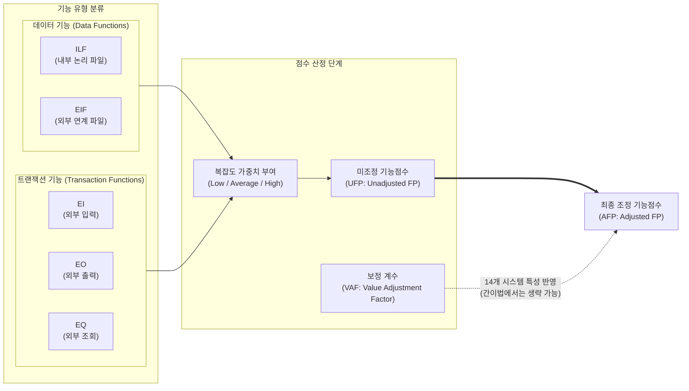

# Function Point (기능 점수)

---

## I. 사용자 관점의 객관적 소프트웨어 규모 산정 표준, Function Point의 개요

* **정의**: 소프트웨어가 사용자에게 제공하는 논리적 기능의 규모를 정량적으로 측정하여, 개발 비용 및 공수 산정의 기준으로 활용하는 소프트웨어 규모 산정 기법 (ISO/IEC 14143 표준)
* **필요성 및 주요 특징**:
* **사용자 관점 측정**: 시스템의 물리적 구조나 [[데이터베이스]] 테이블 수가 아닌, 사용자가 요구하고 인식하는 비즈니스 기능(입출력, 데이터 저장 등)을 기준으로 평가
* **기술 및 언어 독립성**: 구현하는 프로그래밍 언어나 개발자의 스킬, 아키텍처에 종속되지 않고 동일한 논리적 규모를 도출
* **공공/금융 IT 대가 산정의 표준**: 대한민국 '[[SW사업 대가산정 가이드]]'의 핵심 기준으로, 프로젝트 예산 수립, 제안요청서(RFP) 작성, 수행 후 정산의 법적 근거로 활용

---

## II. Function Point의 개념도 및 핵심 구성 요소

### 가. 기능 점수 산정 프로세스 및 분류 개념도

* 사용자 요구사항을 5가지 기능 유형(ILF, EIF, EI, EO, EQ)으로 식별하고, 각 기능의 복잡도(데이터 요소 수 등)를 측정하여 미조정 기능점수(UFP)를 산출함
* 이후 시스템의 비기능적 특성(분산 처리, 성능 요구 등)을 보정 계수(VAF)로 반영하여 최종 조정 기능점수(AFP)를 확정함

### 나. Function Point의 5대 핵심 기능 및 측정 요소

| 구분 | 요소기술(키워드) | 세부 설명 |
| --- | --- | --- |
| **데이터 기능** | ILF (내부 논리 파일) | 측정 대상 애플리케이션 내부에서 생성, 유지, 관리되는 논리적인 사용자 데이터 그룹 (예: 회원 정보 테이블) |
| **데이터 기능** | EIF (외부 인터페이스 파일) | 측정 대상 시스템 내에서는 참조만 수행되며, 다른 애플리케이션에서 유지 및 관리되는 데이터 그룹 (예: 타 기관 신용정보) |
| **[[트랜잭션]] 기능** | EI (외부 입력) | 시스템 외부에서 데이터나 제어 정보를 입력받아 내부 논리 파일(ILF)을 갱신하거나 시스템 동작을 제어하는 기능 |
| **트랜잭션 기능** | EO (외부 출력) | 계산, 파생 데이터 생성 등의 수학적/논리적 처리 로직을 거쳐 사용자에게 정보를 제공하는 기능 (예: 통계 보고서 출력) |
| **트랜잭션 기능** | EQ (외부 조회) | 내부 논리 파일이나 외부 연계 파일의 데이터를 단순히 검색하여 사용자에게 있는 그대로 제공하는 기능 |
| **복잡도 측정** | DET (Data Element Type) | 기능 실행 시 사용자가 식별할 수 있는 논리적인 데이터 필드의 수 (예: 사번, 이름, 부서명 = 3 DET) |
| **복잡도 측정** | RET (Record Element Type) | 하나의 내부 논리 파일(ILF) 또는 외부 인터페이스 파일(EIF) 내에 존재하는 의미 있는 서브그룹의 수 |
| **복잡도 측정** | FTR (File Type Referenced) | 트랜잭션 기능(EI, EO, EQ)을 수행하는 동안 읽거나 갱신하기 위해 참조되는 ILF 및 EIF의 개수 |

---

## III. 규모 산정 기법 비교 및 최신 동향

### 가. 소프트웨어 규모 산정 기법 비교 (FP vs LOC)

| 비교 항목 | Function Point (기능 점수) | LOC (Lines of Code, 코드 라인 수) |
| --- | --- | --- |
| **측정 기준** | 사용자 요구 기능 중심 (논리적) | 개발된 물리적 소스 코드 라인 수 |
| **언어 종속성** | **없음 (언어에 무관하게 동일 규모)** | 매우 높음 (C, Java, Python 등 언어마다 상이) |
| **산정 가능 시기** | **요구사항 분석 및 설계 단계** | 구현 및 코딩이 완료된 이후 단계 |
| **[[유지보수]] 시 특징** | 구조 변경 없이 코드 리팩토링 시 점수 변동 없음 | 코드 최적화 및 리팩토링 시 규모(LOC)가 오히려 감소하는 모순 발생 |
| **주요 활용 분야** | 시스템 통합(SI) 구축 사업 대가 산정 | 레거시 시스템 운영/유지보수, 오픈소스 기여도 측정 |

### 나. 기능 점수 산정 방식의 발전 및 최신 동향

* **간이 기능점수법(Estimated FP)의 보편화**: 프로젝트 초기 설계 문서를 기반으로 각 기능의 복잡도(Low/Avg/High)를 일일이 산정하기 어려운 현실을 반영하여, 과거 프로젝트의 통계적 평균 복잡도 가중치를 일괄 적용하여 신속하게 예산을 산정하는 간이 기능점수법이 공공 발주 사업의 표준으로 정착됨
* **[[MSA (Micro Service Architecture)|MSA]] 및 임베디드 특화를 위한 COSMIC 기능점수**: 전통적인 IFPUG 방식의 FP는 데이터 입출력 중심의 MIS(경영정보시스템)에 최적화되어 있어, 최근의 복잡한 마이크로서비스 간 비동기 통신이나 IoT/임베디드 소프트웨어의 제어 로직을 평가하는 데 한계가 있음. 이를 극복하기 위해 소프트웨어 계층 간의 데이터 이동(Data Movement)을 기반으로 규모를 측정하는 COSMIC 기능점수(ISO/IEC 19761)가 차세대 대안으로 도입되고 있음
* **[[초거대 언어 모델|LLM]] 기반 FP 산정 자동화**: 요구사항 정의서나 유스케이스 명세서를 입력하면, 대형 언어 모델(LLM)이 문맥을 분석하여 5가지 기능 유형과 DET/FTR을 자동 식별해 기능점수 산출 내역서를 초안 형태로 자동 생성하는 AI 도구들이 SI 기업을 중심으로 R&D되고 있음

---

### 🔗 연관 토픽

- **소속 도메인**: [[00_소프트웨어공학_MOC|🏗️ 소프트웨어공학]]
- **세부 분류**: `3. 요구사항 공학 & UML 객체지향 분석/설계`
- **핵심 연관 토픽**:
  - [[SW사업 대가산정 가이드]]
  - [[SW 규모산정]]
  - [[MSA (Micro Service Architecture)]]
  - [[데이터베이스]]
  - [[트랜잭션]]
