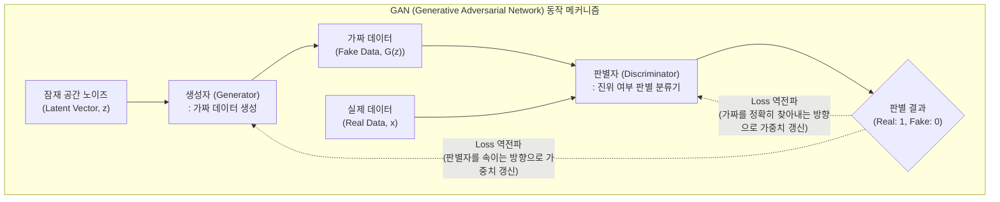

# GAN (Generative Adversarial Network)

---

## I. 두 신경망의 적대적 경쟁을 통한 고품질 데이터 생성 알고리즘, GAN의 개요

* **정의**: 생성자(Generator)와 판별자(Discriminator)라는 두 개의 신경망이 서로 적대적(Adversarial)으로 경쟁하며 실제 데이터 분포와 유사한 새로운 데이터를 생성해내는 [[비지도 학습]] 기반의 생성형 [[인공지능]] 모델 (Ian Goodfellow, 2014년 제안)
* **필요성 및 주요 특징**:
* **적대적 학습 (Adversarial Learning)**: 위조지폐범(생성자)은 경찰(판별자)을 속이려 하고, 경찰은 위조지폐를 완벽히 찾아내려 하는 미니맥스 게임(Minimax Game) 원리를 통해 상호 발전하며 정교한 데이터를 생성
* **선명한 데이터 창출**: 기존 확률 분포 모델(VAE 등)이 생성한 흐릿한(Blurry) 이미지의 한계를 극복하고, 실제 사진과 구별하기 힘들 정도로 선명하고 현실적인 미디어(이미지, 음성)를 생성
* **잠재 공간(Latent Space) 제어**: 고차원의 랜덤 노이즈를 입력으로 사용하여, 무한에 가까운 다양성을 지닌 데이터를 창출하고 속성을 합성(Interpolation)하는 기능 제공

---

## II. GAN의 개념도 및 핵심 기술 요소

### 가. GAN의 적대적 학습 아키텍처 개념도

* 학습 과정에서 판별자(Discriminator)를 먼저 학습시켜 진짜와 가짜를 구별하게 한 뒤, 생성자(Generator)는 이 판별자의 오차(Loss)를 극대화하는 방향으로 학습을 진행함
* 학습이 이상적으로 완료되면, 생성자는 완벽한 가짜 데이터를 만들고 판별자의 진위 판별 확률은 50%(0.5)로 수렴하는 내시 균형(Nash Equilibrium)에 도달함

### 나. GAN의 핵심 기술 및 구성 요소

| 구분 | 요소기술(키워드) | 세부 설명 |
| --- | --- | --- |
| **핵심 신경망** | Generator (생성자) | 랜덤 노이즈를 입력받아 실제 데이터 분포를 모사하는 가짜 데이터를 생성하는 신경망 (Deconvolution 등 활용) |
| **핵심 신경망** | Discriminator (판별자) | 입력된 데이터가 실제(Real)인지 생성자가 만든 가짜(Fake)인지 판별하는 이진 분류(Binary Classification) 신경망 |
| **학습 원리** | Minimax Loss | 생성자는 $V(D,G)$를 최소화하려 하고, 판별자는 최대화하려는 GAN의 핵심 목적 함수 (Zero-Sum Game) |
| **학습 한계** | Mode Collapse (모드 붕괴) | 생성자가 다양한 데이터를 만들지 못하고, 판별자를 속이기 쉬운 특정한 소수의 패턴(Mode)만 반복적으로 생성하는 현상 |
| **학습 한계** | Vanishing Gradient (기울기 소실) | 판별자가 너무 완벽하게 학습되면 생성자로 전달될 오차 기울기가 사라져 학습이 정체되는 문제 |
| **파생 아키텍처** | [[DCGAN]] (Deep Convolutional GAN) | 초기 GAN에 [[CNN]](합성곱 신경망) 아키텍처를 도입하여 이미지 생성 품질과 학습 안정성을 비약적으로 높인 모델 |
| **파생 아키텍처** | CycleGAN | 두 도메인 간의 짝(Pair) 데이터 없이도 스타일을 변환해 주는 모델 (예: 낮 사진 $\rightarrow$ 밤 사진 변환, 말 $\rightarrow$ 얼룩말) |
| **파생 아키텍처** | StyleGAN | NVIDIA에서 개발한 모델로, 이미지의 스타일(성별, 나이, 머리색 등)을 잠재 공간에서 세밀하게 분리 제어(Disentanglement) |

---

## III. 생성형 AI 모델 비교 및 최신 산업 동향

### 가. 3대 이미지 생성 AI 알고리즘 비교 (GAN vs VAE vs Diffusion)

| 비교 항목 | GAN (Generative Adversarial Network) | VAE ([[VAE|Variational Autoencoder]]) | Diffusion Models (확산 모델) |
| --- | --- | --- | --- |
| **학습 메커니즘** | 생성자와 판별자의 **적대적 경쟁** | 인코더-디코더 기반의 **확률 분포 추정** | 노이즈를 점진적으로 주입 후 **제거(Denoising)** |
| **생성 품질 (해상도)** | 선명함 (High Quality) | 다소 흐릿함 (Blurry) | **매우 정교하고 압도적임 (SotA)** |
| **학습/추론 속도** | 추론 속도 매우 빠름 (실시간 가능) | 추론 속도 빠름 | 추론 속도 **매우 느림** (반복적인 Denoising) |
| **학습 안정성** | 불안정함 (Mode Collapse, 진동 발생) | 매우 안정적임 | 안정적이며 다양성이 높음 |
| **주요 활용 분야** | 딥페이크, 실시간 영상 생성, 화질 개선 | 이상 탐지, 특징 추출(Feature Extraction) | Midjourney, DALL-E, Stable Diffusion |

### 나. GAN의 발전 양상 및 최신 보안 동향

* **실시간 및 초해상도(Super Resolution) 영역에서의 굳건한 입지**: 정지 이미지 생성 분야의 주도권은 높은 품질과 텍스트 제어력을 지닌 확산 모델(Diffusion)로 넘어갔으나, Diffusion의 치명적 단점인 느린 연산 속도 때문에 60fps 이상의 **실시간 게임 그래픽 렌더링(DLSS), 동영상 생성, 영상 화질 복원(SRGAN)** 분야에서는 단일 패스(Single-pass) 연산이 가능한 GAN 아키텍처가 여전히 핵심 엔진으로 활용되고 있음
* **[[딥페이크|딥페이크(Deepfake)]] 양날의 검과 탐지 기술**: GAN 기술이 오픈소스로 대중화되면서 악의적인 딥페이크 범죄와 보이스 피싱이 심각한 사회적 문제로 대두됨. 이에 대응하여 각국 정보기관과 IT 기업들은 GAN의 원리를 역이용하여, 비디오나 오디오에 존재하는 미세한 주파수 왜곡이나 'GAN-fingerprint'를 식별하는 **판별자(Discriminator) 특화 딥페이크 탐지 방어 체계** 구축에 집중하고 있음

---

### 🔗 연관 토픽

- **소속 도메인**: [[00_인공지능_MOC|🤖 인공지능]]
- **세부 분류**: `1. 수학 · 통계학 & 데이터 전처리`
- **핵심 연관 토픽**:
  - [[비지도 학습]]
  - [[인공지능]]
  - [[VAE|VAE(Variational Autoencoder)]]
  - [[딥페이크|딥페이크(Deepfake)]]
  - [[DCGAN]]
