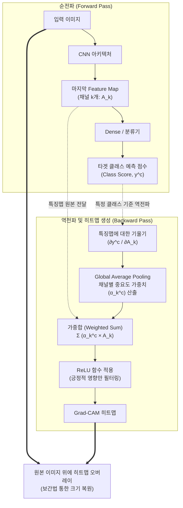

# Grad-CAM (Gradient-weighted Class Activation Mapping)

---

## I. 딥러닝 비전 모델의 블랙박스를 해소하는 시각적 설명 기법, Grad-CAM의 개요

* **정의**: [[딥러닝]] 비전 모델([[CNN]])의 예측 결과를 설명하기 위해, 특정 [[클래스]](Class) 예측 시 마지막 합성곱 계층(Convolution Layer)으로 흐르는 기울기(Gradient)를 계산하여 원본 이미지 상의 중요 영역을 히트맵(Heatmap) 형태로 시각화하는 설명 가능한 AI ([[XAI]]) [[알고리즘]]
* **필요성 및 주요 특징**:
* **구조 변경 및 재학습 불필요 (Architecture Agnostic)**: 기존 CAM(Class Activation Mapping) 기법과 달리, 모델의 구조(GAP 계층 등)를 수정하거나 재학습할 필요 없이 이미 학습이 완료된 다양한 CNN 아키텍처(ResNet, VGG, 등)에 즉시 적용 가능
* **설명 가능성(Explainability) 확보**: 딥러닝 모델이 왜 특정한 결과(예: 고양이)를 도출했는지 시각적인 판단 근거를 제공하여, 사용자의 신뢰도를 높이고 모델의 [[편향]](Bias)이나 오류를 디버깅하는 데 기여
* **긍정적 영향 필터링**: ReLU 활성화 함수를 적용하여 해당 클래스 예측에 긍정적인(+) 영향을 미친 픽셀 영역만을 추출함으로써, 사람이 이해하기 쉬운 직관적인 하이라이트 제공

---

## II. Grad-CAM의 개념도 및 핵심 기술 요소

### 가. Grad-CAM의 생성 메커니즘 개념도

* 모델이 타겟 클래스를 예측한 점수($y^c$)를 기준으로 역전파를 수행하여, 마지막 합성곱 계층의 특징 맵들이 이 예측에 미치는 영향(기울기)을 구함
* 이 기울기들을 GAP(공간 평균) 처리하여 각 채널의 가중치를 구한 뒤, 원래의 특징 맵과 가중합 연산을 수행하고 ReLU로 음의 값을 제거하여 최종 히트맵을 생성함

### 나. Grad-CAM의 핵심 기술 및 구성 요소

| 구분 | 요소기술(키워드) | 세부 설명 및 산출 공식 |
| --- | --- | --- |
| **추출 대상** | Feature Map ($A^k$) | 이미지의 공간적(Spatial) 특징을 유지하고 있는 마지막 합성곱(Conv) 계층의 $k$번째 채널 출력값 |
| **중요도 지표** | Gradient (기울기) | 특정 클래스 점수($y^c$)를 특징 맵 원소로 편미분($\frac{\partial y^c}{\partial A^k}$)하여 구한 국소적 영향력 |
| **가중치 연산** | Global Average Pooling | 계산된 기울기 값들을 너비와 높이 공간(Width $\times$ Height)에 대해 평균을 내어 하나의 가중치 값($\alpha_k^c$)으로 압축 |
| **조합 연산** | Weighted Sum (가중합) | 특징 맵의 각 채널($A^k$)에 산출된 중요도 가중치($\alpha_k^c$)를 선형 결합(곱셈 후 덧셈)하는 과정 |
| **직관성 확보** | ReLU 함수 | 가중합 결과에 $\max(0, x)$ 형태의 ReLU를 통과시켜, 클래스 예측을 방해하는 음(-)의 영향력을 0으로 제거하고 양의 영역만 강조 |
| **시각화 적용** | Bilinear Interpolation | 마지막 합성곱 계층은 원본보다 해상도가 크게 축소되어 있으므로, 이중 선형 보간법을 통해 원본 이미지 크기로 히트맵을 업샘플링(Upsampling) |

---

## III. CAM 아키텍처 비교 및 최신 XAI 동향

### 가. CAM과 Grad-CAM 아키텍처 비교

| 비교 항목 | CAM (Class Activation Mapping) | Grad-CAM |
| --- | --- | --- |
| **가중치 추출 소스** | GAP 계층 이후의 Fully Connected 가중치 | 예측 점수에 대한 **기울기(Gradient)** |
| **아키텍처 제약** | 모델 마지막에 반드시 **GAP(Global Average Pooling) 계층이 존재해야 함** | 제약 없음 (**어떤 형태의 CNN 모델이든 무관**) |
| **모델 재학습 필요성** | GAP가 없는 모델은 구조 변경 후 **재학습(Retraining) 필수** | 구조 변경이 없으므로 **재학습 불필요 (사전 학습 모델 즉시 적용)** |
| **성능 및 유연성** | 특정 구조에 한정되나 결과는 상대적으로 정교함 | 이미지 분류뿐만 아니라 캡셔닝, VQA 등 다양한 멀티모달 태스크에 적용 가능 |

### 나. Grad-CAM의 진화 및 최신 산업 동향

* **고도화된 파생 알고리즘의 등장**: 하나의 이미지에 동일한 객체가 여러 개 존재하거나, 미세한 병변 등을 탐지할 때 위치를 더 정교하게 포착하기 위해 **Grad-CAM++** (기울기의 2차, 3차 미분 활용), **Score-CAM** (기울기 의존성을 탈피하고 Forward Pass의 점수를 가중치로 활용) 등으로 XAI 알고리즘이 지속적으로 진화하고 있음
* **컴플라이언스 준수를 위한 의료 AI 및 [[Smart Car(자율주행)|자율주행]] 도입**: EU AI법(AI Act) 등 글로벌 규제에서 '인공지능의 설명 요구권'이 강화됨에 따라, 엑스레이나 MRI의 병변 위치를 의사에게 설명하는 의료 진단 모델, 표지판 및 보행자를 인식하는 자율주행 모델 등 생명과 직결된 고신뢰성 도메인에서 Grad-CAM 기반의 시각화 모듈이 필수 [[MLOps]] 파이프라인으로 내재화되고 있음

---

### 🔗 연관 토픽

- **소속 도메인**: [[00_인공지능_MOC|🤖 인공지능]]
- **세부 분류**: `3. 딥러닝 핵심 아키텍처 & 신경망`
- **핵심 연관 토픽**:
  - [[딥러닝]]
  - [[편향]]
  - [[XAI]]
  - [[CNN|CNN (Convolutional Neural Network)]]
  - [[알고리즘]]
