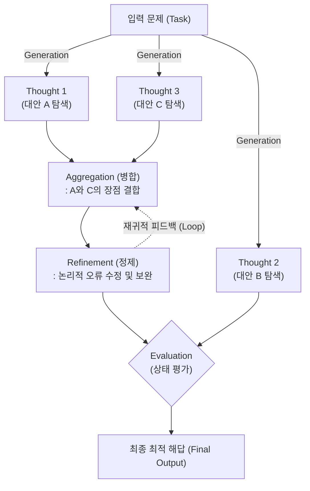

# Graph of Thoughts (GoT)

---

## I. LLM의 비선형적 추론과 다중 사고 병합을 위한 프롬프팅 아키텍처, GoT의 개요

* **정의**: 대규모 언어 모델([[초거대 언어 모델|LLM]])의 추론(Reasoning) 과정을 선형적이나 계층형 트리가 아닌 '방향성 그래프(Directed Graph)' 형태로 모델링하여, 독립적인 여러 생각(Thought)들을 병합하거나 분기, 교차시키며 복잡한 문제를 해결하는 차세대 프롬프팅 기법
* **필요성 및 주요 특징**:
* **비선형적 인간 사고 모사**: 인간이 문제를 해결할 때 여러 아이디어를 결합(Synergy)하거나 과거의 생각으로 되돌아가 수정(Refinement)하는 입체적인 사고 과정을 AI로 구현
* **네트워크 시너지(Aggregation)**: 트리 구조([[ToT]])의 한계인 '사고의 단절'을 극복하고, 서로 다른 가지(Branch)에서 파생된 유용한 정보들을 하나로 합쳐 최적의 해답을 도출
* **효율성 및 비용 절감**: 이미 검증된 생각(Node)을 다시 계산하지 않고 [[재사용]](Reuse)함으로써, 복잡한 태스크에서 추론 정확도는 높이면서도 불필요한 토큰(Token) 사용량은 감소

---

## II. GoT의 개념도 및 핵심 기술 요소

### 가. Graph of Thoughts의 추론 메커니즘 개념도

* 초기 문제에서 여러 대안(생각)을 생성(Generation)하고, 유망한 서로 다른 생각들을 병합(Aggregation)함
* 이후 결과물을 지속적으로 정제(Refinement)하며 피드백 루프를 형성하고, 최종 평가(Evaluation)를 거쳐 도달한 최적의 경로를 정답으로 채택함

### 나. GoT의 핵심 기술 및 구성 요소

| 구분 | 요소기술(키워드) | 세부 설명 |
| --- | --- | --- |
| **기본 구조** | Graph (Thought, [[EDGE|Edge]]) | 추론의 중간 결과물인 상태(Thought)를 '노드(Node)'로, 생각들 간의 종속성 및 논리적 흐름을 '간선(Edge)'으로 표현 |
| **핵심 연산** | Aggregation (병합) | 여러 개의 독립적인 노드(생각)를 결합하여, 각 아이디어의 장점을 모은 하나의 새로운 고차원 노드를 생성하는 기능 |
| **핵심 연산** | Refinement (정제) | 특정 노드의 결과물에 대해 스스로 피드백을 적용하여, 이전 상태로 되돌아가거나(Loop) 논리적 오류를 지속적으로 수정 |
| **핵심 연산** | Generation (분기/생성) | 하나의 현재 상태에서 가능한 다음 단계의 여러 대안(Thought)들을 탐색하여 새로운 노드들을 파생 |
| **품질 관리** | Evaluation (평가/채점) | 각 노드가 문제 해결 목표에 얼마나 근접했는지 스스로 점수(Score)를 매겨, 유망한 노드만 살리고 나머지는 가지치기(Pruning) 수행 |
| **시스템 모듈** | Prompter | 그래프의 각 연산(병합, 정제 등)을 수행하기 위해 LLM에 주입할 프롬프트 메시지를 동적으로 구성하는 모듈 |
| **시스템 모듈** | Controller (제어기) | 그래프의 전체 구조와 탐색 경로(BFS, DFS 등)를 스케줄링하고, 메모리를 관리하여 최종 해답을 도출하는 두뇌 역할 |

---

## III. LLM 추론 프롬프팅 기법 비교 및 최근 동향

### 가. LLM 추론(Reasoning) 아키텍처 진화 비교

| 비교 항목 | [[COT|CoT]] (Chain of Thought) | ToT (Tree of Thoughts) | GoT (Graph of Thoughts) |
| --- | --- | --- | --- |
| **사고의 구조** | 선형적 (Linear) 단일 경로 | 계층적 트리 (Tree) 분기 구조 | **망형 (Graph) 네트워크 구조** |
| **탐색 방식** | A $\rightarrow$ B $\rightarrow$ C (한 방향으로만 전진) | BFS/DFS 기반으로 여러 대안 탐색 | 대안 탐색 + 상호 연결 및 피드백 |
| **생각의 병합(Synergy)** | 불가 (이전 단계만 참조) | 불가 (다른 가지의 결과 공유 불가) | **가능 (서로 다른 가지의 노드 결합)** |
| **오류 수정 (Loop)** | 제한적 (프롬프트 재입력 필요) | 백트래킹(Backtracking)을 통해 가능 | **자체 순환 구조(Cycle)로 유연하게 정제** |
| **주요 적용 태스크** | 단순 수학 연산, 논리 퀴즈 | 스도쿠, 크로스워드 퍼즐, 단기 계획 | 복잡한 텍스트 요약, 교집합 데이터 병합, 대규모 코드 작성 |

### 나. GoT의 최신 활용 동향 및 향후 전망

* **Agentic AI의 두뇌 알고리즘으로 채택**: 단순한 질의응답을 넘어, 완전 자율형 AI 에이전트(Autonomous Agent)가 스스로 도구를 선택하고 복잡한 장기 계획(Long-horizon Planning)을 수립할 때, 다양한 시나리오를 시뮬레이션하고 결과를 융합하는 핵심 사고 엔진(Reasoning Engine)으로 GoT 아키텍처가 적극 채택되고 있음
* **다중 에이전트 협업(Multi-Agent System)과의 결합**: 개별 LLM 인스턴스의 내부 추론 과정뿐만 아니라, 여러 특화 AI 에이전트(예: 코더, 테스터, 기획자)가 각자의 산출물(Node)을 교환하고 병합(Aggregation)하여 최종 결과물을 도출하는 거시적인 조직 통신망 아키텍처로도 그 개념이 확장되고 있음

---

### 🔗 연관 토픽

- **소속 도메인**: [[00_인공지능_MOC|🤖 인공지능]]
- **세부 분류**: `4. 거대언어모델 (LLM) & 생성형 AI`
- **핵심 연관 토픽**:
  - [[COT|COT(Chain of Thought)]]
  - [[ToT|tot Tree of thought]]
  - [[대규모 언어 모델 성능 향상 기술|대규모 언어 모델(LLM) 성능 향상 기술]]
  - [[초거대 언어 모델|초거대 언어 모델(Large Language Model)]]
  - [[프롬프트 엔지니어링|프롬프트 엔지니어링(Prompt Engineering)]]
