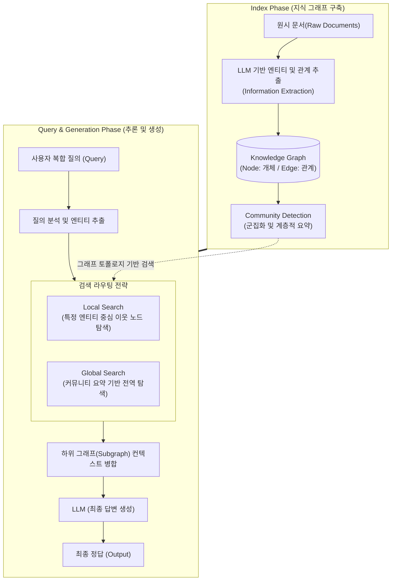

# GraphRAG (Graph Retrieval-Augmented Generation)

---

## I. 복잡한 관계 추론과 전역적 문맥 파악을 위한 차세대 RAG, GraphRAG의 개요

* **정의**: 대규모 언어 모델([[초거대 언어 모델|LLM]])의 검색 증강 생성(RAG) 파이프라인에 지식 그래프(Knowledge Graph)를 결합하여, 문서 내 [[엔티티|엔티티(Entity)]] 간의 의미론적 관계와 구조적 문맥을 기반으로 정보를 검색하고 답변을 생성하는 고도화된 AI 아키텍처
* **필요성 및 주요 특징**:
* **다중 홉 추론(Multi-hop Reasoning) 해결**: 단순한 텍스트 청크(Chunk) 간의 벡터 [[유사도]] 검색으로는 해결하기 힘든 '여러 문서를 건너뛰며 관계를 추론해야 하는' 복잡한 질의 해결
* **전역적 문맥 파악(Global Context Understanding)**: 파편화된 문서에 흩어진 정보들을 점(Node)과 선([[EDGE|Edge]])으로 연결(Connecting the dots)하여, 전체 데이터셋을 관통하는 거시적인 요약과 인사이트 도출 가능
* **환각(Hallucination) 억제 및 설명 가능성 향상**: 명확하게 정의된 지식 그래프 상의 경로(Path)를 탐색하므로, LLM이 도출한 답변의 출처와 논리적 근거(선행 관계)를 명확히 추적 가능

---

## II. GraphRAG의 개념도 및 핵심 기술 요소

### 가. GraphRAG의 동작 메커니즘 개념도

* **인덱싱 단계**: LLM을 활용해 문서에서 명사(엔티티)와 동사(관계)를 추출하여 그래프 DB를 구축하고, 관련된 노드들을 군집화(Community Detection)하여 사전 요약본을 생성함
* **검색 및 생성 단계**: 사용자의 질의에서 핵심 엔티티를 파악한 후, 지식 그래프를 순회(Traversal)하며 연관된 하위 그래프나 커뮤니티 요약을 프롬프트에 주입하여 최종 답변을 생성함

### 나. GraphRAG의 핵심 기술 및 구성 요소

| 구분 | 요소기술(키워드) | 세부 설명 |
| --- | --- | --- |
| **데이터 구조** | Node & Edge (노드와 간선) | 개념, 인물, 장소 등을 '노드(Node)'로, 이들 간의 행위나 종속 관계를 '간선(Edge)'으로 표현하는 그래프 데이터 모델 |
| **정보 추출** | NER & RE | 비정형 텍스트에서 명명된 개체를 인식(Named Entity Recognition)하고, 개체 간의 관계를 추출(Relation Extraction) |
| **저장소** | Graph Database (그래프 DB) | 노드와 간선의 토폴로지를 고속으로 저장/조회하기 위한 전용 [[데이터베이스]] (Neo4j, NebulaGraph 등) |
| **구조화 기법** | Community Detection | 방대한 그래프 내에서 밀집되게 연결된 노드 그룹(커뮤니티)을 식별하는 클러스터링 [[알고리즘]] (예: Leiden 알고리즘) |
| **검색 전략** | Local Search (지역 검색) | 질의에 등장한 특정 엔티티를 시작점으로 하여, 인접한(Neighbor) 노드와 간선들을 홉(Hop) 단위로 순회하며 정보 수집 |
| **검색 전략** | Global Search (전역 검색) | "전체 데이터셋에서 가장 중요한 주제는 무엇인가?"와 같은 거시적 질문에 대응하기 위해 커뮤니티(군집) 요약을 병합하여 추론 |
| **질의 언어** | Cypher / GQL | 자연어 질의를 그래프 DB에서 탐색 가능한 정형화된 그래프 쿼리 언어(Cypher 등)로 변환(Text-to-Cypher) |

---

## III. 표준 RAG와 GraphRAG의 비교 및 최신 도입 동향

### 가. 아키텍처 비교 (Vector RAG vs GraphRAG)

| 비교 항목 | Standard Vector RAG | GraphRAG |
| --- | --- | --- |
| **기본 동작 원리** | 텍스트 청크를 벡터로 임베딩 후 **코사인 유사도** 검색 | 텍스트를 엔티티와 관계로 구조화 후 **그래프 토폴로지** 탐색 |
| **데이터 구조** | 1차원적인 청크(Chunk)의 배열 | 다차원 네트워크(Node, Edge) 및 계층적 커뮤니티 |
| **장점** | 구축이 비교적 단순하며, 의미론적(Semantic) 유사 검색에 탁월함 | 다중 홉(Multi-hop) 추론, 문서 간 숨겨진 맥락 연결, 설명 가능성 우수 |
| **단점 / 한계** | 여러 문서에 걸친 분절된 정보 취합 불가 (Global 파악 한계) | 지식 그래프 구축 단계에서 막대한 **LLM API 호출 비용(토큰 소비) 발생** |
| **적용 태스크** | 매뉴얼 검색, 단순 질의응답 (Q&A) | 법률 판례 분석, 범죄/금융 수사망 분석, 신약 개발 논문 요약 |

### 나. GraphRAG의 산업계 발전 및 하이브리드 동향

* **Microsoft의 오픈소스 GraphRAG [[프레임워크]] 공개**: 2024년 마이크로소프트는 단순한 엔티티 추출을 넘어 데이터셋 전체를 커뮤니티 단위로 계층화하고 요약하는 오픈소스 'GraphRAG'를 공개하여, 그동안 LLM이 취약했던 **Sensemaking(거시적 의미 파악)과 Global Search 분야의 혁신**을 이끌고 있음
* **Hybrid RAG (Vector + Graph)의 대세화**: GraphRAG는 추론에는 강력하지만 인덱싱 비용이 높고 유의어 처리가 까다로운 단점이 존재함. 이에 따라 최신 엔터프라이즈 AI 아키텍처는 **Dense Vector Search(의미 검색)를 통해 초기 후보군을 빠르게 좁히고, 해당 후보군 주변의 Graph Traversal(관계 탐색)을 결합**하여 정확도와 효율성을 동시에 극대화하는 하이브리드 RAG 방식을 표준으로 채택하고 있음

---

### 🔗 연관 토픽

- **소속 도메인**: [[00_인공지능_MOC|🤖 인공지능]]
- **세부 분류**: `4. 거대언어모델 (LLM) & 생성형 AI`
- **핵심 연관 토픽**:
  - [[심볼릭 추론]]
  - [[대규모 언어 모델 성능 향상 기술|대규모 언어 모델(LLM) 성능 향상 기술]]
  - [[유사도|유사도(Similarity)]]
  - [[지식그래프]]
  - [[초거대 언어 모델|초거대 언어 모델(Large Language Model)]]
