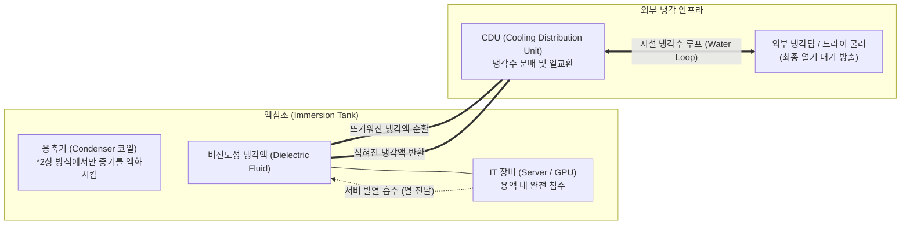

# Green Data Center (액침냉각; Immersion Cooling)

---

## I. 친환경 고집적 AI 데이터센터를 위한 차세대 열관리 기술, 액침냉각의 개요

* **정의**: 서버, [[GPU]], 스토리지 등 IT 하드웨어 전체를 전기가 통하지 않는 비전도성(Dielectric) 특수 냉각유(용액)에 직접 담가 발열을 흡수하고 식히는 친환경 데이터센터(Green Data Center)의 핵심 쿨링 아키텍처
* **필요성 및 주요 특징**:
* **고집적 AI 연산 발열 해소**: 초거대 AI 학습용 GPU(NVIDIA H100, B200 등)의 전력 밀도 급증(랙당 50~100kW 이상)으로 인해, 공기를 차갑게 만들어 불어넣는 기존 공랭식(Air Cooling) 냉각의 물리적 열역학 한계 극복
* **전력 효율 극대화 및 [[ESG 경영]]**: 서버 내부에 장착된 수많은 냉각 팬(Fan)을 제거하고 거대한 항온항습기 구동 전력을 절감하여, 데이터센터의 전력효율지수(PUE)를 이론적 한계치인 1.0에 가깝게 낮춤으로써 탄소 중립(Net Zero) 달성에 기여
* **공간 및 인프라 비용 절감**: 공기 순환을 위한 랙 사이의 여유 공간(Hot/Cold Aisle)이나 이중마루 구조가 불필요하여 데이터센터 내 랙 집적도를 극대화하고, 하드웨어 산화(부식) 및 먼지 유입을 원천 차단하여 장비 수명을 연장

---

## II. 액침냉각의 개념도 및 핵심 기술 요소

### 가. 액침냉각(1상 및 2상 방식)의 구조 개념도

* 전기가 통하지 않는 특수 용액에 서버를 푹 담그는 구조이며, 뜨거워진 용액은 펌프를 통해 CDU(냉각 분배 장치)로 이동하여 외부 냉각탑망의 차가운 물과 열교환을 수행한 후 다시 액침조로 돌아옴

### 나. 액침냉각의 핵심 기술 및 구성 요소

| 구분 | 요소기술(키워드) | 세부 설명 |
| --- | --- | --- |
| **냉각 매질** | Dielectric Fluid (비전도성 유체) | 전기는 통하지 않으면서 열전도율과 비열이 공기보다 월등히 높은 특수 냉각액 (합성유, 미네랄 오일, 불소계 화합물 등) |
| **작동 방식** | 1상 (Single-phase) 액침냉각 | 냉각액이 기화(증발)되지 않고 액체 상태만을 유지하며 순환하는 방식으로, 구조가 상대적으로 단순하고 용액 증발 손실이 없음 |
| **작동 방식** | 2상 (Two-phase) 액침냉각 | 서버의 발열로 냉각액이 끓어올라 기화(증발잠열 활용)되며 열을 앗아가고, 상단의 응축기를 통해 다시 액화되는 상전이(Phase Change) 방식 |
| **핵심 설비** | CDU (Cooling Distribution Unit) | 액침조를 순환하는 '1차 냉각액 루프'와 외부 냉각탑을 순환하는 '2차 냉각수 루프' 사이에서 섞임 없이 열만 교환하도록 통제하는 핵심 설비 |
| **인프라 지표** | PUE (Power Usage Effectiveness) | (데이터센터 총 사용 전력량) / (IT 장비 사용 전력량). 1.0에 가까울수록 냉각 등에 낭비되는 전력이 없음을 의미하며, 액침냉각 적용 시 통상 1.05 이하 달성 |
| **하드웨어 튜닝** | Fanless Architecture | 용액 내 유동 저항을 줄이고 공간을 확보하기 위해 기존 서버의 방열판(Heatsink) 모양을 최적화하고 쿨링 팬을 물리적으로 제거 |
| **표준화 [[프레임워크]]** | OCP (Open Compute Project) | 메타, 마이크로소프트 등이 주도하여 액침조의 폼팩터, 용액의 화학적 안정성, 블라인드 메이트(Blind Mate) 커넥터 규격 등을 오픈소스로 표준화 |

---

## III. 데이터센터 냉각 방식 비교 및 최신 산업 동향

### 가. 데이터센터 냉각 방식 발전 단계별 비교

| 비교 항목 | 공랭식 (Air Cooling) | 직접 수랭식 (D2C, Direct-to-Chip) | 액침냉각 (Immersion Cooling) |
| --- | --- | --- | --- |
| **냉각 매질 및 접촉점** | 차가운 공기 $\rightarrow$ 방열판 | 차가운 물 $\rightarrow$ 칩셋 표면(Cold Plate) | **특수 용액 $\rightarrow$ 기판 포함 서버 전체** |
| **지원 가능 전력 밀도** | 랙당 최대 15 ~ 20 kW | 랙당 약 50 ~ 80 kW | **랙당 100 kW 이상 (가장 우수)** |
| **전력효율 (PUE 수준)** | 1.5 ~ 2.0 수준 (비효율적) | 1.1 ~ 1.2 수준 | **1.01 ~ 1.05 수준 (최고 효율)** |
| **[[유지보수]] 특성** | 직관적이고 쉬움 (핫스왑 용이) | 냉각수 누수(Leak)에 대비한 철저한 모니터링 필요 | 전용 크레인 인양 필요, 용액 노출/잔여물 처리 등 까다로움 |
| **도입 및 구축 비용** | 낮음 (기존 레거시 인프라) | 중간 (배관 및 워터블록 비용) | **높음 (특수 액침조 및 고가의 냉각액 비용)** |

### 나. 액침냉각 기술의 최신 산업 동향 및 전망

* **AI 반도체 고전력화에 따른 강제적 전환 (NVIDIA GB200 등)**: 최신 AI 칩셋은 단일 칩에서만 1,000W 이상의 발열을 뿜어내며 공랭식의 한계를 초과함. 이에 따라 차세대 AI 데이터센터는 과도기 기술인 수랭식(Cold Plate)을 거쳐 최종적으로 열 방출 효율이 가장 높은 액침냉각 아키텍처로의 전환을 기정사실로 받아들이고 있음
* **국내외 이종 산업 간 합종연횡 (통신사 + 정유사)**: 친환경 데이터센터 인프라가 새로운 비즈니스 모델로 부상하면서, 방대한 데이터를 다루는 IT/통신사(SKT, KT, 카카오 등)와 고품질 특수 윤활유 제조 역량을 갖춘 정유사(SK엔무브, GS칼텍스, 에쓰오일 등)가 합작하여 전용 냉각유를 공동 개발하고 상용화 실증(PoC)을 선도하는 산업 융합 트렌드가 가속화되고 있음

---

### 🔗 연관 토픽

- **소속 도메인**: [[00_컴퓨터구조_MOC|💻 컴퓨터구조]]
- **세부 분류**: `2. 캐시 & 메모리 계층 구조 · 스토리지`
- **핵심 연관 토픽**:
  - [[GPU]]
  - [[ESG 경영]]
  - [[프레임워크]]
  - [[유지보수]]
  - [[메모리 관리]]
