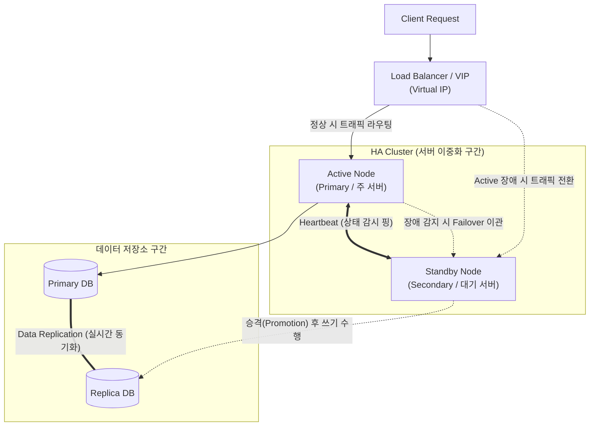

# HA (High Availability, 고가용성)

---

## I. 무중단 비즈니스 연속성을 보장하는 IT 인프라 설계의 핵심, HA의 개요

* **정의**: 서버, 네트워크, 스토리지 등의 IT 시스템이 철저한 이중화(Redundancy) 및 장애 조치(Failover) 메커니즘을 통해, 오랜 기간 동안 지속적으로 정상 운영을 유지할 수 있는 능력(예: 99.999% 가동률)
* **필요성 및 주요 특징**:
* **단일 장애점(SPOF) 제거**: 시스템 구성 요소 중 어느 하나가 고장 나더라도 전체 서비스가 중단되지 않도록 모든 경로와 자원을 다중화하여 설계
* **자동화된 장애 복구**: 주 서버(Active)에 장애가 발생하면 예비 서버(Standby)가 즉각적으로 서비스 IP(VIP)와 세션을 인계받아 다운타임(Downtime)을 최소화
* **[[비즈니스 연속성 계획]]([[BCP]]) 달성**: 금융, 이커머스, 클라우드 서비스 등 단 몇 분의 장애로도 막대한 금전적 손실과 신뢰도 하락이 발생하는 미션 크리티컬 환경의 필수 아키텍처

---

## II. HA의 개념도 및 핵심 기술 요소

### 가. HA 클러스터(Active-Standby) 구성 개념도 및 동작 원리

* 두 노드는 **하트비트(Heartbeat)** 전용망을 통해 서로의 상태를 주기적으로 감시함
* Active 노드 장애 시, Standby 노드가 가상 IP(VIP)를 탈취(Takeover)하고 즉시 Active 상태로 승격(Promotion)되어 클라이언트의 요청을 끊김 없이 처리하는 페일오버(Failover)가 발생함

### 나. HA의 핵심 기술 및 지표 구성 요소

| 구분 | 요소기술(키워드) | 세부 설명 |
| --- | --- | --- |
| **핵심 설계** | SPOF (Single Point of Failure) | 단일 고장점. HA 아키텍처 설계 시 가장 우선적으로 식별하고 다중화하여 제거해야 하는 시스템의 병목 구간 |
| **운영 방식** | Active-Standby | 한 대는 서비스(Active)를 처리하고, 다른 한 대는 대기(Standby)하며 장애 시에만 투입되는 구조 (구성 쉬움, 자원 유휴 발생) |
| **운영 방식** | Active-Active | 구성된 모든 노드가 동시에 서비스를 처리하는 구조로, 부하 분산(Load Balancing)과 고가용성을 동시에 달성 (구성 복잡) |
| **장애 조치** | Failover / Failback | 장애 발생 시 대기 시스템으로 자동 전환되는 현상을 **Failover**, 원복되어 기존 주 시스템으로 돌아가는 것을 **Failback**이라 함 |
| **상태 감시** | Heartbeat (하트비트) | 클러스터 내의 노드들이 서로 살아있음을 확인하기 위해 주기적으로 주고받는 네트워크 신호 |
| **네트워크** | VIP (Virtual IP) / [[MAC]] Takeover | 물리적인 서버 IP 대신 논리적인 가상 IP를 외부에 노출하여, 백엔드 서버가 변경되어도 클라이언트는 동일한 IP로 접근하도록 지원 |
| **평가 지표** | Nines (9s) 가동률 | 연간 허용되는 다운타임을 나타내는 지표. **99.999% (Five Nines)**는 연간 다운타임이 약 **5.26분**에 불과한 최상위 HA 상태를 의미 |
| **공식** | MTBF / MTTR | 가동률(Availability) = $\frac{MTBF}{MTBF + MTTR} \times 100$ (MTBF: 평균 무고장 시간, MTTR: 평균 수리 시간) |

---

## III. 시스템 생존성 아키텍처 비교 및 최신 동향

### 가. 시스템 연속성 보장 수준별 비교 (HA vs FT vs DR)

| 비교 항목 | HA (High Availability, 고가용성) | FT (Fault Tolerance, 결함 허용) | DR (Disaster Recovery, 재해 복구) |
| --- | --- | --- | --- |
| **목적** | 단일 장애점 극복 및 다운타임 **최소화** | 장치 고장 시에도 다운타임 **제로(0)** 보장 | 지진, 화재 등 **물리적 재난(재해)** 발생 시 시스템 복구 |
| **다운타임 허용** | 수 초 ~ 수 분 이내의 짧은 순단 발생 가능 | **단 1초의 다운타임도 허용하지 않음** | 수 시간 ~ 수 일 (RTO/RPO 기준에 따름) |
| **구현 방식** | 소프트웨어 클러스터링 기반 (Active-Standby) | 하드웨어 락스텝(Lockstep) 동기화, 다중 부품 병렬 처리 | 물리적으로 멀리 떨어진 원격지(다른 Region)에 백업 센터 구축 |
| **비용 및 활용** | 상대적으로 합리적 / 대부분의 상용 서비스 | 구축 비용이 매우 비쌈 / 항공기, 원자력 등 특수 목적 | 대규모 인프라 투자 필요 / 금융권 및 엔터프라이즈 |

### 나. 최신 클라우드 네이티브 환경의 HA 동향

* **Multi-AZ (가용 영역) 분산 배치 기본화**: 온프레미스 시대에는 단일 데이터센터 내의 서버 랙(Rack) 단위 이중화에 머물렀으나, 현재 AWS, GCP 등 퍼블릭 클라우드 환경에서는 물리적으로 분리된 여러 데이터센터(Multi-AZ)에 인스턴스와 DB(Amazon RDS Multi-AZ 등)를 분산 배치하여, 특정 데이터센터 전체 정전 시에도 HA를 보장하는 아키텍처가 표준이 됨
* **Kubernetes(K8s) 기반의 자가 치유(Self-Healing)**: 마이크로서비스([[MSA (Micro Service Architecture)|MSA]]) 환경에서는 특정 [[컨테이너]](Pod)나 노드가 다운되면, 쿠버네티스의 컨트롤 플레인이 선언적 상태(Desired State)를 유지하기 위해 즉시 다른 노드에 새로운 파드를 띄워(Rescheduling) 무중단 서비스를 이어가는 소프트웨어 기반의 고도화된 HA가 기본 내장(Built-in)되어 동작함

---

### 🔗 연관 토픽

- **소속 도메인**: [[00_컴퓨터구조_MOC|💻 컴퓨터구조]]
- **세부 분류**: `2. 캐시 & 메모리 계층 구조 · 스토리지`
- **핵심 연관 토픽**:
  - [[RAID]]
  - [[컨테이너|컨테이너 (Container)]]
  - [[무결성]]
  - [[클라우드 네이티브]]
  - [[신뢰성]]
