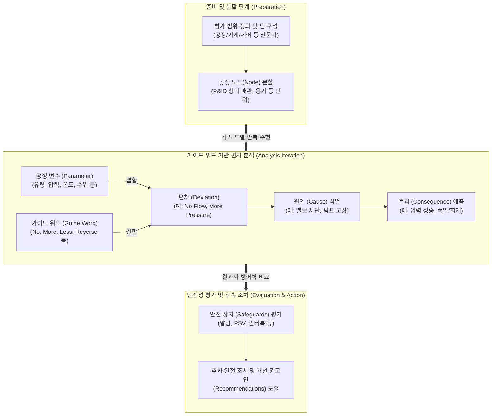

# HAZOP (Hazard and Operability Study)

---

## I. 공정 안전을 위한 체계적 위험성 평가 기법, HAZOP의 개요

* **정의**: 공정 설계 및 운전 지침서(P&ID 등)를 바탕으로, 다학제간 전문가 팀(Multidisciplinary Team)이 모여 시스템을 여러 구간(Node)으로 나누고, 가이드 워드(Guide Word)와 공정 변수(Parameter)를 결합해 의도된 설계 조건으로부터의 편차(Deviation)를 찾아내어 잠재적 위험성과 운전상의 문제점을 도출하는 체계적인 정성적 위험성 평가 기법 (IEC 61882 표준)
* **필요성 및 주요 특징**:
* **체계적 브레인스토밍 (Systematic Brainstorming)**: 펌프, 배관, 반응기 등 공정 전체를 촘촘하게 분할(Node)하고, 모든 변수에 대해 예외 없이 가이드 워드를 적용함으로써 분석의 누락을 원천적으로 방지
* **원인-결과-방어벽의 구조화**: 특정 편차가 발생하는 '원인'을 찾고, 그로 인한 최악의 '결과'를 예측하며, 현재 갖춰진 '안전 장치(Safeguard)'의 적절성을 평가하여 필요시 '개선 권고안'을 도출
* **공정안전관리(PSM)의 핵심**: 석유화학, 플랜트, 가스, 제약 등 중대산업사고 발생 위험이 높은 고위험 공정에서 법적으로 요구되는 필수적인 공정위험성평가(PHA) 방법론

---

## II. HAZOP의 개념도 및 핵심 기술 요소

### 가. HAZOP의 동작 프로세스 및 논리 전개 개념도

* HAZOP은 설계 의도를 가진 **노드(Node)** 단위로 수행되며, 가이드 워드와 공정 변수가 결합하여 발생 가능한 이상 상태인 편차(Deviation)를 강제로 상상하게 만듦
* 도출된 편차에 대해 현실적인 원인과 결과를 분석한 후, 기존 안전 장치로 감당이 불가하다고 판단되면 즉각적인 설계 변경이나 절차 보완을 권고함

### 나. HAZOP의 핵심 기준 및 구성 요소 (가이드 워드 중심)

| 구분 | 요소(키워드) | 세부 설명 |
| --- | --- | --- |
| **분석 단위** | Node (노드) | P&ID(배관 및 계장도) 상에서 일정한 설계 의도를 가지는 공정의 분할 구역 (예: 펌프부터 반응기까지의 배관) |
| **변수 요소** | Parameter (공정 변수) | 유량(Flow), 압력(Pressure), 온도(Temperature), 수위(Level), 조성(Composition) 등 공정의 물리/화학적 상태 값 |
| **가이드 워드** | No / None (없음) | 설계 의도가 완전히 이루어지지 않은 상태 (예: No + Flow = 유량 없음) |
| **가이드 워드** | More (증가/많음) | 공정 변수가 설계 기준치를 초과하여 증가한 상태 (예: More + Pressure = 고압) |
| **가이드 워드** | Less (감소/적음) | 공정 변수가 설계 기준치에 미달하는 상태 (예: Less + Temperature = 저온) |
| **가이드 워드** | Reverse (역방향) | 설계 의도와 반대 방향으로 작동하거나 흐르는 상태 (예: Reverse + Flow = 역류) |
| **가이드 워드** | As well as / Part of | 의도한 불순물 외에 다른 물질이 포함(As well as)되거나, 의도한 물질 중 일부가 누락(Part of)된 상태 |
| **안전 장치** | Safeguard (안전 장치) | 편차를 예방하거나, 감지하거나, 결과를 완화할 수 있는 물리적/시스템적 방어벽 (릴리프 밸브, 알람 등) |

---

## III. 위험성 평가 기법 비교 및 최신 산업 동향

### 가. 주요 공정 위험성 평가 기법 비교 (HAZID vs HAZOP)

| 비교 항목 | HAZID (Hazard Identification) | HAZOP (Hazard and Operability) |
| --- | --- | --- |
| **수행 시기** | 프로젝트 초기 개념 설계 및 FEED 단계 | **상세 설계 (P&ID 완료 및 확정) 단계** |
| **분석 수준** | 거시적 (System / Area 단위의 큰 그림) | **미시적 (Node 단위, 배관/기기별 상세 분석)** |
| **분석 도구** | 거시적 체크리스트 및 광범위한 위험 카테고리 | **가이드 워드 + 공정 변수 기반의 편차 탐색** |
| **목적 및 결과물** | 부지 선정, 주요 설비 배치, 심각한 치명적 위험 식별 | 세부적인 조작 오류, 설비 고장 시나리오 파악 및 안전 장치(인터록) 설계 검증 |

### 나. HAZOP의 고도화 및 최신 적용 동향

* **반정량적 리스크 평가(LOPA)와의 통합 연계**: 전통적인 HAZOP은 정성적(Qualitative) 방법론이므로, 위험의 크기를 정확한 수치로 나타내기 어려움. 최근에는 HAZOP을 통해 심각한 위험(시나리오)이 도출되면, 이를 방호계층분석(LOPA; Layer of Protection Analysis)으로 넘겨 사고 발생 빈도와 방어벽의 신뢰도를 수치화(SIL 등급 도출)하는 'HAZOP-LOPA 통합 파이프라인'이 글로벌 EPC 및 플랜트 안전 표준으로 정착됨
* **사이버 보안 영역으로의 확장 (CHAZOP; Cyber-HAZOP)**: 원전 및 스마트 팩토리의 OT(운영 기술)망과 ICS(산업제어시스템)가 IT망과 연결되면서 해킹 위협이 급증함. 이에 따라 물리적 배관이나 밸브 대신, '네트워크 노드'와 '데이터 흐름'을 파라미터로 설정하여 스턱스넷(Stuxnet)과 같은 제어 시스템 해킹의 원인과 결과를 평가하는 CHAZOP 기법이 국가 핵심 기반시설에 의무화되는 추세임

---

### 🔗 연관 토픽

- **소속 도메인**: [[00_소프트웨어공학_MOC|🏗️ 소프트웨어공학]]
- **세부 분류**: `2. 애자일(Agile) & 지속적 통합/배포(CI/CD)`
- **핵심 연관 토픽**:
  - [[기능안전 표준|기능안전 표준 (Functional Safety Standards)]]
  - [[SW 안전성(SW Safety) 및 분석 개념]]
  - [[DevOps|데브옵스 (DevOps)]]
  - [[리그레션 테스트|리그레션(회귀, Regression) 테스트]]
  - [[TDD|TDD (Test Driven Development)]]
