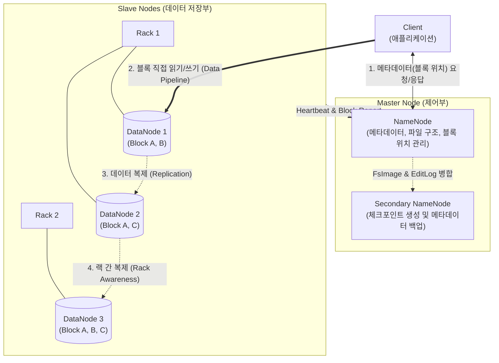

# HDFS (Hadoop Distributed File System)

## I. 페타바이트급 대용량 데이터 분산 저장의 표준, HDFS의 개요

* **정의**: 수십 테라바이트에서 페타바이트 규모의 대용량 파일을 저가의 상용 하드웨어(Commodity Hardware) 클러스터에 분산 저장하고, 높은 [[처리량]](Throughput)으로 접근할 수 있도록 설계된 아파치 [[하둡]](Apache Hadoop) 생태계의 핵심 분산 파일 시스템
* **필요성 및 주요 특징**:
* **내결함성 (Fault Tolerance)**: 하드웨어 고장을 일상적인(Norm) 현상으로 가정하고, 데이터 블록을 여러 노드에 복제하여 장애 발생 시에도 데이터 유실을 방지하고 무중단 서비스를 제공
* **대용량 데이터 스트리밍**: 수많은 작은 파일보다는 소수의 거대한 파일을 처리하는 데 최적화되어 있으며, 한 번 쓰고 여러 번 읽는(Write-Once-Read-Many) 일괄 처리(Batch Processing) 워크로드에 적합
* **데이터 [[지역성]] (Data Locality)**: 방대한 데이터를 연산 서버로 네트워크를 통해 전송하는 대신, 데이터가 저장된 물리적 노드(DataNode)로 연산 코드(MapReduce, Spark 등)를 이동시켜 처리함으로써 네트워크 병목을 최소화

---

## II. HDFS의 아키텍처 개념도 및 핵심 기술 요소

### 가. HDFS의 Master-Slave 아키텍처 및 데이터 입출력 개념도

* **단일 마스터 구조**: HDFS 클러스터는 메타데이터를 관리하는 단일 NameNode와 실제 데이터를 저장하는 다수의 DataNode로 구성됨
* 클라이언트는 NameNode를 통해 파일의 위치 정보만 획득한 후, 실제 데이터 입출력은 DataNode와 직접 통신하여 NameNode의 병목을 방지함

### 나. HDFS의 핵심 기술 및 구성 요소

| 구분 | 요소기술(키워드) | 세부 설명 |
| --- | --- | --- |
| **마스터 노드** | NameNode (네임노드) | 파일 시스템의 네임스페이스(디렉토리 구조)와 각 파일이 어떤 블록으로 구성되어 어느 노드에 저장되어 있는지(메타데이터)를 메모리에서 관리 |
| **워커 노드** | DataNode (데이터노드) | NameNode의 지시에 따라 클라이언트의 읽기/쓰기 요청을 처리하고, 주기적으로 자신의 상태(Heartbeat)와 보유한 블록 목록을 보고 |
| **보조 마스터** | Secondary NameNode | NameNode의 메모리 부하를 줄이기 위해, [[트랜잭션]] 로그(EditLog)와 파일 시스템 스냅샷(FsImage)을 주기적으로 병합(Checkpointing)하는 백업 노드 |
| **저장 단위** | Block (블록) | HDFS에서 데이터를 나누어 저장하는 논리적 단위. 일반 OS(4KB)와 달리 기본 128MB 단위의 거대한 블록을 사용하여 디스크 탐색 시간(Seek Time) 오버헤드 최소화 |
| **데이터 보호** | Replication (복제) | 하드웨어 고장에 대비하여 동일한 블록을 기본적으로 3개의 서로 다른 DataNode에 분산 복제하여 저장 |
| **[[HA(High Availability)|가용성]] 전략** | Rack Awareness (랙 인지) | 네트워크 스위치나 전원 장애로 물리적 랙(Rack) 전체가 다운되는 상황을 방지하기 위해, 복제본 중 최소 1개는 반드시 다른 랙에 저장하는 배치 [[알고리즘]] |

---

## III. 데이터 저장소 아키텍처 비교 및 최신 동향

### 가. 빅데이터 스토리지 구조 비교 (HDFS vs Cloud Object Storage)

| 비교 항목 | HDFS (Hadoop Distributed File System) | Cloud Object Storage (Amazon S3, ABFS) |
| --- | --- | --- |
| **구조 패러다임** | 컴퓨팅(YARN)과 스토리지(HDFS)의 **강한 결합** | 컴퓨팅(EC2 등)과 스토리지(S3)의 **완전한 분리** |
| **네임스페이스** | 전통적인 계층형(Tree) 디렉토리 구조 | 평면적(Flat)인 버킷(Bucket) 및 키(Key) 구조 |
| **확장성 제약** | NameNode의 물리적 메모리 크기에 의한 메타데이터 병목 한계 존재 | 클라우드 인프라 기반의 사실상 무한한 확장성 |
| **데이터 수정** | 덮어쓰기 불가 (Append-only 만 가능) | 객체 덮어쓰기(Overwrite) 및 버전 관리 가능 |
| **주요 사용처** | 온프레미스 빅데이터 클러스터, 데이터 레이크 | [[클라우드 네이티브]] [[데이터 레이크하우스]] 구축 |

### 나. HDFS의 생태계 변화 및 진화 방향

* **컴퓨팅-스토리지 분리(Decoupling) 및 클라우드 이전**: 퍼블릭 클라우드의 발달로 인해 노드를 늘릴 때 컴퓨팅과 스토리지를 동시에 증설해야 하는 HDFS의 경직성이 한계로 지적됨. 현대의 데이터 레이크는 무한 확장과 저비용을 자랑하는 클라우드 객체 스토리지(S3, GCS 등)로 대체되었으며, HDFS API 호환 레이어(S3A 등)를 통해 Spark, Presto 연산 엔진이 클라우드 저장소와 직접 통신하는 구조가 표준이 됨
* **온프레미스 HDFS의 고도화 (Ozone 및 Erasure Coding)**: 클라우드 이전을 할 수 없는 온프레미스 환경(금융권, 국가망 등)에서는, NameNode의 메타데이터 병목 현상을 타파하기 위해 블록 크기 제약 없이 수십억 개의 작은 파일(Small Files)을 처리할 수 있는 **Apache Ozone** 프로젝트가 차세대 HDFS로 주목받고 있으며, [[Hadoop 3.0]]에 도입된 [[이레이저 코딩]](Erasure Coding)을 통해 스토리지 오버헤드를 줄이는 방향으로 생존 트렌드가 형성되고 있음

---

### 🔗 연관 토픽

- **소속 도메인**: [[00_데이터베이스_MOC|🗄️ 데이터베이스]]
- **세부 분류**: `4. 물리 저장 구조 & 인덱스 최적화`
- **핵심 연관 토픽**:
  - [[Hadoop 3.0]]
  - [[하둡]]
  - [[지역성|지역성(Locality)]]
  - [[이레이저 코딩|이레이저 코딩(erasure coding)]]
  - [[빅데이터 관련 정보화 사업에 대한 감리 수행]]
