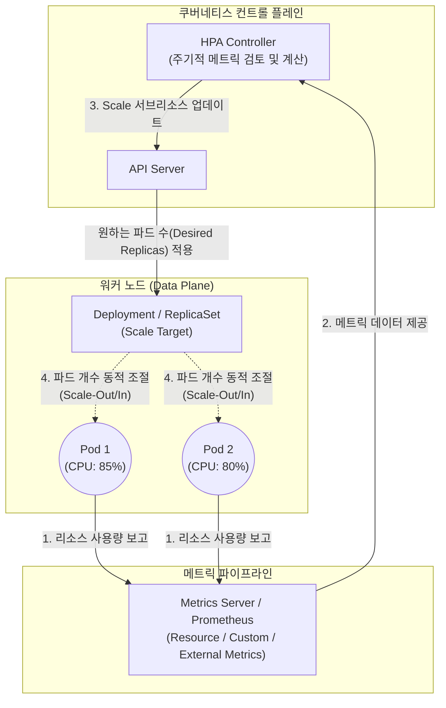

# HPA (Horizontal Pod Autoscaler)

---

## I. 쿠버네티스 워크로드의 동적 부하 대응을 위한 수평 확장 메커니즘, HPA의 개요

* **정의**: [[쿠버네티스]](Kubernetes) 환경에서 [[CPU]], 메모리 사용량 또는 사용자 정의 지표(Custom Metrics)를 모니터링하여, 디플로이먼트(Deployment)나 레플리카셋(ReplicaSet) 내의 파드(Pod) 개수를 자동으로 늘리거나(Scale-out) 줄이는(Scale-in) 오토스케일링 컨트롤러
* **필요성 및 주요 특징**:
* **동적 트래픽 대응(Elasticity)**: 이벤트, 프로모션 등으로 인한 갑작스러운 트래픽 급증(Spike) 시 파드를 즉각적으로 복제하여 서비스의 지연(Latency) 및 장애를 방지
* **클라우드 비용 최적화(Cost Efficiency)**: 트래픽이 감소하는 유휴 시간대에는 불필요한 파드를 회수(Scale-in)하여 클라우드 인프라 자원 낭비를 최소화
* **다양한 메트릭 통합**: 기본 리소스(CPU/Memory) 지표뿐만 아니라, Prometheus 등 외부 모니터링 도구와 연동하여 HTTP 요청 수(RPS), 큐 대기열 길이 등 비즈니스 중심의 메트릭 기반 스케일링 지원

---

## II. HPA의 개념도 및 핵심 기술 요소

### 가. HPA의 동작 메커니즘 및 아키텍처 개념도

* **HPA Controller**는 제어 루프(기본 15초)마다 Metrics Server 또는 Custom Metrics API를 쿼리하여 파드의 현재 부하 상태를 파악함
* 계산 공식에 따라 도출된 목표 파드 수를 API Server를 통해 Deployment의 Scale 서브리소스에 업데이트하면, 쿠버네티스가 파드를 추가 생성하거나 제거함

### 나. HPA의 핵심 기술 및 구성 요소

| 구분 | 요소기술(키워드) | 세부 설명 |
| --- | --- | --- |
| **핵심 [[알고리즘]]** | 비율 기반 스케일링 공식 | `목표 파드 수 = ⌈현재 파드 수 × (현재 메트릭 값 / 목표 메트릭 값)⌉` (올림 처리) |
| **모니터링 연동** | Metrics Server | 클러스터 내 파드와 노드의 CPU, Memory 등 기본 리소스 지표를 메모리 기반으로 수집하여 HPA에 제공하는 애드온 |
| **모니터링 연동** | Custom Metrics API | 쿠버네티스 내장 지표 외에 애플리케이션 특화 지표(예: 동시 접속자 수, TPS)를 HPA가 인식할 수 있도록 연결하는 어댑터 |
| **제어 안정성** | Stabilization Window (안정화 윈도우) | 지표의 일시적인 튀어오름(Spike)으로 인해 파드가 급격히 늘어났다 줄어드는 **플래핑(Flapping/Thrashing)** 현상을 방지하기 위한 대기/지연 시간 |
| **제어 안정성** | Cooldown Period (쿨다운 주기) | 스케일 아웃이 발생한 후 다음 스케일 액션이 발생하기 전까지 상태가 안정화되기를 기다리는 시간 (Scale-in 시 기본 5분) |
| **스케일 대상** | Scale Target (Scale Subresource) | HPA가 파드 개수를 직접 제어하지 않고, Deployment, StatefulSet 등 상위 컨트롤러의 레플리카(Replica) 값을 수정하여 간접 제어 |

---

## III. 쿠버네티스 오토스케일링 기법 비교 및 최신 동향

### 가. 쿠버네티스 3대 오토스케일러 비교 (HPA vs VPA vs CA)

| 비교 항목 | HPA (Horizontal Pod Autoscaler) | VPA (Vertical Pod Autoscaler) | CA (Cluster Autoscaler) |
| --- | --- | --- | --- |
| **스케일링 방식** | **수평 확장 (Scale-Out / In)** | **수직 확장 (Scale-Up / Down)** | **수평 확장 (Scale-Out / In)** |
| **조절 대상** | **파드(Pod)의 개수** | 파드의 **CPU, Memory 할당량** (Requests/Limits) | 쿠버네티스 **워커 노드(VM, EC2 등)의 개수** |
| **트리거 시점** | 파드의 메트릭이 설정한 임계치 초과 시 | 파드 구동에 더 많은 리소스(OOM 방지 등)가 필요할 때 | 자원 부족으로 파드가 할당되지 못하고 **Pending 상태**일 때 |
| **주요 한계점** | 클러스터(노드)의 총 가용 자원이 부족하면 파드 생성 불가 (Pending 상태 진입) | 현재 아키텍처상 리소스를 변경하기 위해 파드를 **재시작(Restart)** 해야 함 | [[CSP]](AWS, GCP) 종속성이 크며, 새 노드를 프로비저닝하는 데 수 분의 **시간 지연** 발생 |

### 나. 오토스케일링의 최신 산업 동향 및 발전 방향

* **이벤트 주도형 스케일링, KEDA(Kubernetes Event-driven Autoscaling)의 부상**: 기존 HPA는 일정 주기의 메트릭 풀링에 의존하고 0으로의 축소(Scale-to-Zero)가 불가능한 한계가 있음. 이를 극복하기 위해 Kafka, RabbitMQ, AWS SQS 등의 외부 이벤트 큐([[Queue]]) 길이 변화에 즉각적으로 반응하여 파드를 확장하고, 트래픽이 없으면 **서버리스(Serverless)처럼 파드를 0개로 줄여** 극단적인 비용 최적화를 달성하는 KEDA가 현대 [[MSA (Micro Service Architecture)|MSA]] 표준으로 자리 잡음
* **HPA와 JIT(Just-In-Time) 노드 프로비저닝의 결합 (Karpenter)**: HPA가 파드를 폭발적으로 늘렸으나 워커 노드 자원이 부족하여 파드가 Pending될 때, 기존 CA(Cluster Autoscaler)는 노드 추가에 시간이 오래 걸림. 최근에는 AWS Karpenter와 같이 Pending된 파드의 요구 사항을 즉시 분석하여 단 몇 초 만에 최적의 노드를 생성해 붙여주는 JIT 인프라 기술이 HPA와 결합하여 실시간 부하 대응력(Agility)을 극대화하고 있음

---

### 🔗 연관 토픽

- **소속 도메인**: [[00_디지털서비스_MOC|🚀 디지털서비스]]
- **세부 분류**: `1. 클라우드 컴퓨팅 & 가상화 인프라`
- **핵심 연관 토픽**:
  - [[CSP|CSP (Cloud Service Provider)]]
  - [[쿠버네티스|쿠버네티스(Kubernates)]]
  - [[Auto Scale Up Auto Scale Out]]
  - [[처리량]]
  - [[도커|도커 (Docker)]]
