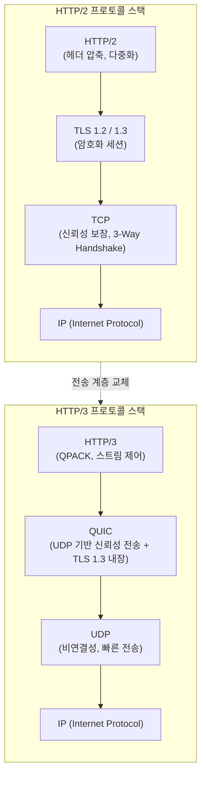

# HTTP/3

---

## I. TCP의 태생적 한계를 극복한 차세대 웹 통신 표준, HTTP/3의 개요

* **정의**: IETF에서 표준화(RFC 9114)한 세 번째 메이저 버전의 하이퍼텍스트 전송 프로토콜로, [[전송 계층]](Transport Layer)에 전통적인 [[TCP]] 대신 **UDP 기반의 QUIC(Quick UDP Internet Connections)** 프로토콜을 채택하여 웹 통신의 속도와 안정성을 혁신한 기술
* **필요성 및 주요 특징**:
* **HoL(Head-of-Line) 블로킹 원천 해결**: HTTP/2가 [[다중화]](Multiplexing)를 도입했음에도 TCP 레이어에서 패킷 하나가 손실되면 뒤따르는 모든 패킷이 대기해야 했던 병목 현상을 타파
* **초고속 연결 수립 (0-RTT)**: TCP의 3-Way Handshake와 TLS의 [[암호화]] 핸드쉐이크 과정을 하나로 통합하여, 재접속 시 통신 지연(Latency) 없이 즉시 데이터를 전송
* **끊김 없는 연결 마이그레이션**: 모바일 기기가 Wi-Fi에서 LTE/5G로 전환되어 IP 주소가 바뀌더라도, 통신 세션을 유지하여 스트리밍이나 다운로드의 끊김을 방지

---

## II. HTTP/3의 개념도 및 핵심 기술 요소

### 가. 프로토콜 스택 비교 개념도 (HTTP/2 vs HTTP/3)

* HTTP/2는 독립된 TCP와 TLS 위에서 동작하여 연결 수립에 시간이 오래 걸리고 TCP 레이어의 HoL 블로킹이 발생함
* HTTP/3는 가볍고 빠른 UDP를 기반으로 하되, TCP의 [[신뢰성]] 제어와 TLS 1.3 암호화 계층을 하나로 통합한 **QUIC** 엔진 위에서 동작하여 전송 효율을 극대화함

### 나. HTTP/3의 핵심 기술 및 구성 요소

| 구분 | 요소기술(키워드) | 세부 설명 |
| --- | --- | --- |
| **핵심 [[프로토콜]]** | QUIC | 구글이 개발하고 IETF가 표준화한 UDP 기반의 범용 전송 계층 프로토콜. 패킷 재전송, [[혼잡 제어]] 등을 사용자 공간(User Space)에서 직접 처리 |
| **지연 시간 단축** | 1-RTT & 0-RTT | 최초 연결 시 암호화와 연결 수립을 1번의 왕복(1-RTT)으로 끝내고, 이전에 접속했던 서버와는 핸드쉐이크 없이 바로 데이터 전송(0-RTT) |
| **병목 해결** | Independent Streams | QUIC 내의 스트림들은 서로 완전히 독립적이어서, 특정 스트림의 패킷이 유실되더라도 다른 스트림의 데이터 처리에 지연(HoL Blocking)을 주지 않음 |
| **모바일 최적화** | Connection Migration | IP/포트 튜플(Tuple) 대신 고유한 **Connection ID**를 사용하여 클라이언트를 식별하므로, 망 전환(네트워크 변경) 시에도 세션이 유지됨 |
| **보안 강화** | 내장된 TLS 1.3 | 프로토콜 스펙 자체에 TLS 1.3 적용이 강제 및 내장되어 있어, 평문 통신이 불가능하며 패킷의 헤더(메타데이터) 영역까지 암호화하여 보안성 향상 |
| **헤더 압축** | QPACK | HTTP/2의 HPACK을 개선하여, UDP의 순서가 뒤섞이는(Out-of-order) 특성 하에서도 헤더 압축과 복원이 정상적으로 이루어지도록 설계된 [[알고리즘]] |

---

## III. HTTP 버전별 비교 및 최신 도입 동향

### 가. HTTP 프로토콜의 진화 비교 (HTTP/1.1 vs HTTP/2 vs HTTP/3)

| 비교 항목 | HTTP/1.1 | HTTP/2 | HTTP/3 |
| --- | --- | --- | --- |
| **전송 계층 (Transport)** | TCP | TCP | **UDP (QUIC)** |
| **멀티플렉싱 (Multiplexing)** | 미지원 (Keep-Alive, Pipelining 한계) | 스트림 다중화 지원 | **스트림 다중화 지원** |
| **HoL (Head-of-Line) 블로킹** | HTTP, TCP 계층 모두에서 발생 | HTTP 계층 해결, **TCP 계층 한계 존재** | **완전 해결 (네트워크 지연 무관)** |
| **보안 (TLS)** | 선택 사항 (HTTP/HTTPS) | 필수 권장 (대부분의 브라우저 강제) | **기본 내장 (TLS 1.3 강제 적용)** |
| **네트워크 전환 (이동성)** | 불가능 (IP 변경 시 연결 끊어짐) | 불가능 | **가능 (Connection ID 기반)** |
| **헤더 압축 기술** | 텍스트 압축 없음 | HPACK | **QPACK** |

### 나. HTTP/3의 최신 산업 동향 및 적용 전망

* **글로벌 트래픽의 모바일 최적화 대세**: 메타(인스타그램, 페이스북), 구글(유튜브, 검색), 클라우드플레어(Cloudflare) 등 모바일 트래픽이 절대적인 글로벌 빅테크 플랫폼들은 네트워크 전환 시 지연을 방지하는 Connection Migration의 이점을 누리기 위해 이미 대부분의 트래픽을 HTTP/3로 전환하여 서비스 중임
* **기업망 [[방화벽]] 이슈와 Fallback 아키텍처**: 많은 기업망이나 통신사 방화벽 정책이 전통적인 TCP 80/443 포트만 허용하고 UDP 443 포트를 차단하는 경우가 많음. 이를 해결하기 위해 최신 웹 서버 및 브라우저는 초기 요청 시 `Alt-Svc` 헤더를 통해 HTTP/3 지원 여부를 알리고, UDP 통신이 막혀있을 경우 자동으로 HTTP/2(TCP)로 폴백(Fallback)하는 하이브리드 운영 전략을 기본 채택하고 있음

---

### 🔗 연관 토픽

- **소속 도메인**: [[00_네트워크_MOC|🌐 네트워크]]
- **세부 분류**: `1. OSI 7계층 & 데이터링크 계층 (L1/L2)`
- **핵심 연관 토픽**:
  - [[프로토콜]]
  - [[전송 계층|전송 계층 (Transport Layer)]]
  - [[TCP]]
  - [[네트워크 프로토콜|네트워크 프로토콜 (Network Protocol)]]
  - [[TCP 와 UDP 비교]]
