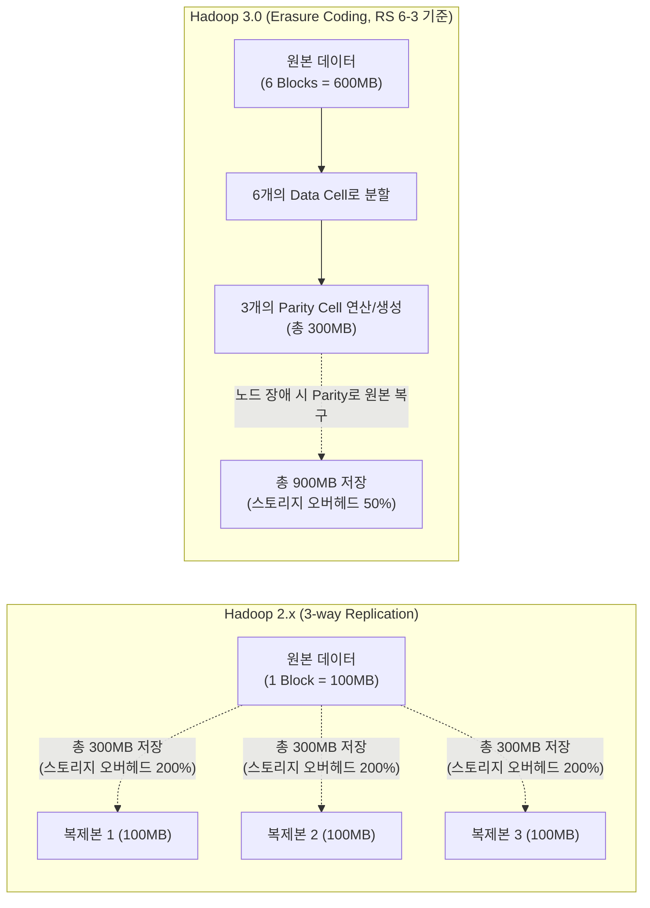

# Hadoop 3.0

---

## I. 스토리지 효율성 극대화와 AI 워크로드 지원을 위한 차세대 빅데이터 플랫폼, Hadoop 3.0의 개요

* **정의**: 아파치 [[하둡]](Apache Hadoop) 2.x의 아키텍처 한계(저장 공간 낭비, 확장성 병목)를 극복하고, [[HDFS]]의 스토리지 효율성 극대화 및 YARN의 스케일아웃(Scale-out) 확장성, 머신러닝(ML) 워크로드 처리를 지원하기 위해 출시된 분산 데이터 처리 [[프레임워크]] 메이저 버전
* **필요성 및 주요 특징**:
* **스토리지 비용 절감 (Erasure Coding)**: 기존 HDFS의 단순 3배수 복제(3-Way Replication) 방식이 유발하는 200%의 저장 공간 오버헤드를 타파하고, 데이터 복구 능력을 유지하면서 오버헤드를 약 50% 수준으로 혁신적으로 감축
* **단일 클러스터 한계 극복 (YARN Federation)**: 수천 대 규모에서 발생하던 YARN 자원 관리자의 병목 현상을 해결하여, 서브 클러스터 연합을 통해 1만 대 이상의 초대규모 노드 확장 지원
* **AI/머신러닝 워크로드 수용**: [[CPU]]와 메모리 중심의 기존 스케줄링을 넘어 [[GPU]], FPGA 등 하드웨어 가속기를 네이티브로 지원하여 [[딥러닝]] 애플리케이션의 분산 처리 환경 제공

---

## II. Hadoop 3.0의 개념도 및 핵심 기술 요소

### 가. Hadoop 3.0의 핵심 아키텍처 변화 (HDFS Erasure Coding 중심) 개념도

* Hadoop 3.0의 [[이레이저 코딩]](Reed-Solomon 6-3 기준)을 적용하면 6개의 데이터 블록당 3개의 패리티(Parity) 블록만 추가로 생성함.
* 장애 발생 시 남은 블록과 패리티를 통해 데이터를 복원(디코딩)할 수 있어, 2.x 대비 동일한 결함 허용(Fault Tolerance) 수준을 유지하면서도 저장 공간을 획기적으로 절약함

### 나. Hadoop 3.0의 5대 핵심 기술 및 구성 요소

| 구분 | 요소기술(키워드) | 세부 설명 |
| --- | --- | --- |
| **스토리지 (HDFS)** | Erasure Coding (이레이저 코딩) | 데이터 블록을 분할하고 패리티 비트를 추가 연산하여 저장함으로써, 기존 3배 복제 대비 스토리지 효율성을 극대화한 HDFS 핵심 기술 |
| **스토리지 (HDFS)** | Multi-NameNode HA | 기존 Active/Standby 2개로 제한되던 네임노드를 3개 이상 구성 가능하도록 확장하여, 마스터 노드의 결함 허용성(HA) 강화 |
| **자원 관리 (YARN)** | YARN Federation (연합) | 여러 개의 YARN 서브 클러스터를 하나로 묶어 [[라우터]](Router)를 통해 단일 클러스터처럼 투명하게 관리하는 대규모 확장 아키텍처 |
| **자원 관리 (YARN)** | 하드웨어 가속기 [[스케줄링]] | YARN이 컨테이너에 할당할 자원으로 CPU, Memory 외에 **GPU 및 FPGA** 리소스를 인식하고 스케줄링하여 AI/ML 워크로드 처리 지원 |
| **운영 환경** | [[도커|Docker]] Container 지원 | YARN NodeManager가 전통적인 JVM 컨테이너뿐만 아니라 Docker [[컨테이너]] 환경에서 애플리케이션을 배포 및 격리 실행할 수 있도록 지원 |
| **클라우드 통합** | Cloud Object Store 강화 | Amazon S3(S3A), MS Azure(ABFS), Aliyun 등 퍼블릭 클라우드의 객체 스토리지와 연동 시 성능 및 호환성을 대폭 개선 (S3 Guard 등) |

---

## III. Hadoop 2.x와 3.0 비교 및 최신 생태계 동향

### 가. Hadoop 메이저 버전 간 핵심 아키텍처 비교

| 비교 항목 | Hadoop 2.x | Hadoop 3.0 |
| --- | --- | --- |
| **HDFS 복제 구조** | 3-Way Replication (오버헤드 200%) | **Erasure Coding (오버헤드 50% 수준)** |
| **NameNode [[HA(High Availability)|가용성]]** | 최대 2개 (Active 1 + Standby 1) | **3개 이상의 NameNode** 구성 지원 (QJM 기반) |
| **YARN 노드 확장성** | 단일 클러스터 최대 수천 대 수준에서 병목 | **YARN Federation**으로 수만 대 이상 규모 확장 |
| **자원 스케줄링 범위** | CPU, Memory 자원 할당에 국한 | **GPU, FPGA 리소스** 포함 스케줄링 지원 |
| **최소 Java 요구사항** | Java 7 | **Java 8 이상** |
| **주요 운영 환경** | 온프레미스(On-premise) Bare-metal 중심 | 도커(Docker) 지원 및 **클라우드 연계(하이브리드)** 강화 |

### 나. 하둡 생태계의 최신 동향 및 아키텍처 패러다임 변화

* **빅데이터 인프라의 [[클라우드 네이티브]](Cloud-Native) 전환**: Hadoop 3.0이 클라우드와 컨테이너 지원을 강화했음에도 불구하고, 현재 글로벌 빅데이터 시장의 주도권은 온프레미스 기반의 Hadoop 생태계에서 AWS EMR, Databricks, Snowflake와 같은 클라우드 기반의 **[[데이터 레이크하우스|데이터 레이크하우스(Data Lakehouse)]]** 아키텍처로 완전히 이동하였음
* **컴퓨팅과 스토리지의 분리(Decoupling)**: 하둡의 철학이었던 '데이터가 있는 곳으로 연산을 이동(Data Locality)'시키는 방식은 쇠퇴하고 있음. 대신 Amazon S3와 같은 무한 확장이 가능한 객체 스토리지를 데이터 레이크로 활용하고, 연산은 Kubernetes(K8s) 상에서 동적으로 확장되는 Spark, Trino 컨테이너가 담당하는 **저장-연산 분리 아키텍처**가 현대 데이터 플랫폼의 확고한 표준으로 자리매김함

---

### 🔗 연관 토픽

- **소속 도메인**: [[00_데이터베이스_MOC|🗄️ 데이터베이스]]
- **세부 분류**: `4. 물리 저장 구조 & 인덱스 최적화`
- **핵심 연관 토픽**:
  - [[HDFS]]
  - [[이레이저 코딩|이레이저 코딩(erasure coding)]]
  - [[클라우드 네이티브]]
  - [[컨테이너|컨테이너 (Container)]]
  - [[스케줄링]]
