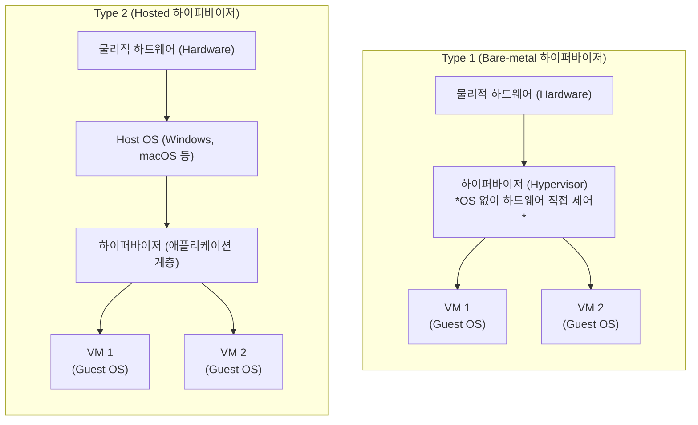

# 하이퍼바이저 (Hypervisor / VMM)

---

## I. 물리적 하드웨어 추상화 및 가상 머신(VM) 제어의 핵심 엔진, 하이퍼바이저의 개요

* **정의**: 단일 물리적 서버의 하드웨어 자원([[CPU]], 메모리, 스토리지 등)을 논리적으로 분할 및 추상화하여, 여러 개의 독립적인 가상 머신(Virtual Machine)을 생성, 실행, 관리하는 시스템 소프트웨어 또는 펌웨어 (Virtual Machine Monitor, VMM이라고도 불림)
* **필요성 및 주요 특징**:
* **하드웨어 자원 활용률 극대화**: 유휴 상태의 서버 자원을 여러 VM에 동적으로 할당(Provisioning)하여, 물리적 서버 한 대가 수십 대의 서버 역할을 수행하도록 함 (클라우드 컴퓨팅의 근간)
* **강력한 격리성(Isolation) 보장**: 각 VM은 독립된 Guest OS와 메모리 공간을 가지므로, 특정 VM에 장애가 발생하거나 보안이 뚫려도 다른 VM이나 호스트 시스템에 영향을 주지 않음
* **이식성 및 유연성**: VM의 상태를 스냅샷(Snapshot)으로 저장하거나, 가동 중인 상태 그대로 다른 물리 서버로 이동시키는 라이브 마이그레이션(Live Migration) 기능 제공

---

## II. 하이퍼바이저의 아키텍처 개념도 및 핵심 기술 요소

### 가. 하이퍼바이저의 2대 아키텍처(Type 1 vs Type 2) 개념도

* **Type 1 (네이티브/베어메탈)**: 하이퍼바이저가 하드웨어 위에 직접 설치되어 자원을 제어하므로 오버헤드가 적고 성능이 우수함 (기업용 서버 표준)
* **Type 2 (호스트형)**: 기존 [[OS(운영체제)|운영체제]](Host OS) 위에 소프트웨어 프로그램처럼 설치되어 동작하므로 설치가 쉽지만, OS를 거쳐야 하므로 성능 손실(오버헤드)이 발생함 (개인용/테스트용)

### 나. 하이퍼바이저의 핵심 기술 및 구성 요소

| 구분 | 요소기술(키워드) | 세부 설명 |
| --- | --- | --- |
| **권한 제어** | Ring Architecture | 하드웨어 제어 권한을 분리하는 구조. [[가상화]] 환경에서는 하이퍼바이저가 OS보다 더 높은 권한인 **Ring -1 (Root Mode)**에서 동작하여 하드웨어를 통제함 |
| **가상화 방식** | 전가상화 (Full Virtualization) | 하드웨어를 완전히 에뮬레이션하여 Guest OS가 자신이 가상 환경에서 도는 것을 인지하지 못하게 하는 방식 (OS 수정 불필요, 이진 변환(Binary Translation) 오버헤드 존재) |
| **가상화 방식** | 반가상화 (Para-Virtualization) | Guest OS의 커널을 수정하여, 하드웨어 제어 명령(Hypercall)을 하이퍼바이저로 직접 전달하게 함으로써 전가상화의 성능 저하를 극복한 방식 (예: Xen) |
| **H/W 지원** | 하드웨어 지원 가상화 | CPU 차원에서 가상화 명령어를 하드웨어로 직접 지원하여 전가상화의 성능을 획기적으로 높인 기술 (Intel VT-x, AMD-V) |
| **[[메모리 관리]]** | Shadow Page Table | Guest OS의 [[가상 메모리]] 주소를 하드웨어의 실제 물리 주소로 매핑하기 위해 하이퍼바이저가 유지 및 관리하는 주소 변환 테이블 |
| **I/O 제어** | SR-IOV (단일 루트 I/O 가상화) | 하나의 물리적 네트워크 카드(NIC)를 여러 개의 가상 PCIe 장치로 분할하여, 하이퍼바이저를 거치지 않고 VM이 직접 I/O를 처리하도록 하는 고성능 기술 |

---

## III. 하이퍼바이저 유형 비교 및 클라우드 인프라 최신 동향

### 가. Type 1 vs Type 2 하이퍼바이저 비교

| 비교 항목 | Type 1 (Bare-metal) | Type 2 (Hosted) |
| --- | --- | --- |
| **설치 계층** | 물리적 하드웨어 상단에 직접 설치 | 범용 OS (Host OS) 상단에 애플리케이션으로 설치 |
| **구동 성능** | 오버헤드가 거의 없어 **성능이 매우 우수** | Host OS를 거치므로 **성능 저하(오버헤드) 발생** |
| **보안 및 안정성** | 얇은 계층으로 공격 표면이 적어 매우 안전 | Host OS의 취약점이 모든 VM에 영향을 미침 |
| **대표 솔루션** | VMware ESXi, KVM, Microsoft Hyper-V, Xen | VMware Workstation, Oracle VirtualBox, Parallels |
| **주요 활용 분야** | 엔터프라이즈 데이터센터, 퍼블릭 클라우드 인프라 | 개인 PC의 개발/테스트 환경, 크로스 플랫폼 구동 |

### 나. 하이퍼바이저의 최신 기술 동향 및 진화 (MicroVM & Hardware Offloading)

* **스마트 닉(SmartNIC) 기반의 하드웨어 오프로딩 (AWS Nitro System)**: 하이퍼바이저가 서버의 CPU와 메모리를 점유하여 발생하는 자원 낭비(세금)를 없애기 위해, AWS 등 주요 클라우드 벤더는 하이퍼바이저의 네트워크, 스토리지, 보안 통제 기능을 별도의 특수 칩셋(DPU/IPU)으로 완전히 분리(Offloading)하여, 고객에게 100%의 서버 자원을 제공하는 아키텍처로 진화함.
* **마이크로VM (MicroVM) 기반 서버리스(Serverless) 혁신**: [[컨테이너]]([[도커|Docker]])의 빠른 속도와 가상 머신(하이퍼바이저)의 강력한 보안 격리성을 결합한 경량 하이퍼바이저(예: AWS Firecracker, Kata Containers)가 차세대 기술로 부상함. 불필요한 장치 에뮬레이션을 제거하여 밀리초(ms) 단위로 부팅되며, AWS Lambda와 같은 서버리스 컴퓨팅 및 안전한 멀티 테넌시(Multi-tenancy) 컨테이너 구동의 핵심 엔진으로 활약 중임.

---

### 🔗 연관 토픽

- **소속 도메인**: [[00_디지털서비스_MOC|🚀 디지털서비스]]
- **세부 분류**: `1. 클라우드 컴퓨팅 & 가상화 인프라`
- **핵심 연관 토픽**:
  - [[컨테이너|컨테이너 (Container)]]
  - [[가상화]]
  - [[도커|도커 (Docker)]]
  - [[CSP|CSP (Cloud Service Provider)]]
  - [[쿠버네티스|쿠버네티스(Kubernates)]]
