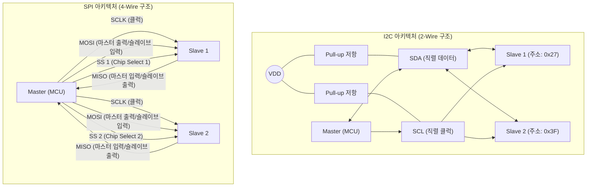

# I2C (Inter-Integrated Circuit)와 SPI (Serial Peripheral Interface)

---

## I. 임베디드 시스템의 근거리 직렬 통신 표준, I2C와 SPI의 개요

* **정의**: 마이크로컨트롤러(MCU)와 주변 장치(센서, 메모리, 디스플레이 등) 간에 데이터를 주고받기 위해 인쇄회로기판([[PCB(Process Control Block)|PCB]]) 내부에서 주로 사용되는 **동기식 직렬 통신(Synchronous Serial Communication)** [[프로토콜]]
* **필요성 및 주요 특징**:
* **I2C (필립스 개발)**: 단 2가닥의 선(데이터, 클럭)만 사용하여 핀(Pin) 리소스 낭비를 최소화하며, 주소(Address) 기반으로 여러 대의 마스터와 슬레이브를 연결하는 데 최적화된 저속/고효율 통신
* **SPI (모토로라 개발)**: 4가닥의 선을 사용하여 송신과 수신을 동시에 수행(전이중, Full-duplex)함으로써, 디스플레이나 플래시 메모리처럼 대용량 데이터의 초고속 전송이 필요한 환경에 최적화됨
* **상호보완적 활용**: IoT 디바이스 설계 시 속도보다 연결의 편의성과 핀 절약이 중요하면 I2C를, 속도와 실시간 대역폭이 중요하면 SPI를 선택하여 시스템 버스 아키텍처를 구성함

---

## II. I2C와 SPI의 아키텍처 개념도 및 핵심 기술 요소

### 가. I2C와 SPI의 하드웨어 연결 토폴로지 개념도

* **I2C**: 버스(Bus) 형태로 SDA, SCL 두 선을 모든 장치가 공유하며, 오픈 드레인(Open-Drain) 구조이므로 반드시 풀업(Pull-up) 저항이 필요함. 통신 대상을 주소(Address)로 식별함.
* **SPI**: SCLK, MOSI, MISO는 공유하지만, 슬레이브를 선택하기 위한 SS(Slave Select, 또는 CS) 라인이 슬레이브 개수만큼 개별적으로 필요함(물리적 식별).

### 나. I2C와 SPI의 핵심 핀(Pin) 구성 및 제어 기술

| 프로토콜 | 요소기술(키워드) | 세부 설명 |
| --- | --- | --- |
| **I2C** | **SDA** (Serial Data) | 마스터와 슬레이브가 데이터를 양방향으로 주고받는 유일한 데이터 선 (**반이중 통신**) |
| **I2C** | **SCL** (Serial Clock) | 마스터가 생성하여 버스 상의 모든 기기에 동기화를 제공하는 클럭 선 |
| **I2C** | **Addressing** (주소 지정) | 7-bit 또는 10-bit 주소를 데이터 프레임 헤더에 실어 통신할 특정 슬레이브를 논리적으로 선택 |
| **I2C** | **ACK / NACK** | 데이터 바이트 전송 후 수신측이 잘 받았는지(Acknowledge)를 확인하는 [[신뢰성]] 제어 비트 |
| **SPI** | **MOSI** (Master Out Slave In) | 마스터에서 슬레이브로 데이터를 전송하는 전용 라인 |
| **SPI** | **MISO** (Master In Slave Out) | 슬레이브에서 마스터로 데이터를 전송하는 전용 라인 (MOSI와 독립되어 **전이중 통신** 가능) |
| **SPI** | **SCLK** (Serial Clock) | 마스터가 생성하여 데이터 샘플링 시점을 결정하는 동기화 클럭 |
| **SPI** | **SS / CS** (Slave / Chip Select) | 마스터가 특정 슬레이브와 통신하기 위해 해당 핀을 Low(0) 상태로 활성화하는 하드웨어 제어 선 |

---

## III. I2C와 SPI 비교 및 차세대 임베디드 통신 동향

### 가. I2C와 SPI의 아키텍처 및 성능 비교

| 비교 항목 | I2C (Inter-Integrated Circuit) | SPI (Serial Peripheral Interface) |
| --- | --- | --- |
| **통신 방식** | **반이중 (Half-Duplex)** / 데이터 라인 1개 | **전이중 (Full-Duplex)** / 데이터 라인 2개 |
| **필요 핀(Pin) 수** | **2개 (SDA, SCL 고정)** - 슬레이브가 늘어도 핀 불변 | **기본 4개 (슬레이브 추가 시 SS 핀 1개씩 추가 필요)** |
| **연결 토폴로지** | 멀티 마스터(Multi-Master), 멀티 슬레이브 | 단일 마스터(Single-Master), 멀티 슬레이브 |
| **통신 속도** | 저속 ~ 중속 (100kHz, 400kHz, 최대 3.4MHz) | **초고속 (일반적으로 10MHz ~ 100MHz 이상 가능)** |
| **전력 및 회로** | 풀업 저항 필요, 오픈 드레인으로 소비 전력 다소 높음 | 풀업 저항 불필요, 푸시-풀(Push-Pull) 구동으로 효율적 |
| **주요 활용 부품** | 온도/습도 센서, EEPROM, RTC, 터치 컨트롤러 | LCD/OLED 디스플레이, SD 카드, 플래시 메모리, ADC |

### 나. 임베디드 통신 프로토콜의 발전 및 차세대 동향 (MIPI I3C)

* **I2C와 SPI의 한계를 극복한 차세대 표준, MIPI I3C의 부상**: 모바일 및 IoT 기기에 탑재되는 센서가 급증함에 따라, I2C의 한계(느린 속도, 높은 전력 소모)와 SPI의 한계(너무 많은 핀 수 요구)를 동시에 해결하기 위해 **MIPI 연합이 I3C(Improved Inter-Integrated Circuit) 표준을 발표**함.
* **I3C의 주요 혁신성**: 기존 I2C와 같이 **단 2가닥의 선**만 사용하면서도, 설계 구조를 푸시-풀(Push-Pull) 방식으로 개선하여 **SPI에 준하는 고속(최대 33Mbps)** 전송을 지원함. 또한, 동적 주소 할당(Dynamic Addressing)과 슬레이브가 마스터에 능동적으로 인터럽트를 거는 기능(In-Band Interrupt)을 추가하여, AIoT 및 [[Smart Car(자율주행)|자율주행]] 차량의 다중 센서 퓨전(Sensor Fusion) 환경을 위한 차세대 핵심 인터페이스로 빠르게 대체되고 있음.

---

### 🔗 연관 토픽

- **소속 도메인**: [[00_컴퓨터구조_MOC|💻 컴퓨터구조]]
- **세부 분류**: `2. 캐시 & 메모리 계층 구조 · 스토리지`
- **핵심 연관 토픽**:
  - [[프로토콜]]
  - [[신뢰성]]
  - [[Smart Car(자율주행)]]
  - [[PCB(Process Control Block)]]
  - [[PIM|PIM(Processing-In-Memory)]]
