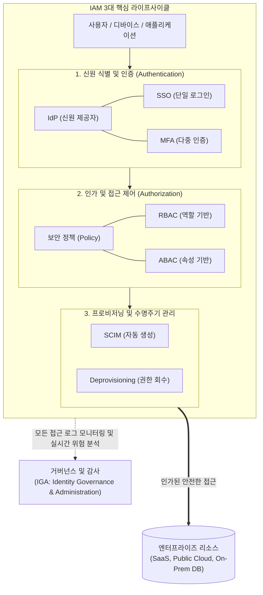

# IAM (Identity and Access Management)

---

## I. 제로 트러스트 아키텍처의 근간이자 통합 신원/권한 통제 체계, IAM의 개요

* **정의**: 기업의 IT 리소스(클라우드, SaaS, 내부 시스템 등)에 대해 '적절한 사용자(Who)'가 '적절한 권한(What)'으로 '적절한 조건(When/Where)' 하에 접근할 수 있도록 신원(Identity)과 접근(Access)의 전체 수명주기를 통합 관리하는 보안 및 비즈니스 [[프레임워크]]
* **필요성 및 주요 특징**:
* **경계 없는 보안(Perimeter-less Security) 대응**: 클라우드 도입 및 원격 근무 확산으로 전통적인 [[방화벽]] 중심의 경계 보안이 무너짐에 따라, '신원(Identity)' 자체를 새로운 통제 경계로 삼는 제로 트러스트([[제로 트러스트 보안모델|Zero Trust]]) 구현의 필수 요소
* **사용자 편의성과 보안성의 동시 달성**: 단일 통합 인증(SSO)과 생체 인식 등 다중 요소 인증(MFA/[[FIDO]])을 결합하여, 패스워드 피로도를 줄이는 동시에 크리덴셜 탈취 공격 원천 차단
* **거버넌스 및 컴플라이언스 준수**: 입사부터 퇴사까지의 계정 생성(Provisioning) 및 회수(De-provisioning)를 자동화하고, 모든 접근 이력을 중앙 집중적으로 감사(Audit)하여 ISMS, GDPR 등 규제 대응

---

## II. IAM의 개념도 및 핵심 기술 요소

### 가. IAM 프레임워크의 동작 라이프사이클 개념도

* 사용자의 요청은 신원 검증(Authentication)과 권한 검증(Authorization)을 거치며, 직무 변경 시 [[프로비저닝]](SCIM)을 통해 리소스 접근 권한이 자동 동기화됨
* 모든 라이프사이클 과정은 거버넌스(IGA) 체계에 의해 로깅되고, 이상 행위 탐지 시 즉각적인 [[세션]] 차단 및 추가 인증(MFA)을 요구함

### 나. IAM의 핵심 기술 및 프로토콜 구성 요소

| 구분 | 요소기술 및 [[프로토콜]] (키워드) | 세부 설명 |
| --- | --- | --- |
| **신원 연동** | Federation (페더레이션) | 서로 다른 신뢰 도메인 간에 사용자 인증 정보를 안전하게 공유하여, 외부 파트너사나 다른 클라우드 서비스에서도 동일한 자격 증명 사용 가능 |
| **인증 프로토콜** | SAML 2.0 / OAuth 2.0 / OIDC | **SAML**: 엔터프라이즈 SSO의 표준 ([[XML]] 기반) 

 **OAuth 2.0**: 리소스 접근 권한 인가(Delegation)의 표준 

 **OIDC (OpenID Connect)**: OAuth 2.0 기반의 신원 인증(Authentication) 표준 ([[JSON]]/JWT 기반) |
| **접근 인가** | [[RBAC]] / ABAC | **RBAC (Role-Based)**: 사용자의 부서/직급 등 '역할' 기반 접근 통제 

 **ABAC (Attribute-Based)**: 접속 시간, 위치, 디바이스 보안 상태 등 다양한 '속성'을 동적으로 평가하는 동적 접근 통제 |
| **계정 동기화** | SCIM (System for Cross-domain Identity Management) | 클라우드 환경(SaaS) 간에 사용자 계정의 생성, 갱신, 삭제를 자동화하고 동기화하기 위한 REST API 기반 개방형 표준 프로토콜 |
| **인증 강화** | MFA (Multi-Factor Authentication) | 지식(비밀번호), 소유(스마트폰/OTP), 생체(지문/FaceID) 중 2가지 이상을 결합하여 크리덴셜 스터핑 등을 방어 |
| **거버넌스** | IGA (Identity Governance & Admin) | 계정의 접근 권한이 규정(Compliance)에 맞게 부여되었는지 주기적으로 리뷰(Access Review)하고 위험을 분석하는 거버넌스 확장 체계 |

---

## III. IAM 진화 모델 비교 및 최신 산업 동향

### 가. 대상과 목적에 따른 IAM 유형 비교 (B2E vs B2C vs B2B)

| 비교 항목 | 엔터프라이즈 IAM (EIAM) | 고객용 CIAM (Customer IAM) | 특권 권한 관리 (PAM) |
| --- | --- | --- | --- |
| **주요 대상** | 내부 임직원 (B2E) | 외부 소비자 및 회원 (B2C) | 시스템 관리자, Root 계정, 서드파티 |
| **핵심 목적** | 내부 보안 강화, 업무 생산성 증대 | UX 향상, 회원 가입 전환율 제고, 개인정보 보호 | 최고위 권한 오남용 방지 및 세션 녹화 |
| **사용자 규모** | 수백 ~ 수만 명 수준 | 수백만 ~ 수천만 명 (초고도 확장성 필수) | 소수의 핵심 인력 |
| **주요 기능** | SSO, RBAC, SCIM 기반 계정 동기화 | 소셜 로그인, 마케팅 데이터 연동, 동의(Consent) 관리 | 일회성 비밀번호 발급, 명령어 통제 및 감사 |
| **대표 벤더** | Microsoft Entra ID(구 Azure AD), Okta | Auth0 (Okta 인수), AWS Cognito | CyberArk, BeyondTrust |

### 나. IAM의 최신 보안 동향 및 발전 전망

* **신원 중심 보안(Identity-First Security) 패러다임의 확립**: 가트너가 제시한 핵심 보안 트렌드로, 물리적 네트워크 방어선이 무의미해짐에 따라 IAM이 방화벽을 대신하는 제1의 보안 경계(First Line of Defense)로 격상됨. 모든 트래픽은 접속 IP와 무관하게 신원과 컨텍스트(기기 상태 등)를 기반으로 최소 권한(PoLP)만 동적으로 부여받는 CARTA(지속적 적응형 리스크 및 신뢰 평가) 아키텍처로 진화 중임
* **리스크 기반 인증 (RBA, Risk-Based Authentication) 및 AI의 결합**: 사용자가 평소와 다른 국가에서 로그인하거나, 낯선 디바이스, 비정상적인 접근 시간대 등 이상 징후([[Anomaly(이상현상)|Anomaly]])가 머신러닝 엔진에 의해 탐지될 경우에만 선택적으로 MFA를 강제하거나 접근을 차단하는 **마찰 없는 보안(Frictionless Security)** 기술이 IAM의 핵심 기능으로 내재화되고 있음

---

### 🔗 연관 토픽

- **소속 도메인**: [[00_보안_MOC|🛡️ 보안]]
- **세부 분류**: `2. 현대 암호학 & 키 관리 · 전자서명`
- **핵심 연관 토픽**:
  - [[RBAC]]
  - [[프로비저닝]]
  - [[FIDO]]
  - [[패스키|패스키(Passkey)]]
  - [[SSRF(Server-Side Request Forgery)]]
