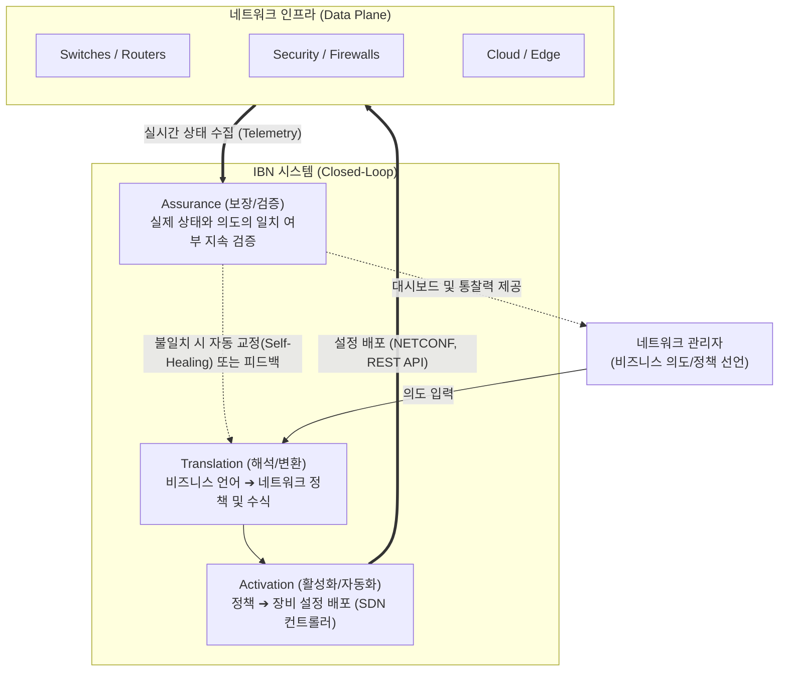

# IBN (Intent-Based Networking)

---

## I. 비즈니스 의도를 스스로 해석하고 보장하는 지능형 네트워크, IBN의 개요

* **정의**: 네트워크 관리자가 복잡한 장비 설정 명령어(CLI)를 입력하는 대신 비즈니스 목적이나 결과(Intent, 의도)를 선언하면, [[인공지능]](AI)과 오케스트레이션 소프트웨어가 이를 해석하여 자동으로 네트워크를 구성하고 지속적으로 상태를 검증하는 폐쇄형 루프(Closed-loop) 기반의 차세대 네트워크 아키텍처
* **필요성 및 주요 특징**:
* **'How(어떻게)'에서 'What(무엇을)'으로의 패러다임 전환**: "VLAN 10과 20 사이의 ACL을 설정하라([[SDN(Software Defined Network)|SDN]]/전통적 방식)"가 아닌, "재무팀은 인사팀 서버에 접근할 수 없다(비즈니스 의도)"라고 선언하면 시스템이 물리/논리적 설계를 자동 변환
* **지속적 검증(Assurance) 및 자가 치유(Self-Healing)**: 초기 설정 후 끝나는 것이 아니라, 현재의 네트워크 상태가 관리자가 입력한 '의도'와 계속 일치하는지 실시간으로 모니터링하고 어긋날 경우 자동으로 교정
* **AI 및 머신러닝(AIOps) 결합**: 방대한 네트워크 원격 측정(Telemetry) 데이터를 실시간 수집 및 분석하여, 장애를 사전에 예측하고 최적의 경로와 리소스 할당을 지능적으로 수행

---

## II. IBN의 개념도 및 핵심 기술 요소

### 가. IBN의 폐쇄형 루프(Closed-Loop) 아키텍처 개념도

* 사용자가 의도를 입력하면 **해석(Translation)** $\rightarrow$ **활성화(Activation)** $\rightarrow$ **상태 모니터링(Telemetry)** $\rightarrow$ 검증 및 보장(Assurance)의 단계를 거치며, 이 과정이 무한히 반복되는 폐쇄 루프(Closed-loop)를 형성하여 시스템의 정합성을 스스로 유지함

### 나. IBN의 핵심 기술 및 구성 요소

| 구분 | 요소기술(키워드) | 세부 설명 |
| --- | --- | --- |
| **의도 해석** | Translation (변환기) | 자연어 또는 비즈니스 중심의 선언적(Declarative) 정책을 이해하고, 이를 네트워크 장비가 실행할 수 있는 구체적인 룰(Rule)과 수학적 모델로 변환 (NLP 등 활용) |
| **적용 및 배포** | SDN Controller | 해석된 정책을 OSPF, [[BGP]], ACL, [[QoS]] 등의 장비 설정(Configuration)으로 변환하여 물리/가상 인프라에 자동 배포(Provisioning)하는 중심 제어부 |
| **상태 수집** | Streaming Telemetry | SNMP와 같은 기존의 주기적 폴링(Polling) 방식의 한계를 넘어, 네트워크 장비가 자신의 상태 변화를 이벤트 발생 즉시 컨트롤러로 실시간 스트리밍(Push) |
| **핵심 검증** | Assurance (검증/보장) | 수집된 텔레메트리 데이터를 바탕으로 현재 네트워크 상태가 관리자의 '의도'대로 완벽하게 작동하고 있는지 지속적으로 검사하고 증명하는 IBN의 차별적 핵심 기능 |
| **지능화 분석** | AI / ML (AIOps) | 머신러닝을 통해 트래픽의 정상 패턴(Baseline)을 학습하고, 이상 징후([[Anomaly(이상현상)|Anomaly]]) 탐지, 성능 저하의 근본 원인 분석(RCA), 예측 [[유지보수]] 수행 |
| **피드백 제어** | Closed-loop (자가 치유) | 검증(Assurance) 단계에서 의도와 실제 상태 간의 편차(Gap)가 발견되면, 사람의 개입 없이 스스로 정책을 수정하여 인프라에 재적용하는 자동 순환 메커니즘 |

---

## III. SDN과의 비교 및 최신 산업 동향

### 가. 네트워크 자동화 패러다임 비교 (SDN vs IBN)

| 비교 항목 | SDN (Software Defined Networking) | IBN (Intent-Based Networking) |
| --- | --- | --- |
| **핵심 목적** | 네트워크의 **제어부와 데이터부 분리**, 프로그래밍화 | 비즈니스 **목적 달성 및 상태의 지속적 보장** |
| **접근 방식** | **명령적(Imperative)** 접근 ("어떻게 설정할 것인가") | **선언적(Declarative)** 접근 ("무엇을 달성할 것인가") |
| **자동화 수준** | 스크립트 및 템플릿 기반의 배포 자동화 | 인공지능 기반의 추론, 검증, 자가 치유 자동화 |
| **데이터 활용** | 주로 설정 배포(Push)에 집중, 모니터링은 별도 시스템 | 텔레메트리를 통한 실시간 피드백 및 검증(Pull/Push 결합) |
| **관계** | IBN을 구현하기 위한 **기반 인프라 기술 (수단)** | SDN 위에 구축되는 **인지적 지능 계층 (목표)** |

### 나. IBN의 최신 산업 동향 및 적용 전망

* **AIOps 기반의 [[클라우드 네이티브]] 네트워크 관리 대세화**: Cisco DNA Center(현재 Cisco Catalyst Center), Juniper Mist 등 글로벌 네트워크 장비 벤더들은 IBN 아키텍처에 딥러닝과 강화학습을 결합하여, 단순한 자동 설정을 넘어 "화상회의 품질이 떨어질 것으로 예측되니, QoS 정책을 자동으로 변경함"과 같은 예측형 AIOps(AI for IT Operations) 플랫폼으로 진화시키고 있음
* **제로 트러스트([[제로 트러스트 보안모델|Zero Trust]]) 및 [[SASE(Secure Access Service Edge)|SASE]]와의 융합**: IBN의 선언적 정책(예: "모든 IoT 기기는 외부망과 통신할 수 없다")은 제로 트러스트 보안 원칙을 가장 완벽하게 구현할 수 있는 도구임. 단말의 보안 상태가 변하는 즉시 IBN의 폐쇄 루프 시스템이 이를 감지하고, 마이크로 [[세그멘테이션]](Micro-segmentation) 정책을 재계산하여 격리 및 차단 설정을 네트워크 전역에 자동 적용하는 방향으로 확장되고 있음

---

### 🔗 연관 토픽

- **소속 도메인**: [[00_네트워크_MOC|🌐 네트워크]]
- **세부 분류**: `5. 통신 인프라 & 차세대 네트워크 기술`
- **핵심 연관 토픽**:
  - [[SDN(Software Defined Network)]]
  - [[인텐트 기반 네트워킹|인텐트 기반 네트워킹(Intent-Based Networking)]]
  - [[라우터]]
  - [[네트워크 계층|네트워크 계층 (Network Layer)]]
  - [[제로 트러스트 보안모델|제로 트러스트 (Zero Trust) 보안모델]]
