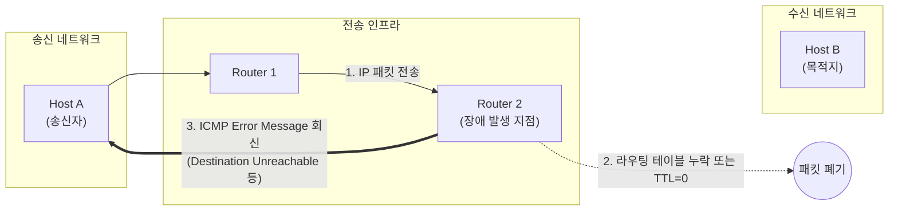

# ICMP (Internet Control Message Protocol)

---

## I. IP 통신의 신뢰성을 보완하는 네트워크 제어 및 에러 보고 표준, ICMP의 개요

* **정의**: 신뢰성을 보장하지 않는(Unreliable) IP 프로토콜을 보완하기 위해, [[네트워크 계층]](L3)에서 라우터나 호스트 간에 패킷 전송 중 발생하는 에러 상황을 보고하고 네트워크 상태를 진단(Query)하는 [[프로토콜]] (RFC 792)
* **필요성 및 주요 특징**:
* **에러 보고 및 진단**: 데이터그램 전송 실패 시 송신자에게 원인(예: 목적지 도달 불가, TTL 만료)을 알려주며, Ping이나 Traceroute 같은 네트워크 진단 도구의 핵심 메커니즘으로 동작
* **IP 데이터그램 [[캡슐화]]**: [[TCP]]/UDP와 같은 상위 계층(L4) 프로토콜처럼 동작하지만, 포트 번호 없이 IP 패킷의 페이로드(데이터 영역)에 캡슐화되어 전송됨 (Protocol ID = 1)
* **상태 비저장(Stateless)**: ICMP 메시지 자체에 대한 응답이나 [[신뢰성]] 검증은 수행하지 않으며, 에러 메시지에 대한 에러 메시지는 무한 루프 방지를 위해 생성하지 않음

---

## II. ICMP의 개념도 및 핵심 기술 요소

### 가. ICMP 에러 보고 메커니즘 개념도

* 송신자(Host A)가 보낸 IP 패킷이 네트워크 인프라(Router 2)를 통과하던 중 문제가 발생하여 폐기(Drop)되면, 해당 라우터는 송신자에게 실패 사유를 담은 ICMP 에러 메시지를 회신함

### 나. ICMP의 주요 메시지 타입 및 구성 요소

| 구분 | Type 번호 (분류) | 세부 설명 및 주요 기능 |
| --- | --- | --- |
| **질의 (Query)** | Type 0 (Echo Reply) | **Ping** 유틸리티의 응답 메시지. 송신자가 보낸 Type 8에 대해 목적지가 정상 수신했음을 회신 |
| **질의 (Query)** | Type 8 (Echo Request) | 목적지 노드가 살아있는지(Reachability) 확인하기 위해 송신자가 보내는 질의 메시지 |
| **에러 (Error)** | Type 3 (Destination Unreachable) | 목적지 네트워크나 호스트, 포트에 도달할 수 없을 때 라우터나 수신측이 반환 (네트워크 단절, [[방화벽]] 차단 등) |
| **에러 (Error)** | Type 5 (Redirect) | 현재 라우터보다 목적지로 향하는 더 짧고 최적화된 경로(다른 [[라우터]])가 있음을 송신자에게 안내 |
| **에러 (Error)** | Type 11 (Time Exceeded) | 패킷의 수명(TTL: Time To Live)이 0이 되어 패킷이 폐기되었음을 알림. **Traceroute(경로 추적)** 명령어의 핵심 원리 |
| **헤더 구조** | Type (1 Byte) | ICMP 메시지의 대분류 (에러인지, 질의인지, 그 종류는 무엇인지 정의) |
| **헤더 구조** | Code (1 Byte) | Type에 대한 상세 사유 (예: Type 3 내에서 Code 0=Net Unreachable, Code 1=Host Unreachable 등) |

---

## III. 프로토콜 비교 및 최신 보안(SecOps) 동향

### 가. ICMPv4 와 ICMPv6 비교

| 비교 항목 | ICMPv4 ([[IPv4]] 환경) | ICMPv6 ([[IPv6]] 환경) |
| --- | --- | --- |
| **기본 프로토콜 ID** | Protocol ID = 1 | Next Header = 58 |
| **역할 및 범위** | 에러 보고 및 단순 네트워크 상태 진단 | 기존 ICMPv4 기능 + **[[ARP]], [[IGMP]] 기능까지 통합** 수행 |
| **주소 해석 ([[MAC]] 찾기)** | 별도의 **ARP (Address Resolution Protocol)** 사용 | ICMPv6 내의 **NDP (Neighbor Discovery Protocol)**로 통합 대체 |
| **멀티캐스트 관리** | 별도의 **IGMP** 프로토콜 사용 | ICMPv6 내의 **MLD (Multicast Listener Discovery)**로 통합 대체 |
| **보안 강화** | 평문 전송 (보안 취약) | [[IP Sec|IPsec]] 적용이 기본 권장되어 메시지 위변조 방지 가능 |

### 나. ICMP 관련 최신 보안 위협 및 클라우드 운영 동향

* **[[DDOS|DDoS]] 공격의 단골 벡터**: 공격자가 출발지 IP를 희생자의 IP로 위조한 대량의 Ping Request를 브로드캐스트 주소로 보내어 막대한 응답이 희생자에게 쏟아지게 하는 **Smurf Attack**이나, 봇넷을 이용한 **ICMP Flooding** 등 네트워크 대역폭 고갈 공격에 자주 악용됨
* **클라우드/제로 트러스트 환경의 Stealth 모드 (ICMP Drop)**: 전통적인 네트워크에서는 장애 진단을 위해 ICMP를 허용했으나, 최근 AWS, Azure 등 퍼블릭 클라우드 방화벽(Security Group)이나 엔터프라이즈 제로 트러스트 아키텍처에서는 정찰 공격(Port Scanning, Ping Sweep)을 막기 위해 모든 외부 ICMP 트래픽을 기본적으로 차단(Drop)하는 것이 표준 보안 프랙티스(Best Practice)로 자리 잡음. (필요 시 특정 모니터링 서버의 IP만 화이트리스트로 허용)

---

### 🔗 연관 토픽

- **소속 도메인**: [[00_네트워크_MOC|🌐 네트워크]]
- **세부 분류**: `1. OSI 7계층 & 데이터링크 계층 (L1/L2)`
- **핵심 연관 토픽**:
  - [[네트워크 계층|네트워크 계층 (Network Layer)]]
  - [[IPv4]]
  - [[DDOS]]
  - [[프로토콜]]
  - [[라우터]]
