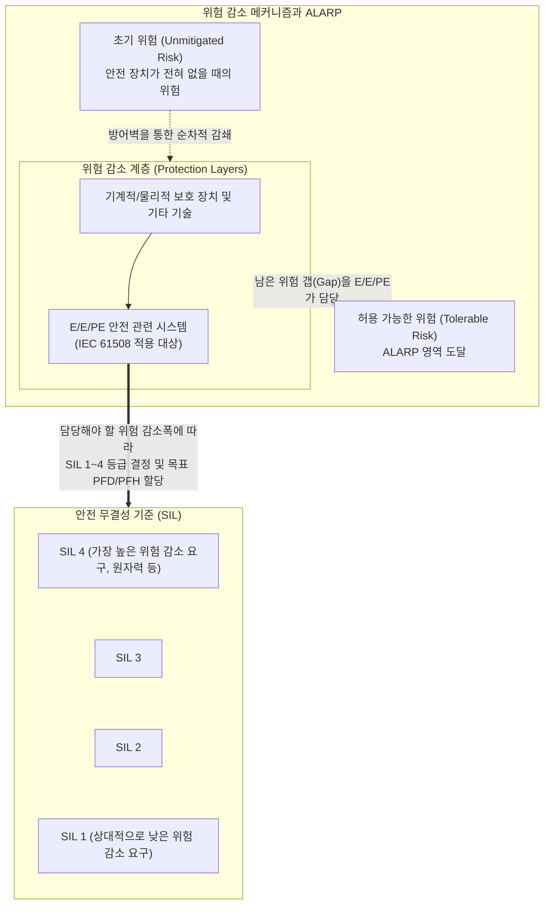

# IEC 61508

---

## I. E/E/PE 시스템의 기능 안전(Functional Safety) 확보를 위한 기본 국제 표준, IEC 61508의 개요

* **정의**: 산업 현장 및 일상생활에서 사용되는 전기/전자/프로그래머블 전자(E/E/PE) 기반의 안전 관련 시스템이 오류나 고장 없이 의도된 안전 기능을 올바르게 수행하도록 요구사항을 정의한 '기능 안전(Functional Safety)' 분야의 모태(Generic) 국제 표준
* **필요성 및 주요 특징**:
* **리스크 수용성 기준 제시 (ALARP)**: 절대적인 무결점(Zero Risk)은 현실적으로 불가능하므로, 인명/환경/재산에 대한 위험을 사회적으로 허용 가능한 수준(Tolerable Risk)까지 합리적으로 낮추는 철학 채택
* **안전 [[무결성]] 기준(SIL) 도입**: 시스템이 수행해야 하는 안전 기능의 중요도와 위험 감소 요구치에 따라 SIL 1에서 SIL 4까지의 정량적/정성적 등급을 부여하여 관리
* **전체 안전 수명주기(Safety Lifecycle) 관리**: 단순한 하드웨어 설계를 넘어, 요구사항 분석부터 [[소프트웨어 아키텍처]], 구현, 테스트, 운영, 폐기에 이르는 전체 생애주기 동안의 오류 예방 프로세스를 규정

---

## II. IEC 61508의 개념도 및 핵심 기술 요소

### 가. 위험 감소(Risk Reduction) 및 SIL 할당 개념도

* 초기 위험(Initial Risk)을 수용 가능한 수준(Tolerable Risk)으로 낮추기 위해 기계적 방어장치와 E/E/PE 시스템이 동원됨
* 전체 위험 감소폭 중 E/E/PE 시스템이 기여해야 하는 '위험 감소 요건'의 크기에 따라 **SIL(Safety Integrity Level)** 등급이 결정됨

### 나. IEC 61508의 핵심 개념 및 구성 요소

| 구분 | 요소기술(키워드) | 세부 설명 |
| --- | --- | --- |
| **핵심 철학** | Functional Safety (기능 안전) | 시스템 자체의 물리적 고장이 없음을 뜻하는 본질 안전과 달리, **'이상 발생 시 시스템이 올바르게 반응하여 안전한 상태(Safe State)로 유도하는 능력'**을 의미 |
| **위험 허용 기준** | ALARP (As Low As Reasonably Practicable) | 위험을 낮추는 데 드는 비용과 시간(Reasonably Practicable) 대비 감소되는 위험의 효익을 교량하여 합리적으로 달성 가능한 최저 수준의 위험 |
| **안전 등급** | SIL (Safety Integrity Level) | 시스템이 지정된 조건에서 지정된 기간 내에 안전 기능을 성공적으로 수행할 확률 등급 (1~4등급, 숫자가 클수록 안전 요구사항이 엄격함) |
| **고장 측정 지표** | PFD / PFH | **PFD** (Probability of Failure on Demand): 저빈도 작동 시스템의 요구 시 고장 확률 

 **PFH** (Probability of Failure per Hour): 고빈도/연속 작동 시스템의 시간당 고장 확률 |
| **적용 대상** | E/E/PES | 전기(Electrical), 전자(Electronic), 프로그래머블 전자(Programmable Electronic) 소자로 구성된 모든 제어 및 안전 시스템 |
| **오류의 분류** | Random / Systematic Failure | **무작위 고장(Random)**: HW 노후화 등으로 발생하는 확률적 고장 (이중화 등으로 해결) 

 **체계적 고장(Systematic)**: SW 버그, 설계 오류 등 원인이 명확한 고장 (수명주기 관리로 해결) |

---

## III. 산업별 파생 기능안전 표준 비교 및 최신 동향

### 가. IEC 61508 기반의 주요 산업별 파생 표준 비교

| 비교 항목 | IEC 61508 (모태 표준) | [[ISO 26262]] (자동차) | IEC 61511 (공정 플랜트) |
| --- | --- | --- | --- |
| **적용 산업군** | **전 산업 (Generic)** | **자동차 / 전장 부품 (Automotive)** | **석유화학, 플랜트 (Process Industry)** |
| **안전 등급 체계** | **SIL 1 ~ SIL 4** | **[[ASIL]] A ~ ASIL D** (Automotive SIL) | **SIL 1 ~ SIL 4** (IEC 61508 차용) |
| **주요 특징** | 모든 산업 기능안전의 뼈대(Framework) 역할 | 완성차 및 부품 벤더 간의 V-Model 개발 수명주기 및 책임소재 명확화 | 센서, 로직솔버, 최종제어요소로 구성된 SIS(안전계측시스템) 구축에 초점 |
| **평가 지표 요소** | 발생 빈도, 결과의 심각성 | 심각성(Severity), 노출(Exposure), 통제 가능성(Controllability) | 공정 공정위험성평가([[HAZOP (Hazard and Operability Study)|HAZOP]], LOPA 등)와 연계 |

### 나. 기능안전(Functional Safety) 분야의 최신 기술 동향

* **의도된 기능의 안전성(SOTIF, ISO 21448) 부상**: 기존 IEC 61508이나 ISO 26262는 하드웨어 결함이나 소프트웨어 버그(Systematic Failure)를 방지하는 데 집중했음. 그러나 자율주행과 AI의 발전으로 '시스템 결함은 없지만 알고리즘의 판단 착오나 환경적 한계(예: 폭우 속 비전 센서 인식 실패)'로 발생하는 사고를 막기 위해 SOTIF(Safety of the Intended Functionality) 표준이 최신 보안 핵심 이슈로 대두됨
* **보안(Security)과 안전(Safety)의 융합 ([[IEC 62443]] 연계)**: 스마트 팩토리 및 [[Smart Car(자율주행)|자율주행]] 차량이 외부 네트워크(IT)와 연결되면서, 해킹이나 사이버 공격이 시스템의 기능 안전(인명 피해)을 직접적으로 위협하게 됨. 이에 따라 단순한 기능 오류 방지(IEC 61508)를 넘어, 의도적인 사이버 침해를 막는 산업용 보안 표준(IEC 62443)을 기능안전 수명주기와 통합(Co-engineering)하여 심사하는 추세임

---

### 🔗 연관 토픽

- **소속 도메인**: [[00_디지털서비스_MOC|🚀 디지털서비스]]
- **세부 분류**: `5. 기능안전 (Functional Safety) & 신뢰성 표준`
- **핵심 연관 토픽**:
  - [[ISO 26262]]
  - [[ASIL|ASIL (Automotive Safety Integrity Level)]]
  - [[Smart Car(자율주행)]]
  - [[기능안전 표준|기능안전 표준 (Functional Safety Standards)]]
  - [[SW 안전성(SW Safety) 및 분석 개념]]
