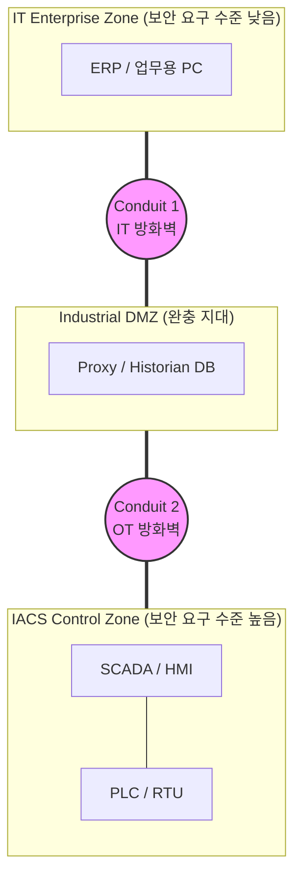

# IEC 62443

---

## I. 산업 제어 시스템(IACS)과 OT 환경을 위한 사이버 보안 국제 표준, IEC 62443의 개요

* **정의**: 산업 자동화 및 제어 시스템(IACS: Industrial Automation and Control Systems)과 운영 기술(OT: Operational Technology) 환경의 사이버 보안을 확보하기 위해, 국제전기기술위원회(IEC)와 국제자동제어협회(ISA)가 공동으로 제정한 보안 [[프레임워크]] 및 일련의 국제 표준 시리즈
* **필요성 및 주요 특징**:
* **[[HA(High Availability)|가용성]] 및 안전 최우선**: [[기밀성]](Confidentiality)을 중시하는 IT 환경(ISO 27001)과 달리, 공장이나 발전소 등 OT 환경에서는 시스템의 무중단 가동(Availability)과 인명/환경의 안전(Safety)을 최우선으로 고려하여 보안 정책을 설계
* **심층 방어 (Defense-in-Depth) 구현**: 단일 보안 솔루션에 의존하지 않고, 네트워크를 물리적/논리적으로 분할하여 공격자의 내부 이동(Lateral Movement)을 차단하는 다계층 방어 체계 구축
* **포괄적 수명주기 접근**: 자산 소유자(Asset Owner), 시스템 통합 사업자(System Integrator), 제품 공급자(Product Supplier) 각각의 역할에 맞춰 조직의 [[프로세스]], 시스템 설계, 컴포넌트 개발에 이르는 전 방위적 보안 요구사항(Security-by-Design)을 정의

---

## II. IEC 62443의 개념도 및 핵심 기술 요소

### 가. Zone 및 Conduit 기반의 네트워크 분할(Segmentation) 개념도

* 전체 인프라를 유사한 보안 요구사항을 가진 자산들의 논리적/물리적 그룹인 Zone(구역)으로 나누고, Zone 간의 모든 통신은 반드시 보안 통제가 적용된 Conduit(도관)을 통해서만 이루어지도록 설계하여 위험의 확산을 차단함

### 나. IEC 62443의 핵심 개념 및 구성 요소

| 구분 | 요소(키워드) | 세부 설명 |
| --- | --- | --- |
| **핵심 아키텍처** | Zone (구역) | 동일한 보안 요구사항(Security Level)을 공유하는 물리적 장치, 데이터 시스템, 애플리케이션의 논리적/물리적 집합 |
| **핵심 아키텍처** | Conduit (도관) | 서로 다른 Zone 간의 통신을 허용하는 유일한 경로로, [[방화벽]], [[암호화]] 터널 등 강력한 보안 통제 기능이 적용된 연결 통로 |
| **보안 등급** | SL 1 (Security Level 1) | 우연하거나 의도치 않은(Accidental) 실수나 노출로부터 시스템을 보호하는 기본 수준 |
| **보안 등급** | SL 2 (Security Level 2) | 낮은 리소스와 일반적인 해킹 기술을 가진 공격자의 **의도적인 공격**을 방어하는 수준 |
| **보안 등급** | SL 3 (Security Level 3) | 제어 시스템(IACS)에 대한 전문 지식과 적당한 리소스를 갖춘 해커 그룹의 정교한 공격을 방어하는 수준 |
| **보안 등급** | SL 4 (Security Level 4) | 막대한 자원과 고도의 전문 지식을 갖춘 국가 주도(Nation-state) 공격 그룹의 끈질긴 위협(APT)을 방어하는 최고 수준 |
| **성숙도 모델** | ML (Maturity Level) | 보안 정책 및 절차의 성숙도를 평가하는 지표로, 비공식적 대응(ML 0)부터 지속적 개선이 이루어지는 최적화 단계(ML 3)까지 분류 |

---

## III. 산업 보안 표준 비교 및 최신 동향

### 가. 기업 보안 표준 비교 (ISO/IEC 27001 vs IEC 62443)

| 비교 항목 | ISO/IEC 27001 | IEC 62443 |
| --- | --- | --- |
| **주요 적용 대상** | **엔터프라이즈 IT 환경** (정보 시스템, 데이터센터) | **산업 제어 및 OT 환경** (공장, 발전소, 정유 시설) |
| **핵심 보호 가치 (우선순위)** | 기밀성 (Confidentiality) > [[무결성]] > 가용성 | **가용성 (Availability) 및 안전성 (Safety)** > 무결성 > 기밀성 |
| **보호 대상** | 기업의 핵심 데이터 및 정보 (Data) | 사람의 생명, 환경, 제어 시스템의 물리적 프로세스 |
| **패치 및 업데이트** | 정기적이고 신속한 패치 권장 (재부팅 허용) | 공정 중단 방지를 위해 매우 보수적으로 패치 적용 (계획된 [[유지보수]] 기간 활용) |
| **보안 통제 방식** | 정보보호 관리체계(ISMS) 기반의 관리적 통제 중심 | Zone & Conduit 기반의 물리적/네트워크 심층 방어 및 하드웨어 컴포넌트 제어 중심 |

### 나. 산업 사이버 보안의 최신 동향 및 규제화

* **글로벌 보안 규제(Compliance)와의 강력한 연계**: 유럽의 강력한 사이버 보안 지침인 **NIS 2**와 제조물의 보안 내재화를 의무화한 사이버 복원력 법안(CRA, Cyber Resilience Act)이 발효됨에 따라, 글로벌 시장에 산업용 장비를 수출하거나 스마트 팩토리를 운영하기 위해 IEC 62443 인증 획득이 사실상의 법적 필수 요건으로 격상되고 있음
* **IT-OT 융합 및 제로 트러스트([[제로 트러스트 보안모델|Zero Trust]])의 OT 확장**: 스마트 제조 및 IIoT(산업용 사물인터넷)의 발전으로 폐쇄망이었던 OT 환경이 클라우드 및 IT 망과 연결(IT-OT Convergence)되면서 사이버 위협 노출 면적이 급증함. 이에 따라 기존의 경계(방화벽) 기반 Zone 구성을 넘어, 네트워크 내부의 각 컴포넌트 간 통신에도 지속적인 인증을 요구하는 '제로 트러스트 아키텍처'를 IEC 62443 프레임워크와 융합하여 구현하는 솔루션이 트렌드로 부상하고 있음

---

### 🔗 연관 토픽

- **소속 도메인**: [[00_보안_MOC|🛡️ 보안]]
- **세부 분류**: `6. 개인정보보호 & 프라이버시 강화 기술`
- **핵심 연관 토픽**:
  - [[기밀성]]
  - [[무결성]]
  - [[암호화|암호화 (Encryption)]]
  - [[제로 트러스트 보안모델|제로 트러스트 (Zero Trust) 보안모델]]
  - [[스마트팩토리 보안취약점 및 대응방안]]
