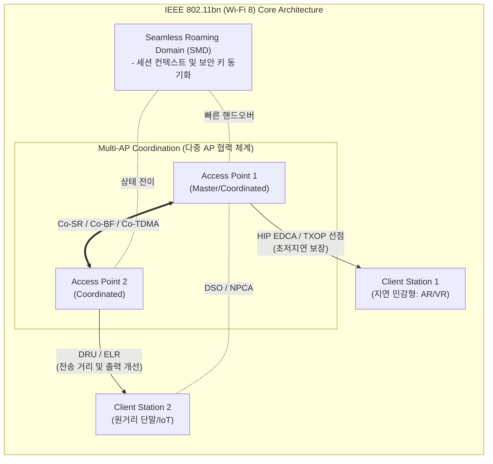

# IEEE 802.11bn (Wi-Fi 8 표준)

---

## I. 초고신뢰성(UHR) 기반 차세대 무선랜 표준, IEEE 802.11bn의 개요

* **정의**: 최대 [[처리량]] 향상을 넘어 다중 AP 협력, 동적 스펙트럼 할당, 심리스 로밍 기술을 통해 고밀도 환경에서 지연 시간을 최소화하고 일관된 초고신뢰성(UHR, Ultra-High Reliability) 연결을 제공하는 8세대 Wi-Fi 표준
* **등장 배경 및 필요성**:
* 속도 경쟁의 한계 극복: 최고 속도(Peak Speed) 중심에서 실제 체감 성능 및 안정성 확보로 패러다임 전환
* 고밀도 디바이스 환경: 밀집된 AP 간의 전파 간섭 해소 및 스펙트럼 효율성 극대화 요구
* 실시간 서비스 품질([[QoS]]) 보장: [[메타버스]], AR/VR, 산업용 IoT 등 지연에 민감한 트래픽의 안정적 처리 필요

---

## II. IEEE 802.11bn의 아키텍처 및 핵심 구성요소

### 가. IEEE 802.11bn의 개념도 및 동작 원리

* 다중 AP 간의 실시간 간섭 제어 및 자원 공유(Multi-AP Coordination)를 통해 전체 네트워크 용량 증대
* 단말이 AP 간 이동 시 SMD를 통해 [[세션]] 단절 없이 로밍을 수행하며, DRU와 우선순위 기반 제어로 안정성 확보

### 나. IEEE 802.11bn의 핵심 기술 요소

| 분류 | 핵심 기술 (키워드) | 세부 설명 |
| --- | --- | --- |
| **다중 AP 협력** | **Multi-AP Coordination** | 다수 AP 간 협력 [[스케줄링]] (Co-SR: 공간 [[재사용]], Co-BF: 협력 빔포밍)으로 간섭 회피 |
| **단절 없는 이동성** | **SMD (Seamless Roaming Domain)** | 여러 AP를 단일 도메인으로 묶어 로밍 시 발생하는 지연 시간 및 패킷 손실 최소화 |
| **스펙트럼 효율화** | **DSO & NPCA** | 대역폭 능력이 다른 단말 간 동적 서브채널 할당 및 비주채널 접근 최적화 |
| **커버리지 확장** | **DRU (Distributed-tone RU)** | 서브캐리어를 가용 대역폭 전체에 분산 배치하여 규제 전력 제한을 극복하고 업링크 성능 향상 |
| **장거리 송수신** | **ELR (Enhanced Long Range)** | 20MHz 대역 내 BPSK/QPSK 변조를 통한 원거리 단말의 업링크/다운링크 링크 버짓 불균형 해소 |
| **저지연 및 QoS** | **HIP EDCA & TXOP Preemption** | 실시간 우선순위 트래픽(AR/VR 등)에 대한 채널 점유권 선점 및 꼬리 지연(Long-tail Latency) 감소 |
| **링크 적응 고도화** | **추가 MCS 레벨 지원** | 4개의 새로운 변조 및 코딩 기법(MCS) 단계를 추가하여 채널 상황에 따른 세밀한 링크 적응 최적화 |
| **기반 스펙 유지** | **320MHz & 4096-QAM** | [[Wi-Fi 7]]과 동일한 최대 46Gbps 이론적 속도 유지, UHR 달성을 위한 기반 전송 규격 활용 |

---

## III. IEEE 802.11bn (Wi-Fi 8)과 Wi-Fi 7 비교 및 향후 전망

### 가. Wi-Fi 8 vs Wi-Fi 7 핵심 항목 비교

| 비교 항목 | Wi-Fi 7 (IEEE 802.11be) | [[Wi-Fi 8]] (IEEE 802.11bn) |
| --- | --- | --- |
| **핵심 목표 (패러다임)** | **EHT (Extremely High Throughput)** | **UHR (Ultra High Reliability)** |
| **최대 이론 속도** | ~46 Gbps | ~46 Gbps (속도 증가보다 안정성 집중) |
| **다중 AP 간섭 제어** | 개별 AP 독립 동작 (미지원) | Multi-AP Coordination 지원 |
| **로밍 및 이동성** | 단말 주도의 AP 간 전환 | SMD 기반 끊김 없는(Seamless) 네트워크 전환 |
| **리소스 할당 방식** | Multi-RU, 연속적인 부반송파 할당 | DSO, 분산형 부반송파(DRU) 할당 |
| **주요 활용 분야** | 4K/8K 영상 스트리밍, 대용량 파일 전송 | 고밀도 산업용 IoT, 실시간 원격 제어, 메타버스 |

### 나. 향후 전망 및 시사점

* **상용화 일정**: 2028년 최종 표준 인가 및 Wi-Fi Alliance 인증 예정이며, 선행 칩셋 개발 및 공유기 생태계 구축 가속화 예상.
* **통신망 융합**: 5G/6G 셀룰러 망과 결합하여 스마트팩토리, 스마트 홈, [[Smart Car(자율주행)|자율주행]] V2X 등에서 끊김 없는 유무선 통합(FMC) 서비스를 제공하는 핵심 인프라로 자리매김할 전망.

---

### 🔗 연관 토픽

- **소속 도메인**: [[00_네트워크_MOC|🌐 네트워크]]
- **세부 분류**: `4. 무선 및 차세대 이동통신 (5G/6G/Wi-Fi)`
- **핵심 연관 토픽**:
  - [[Wi-Fi 8|Wi-Fi 8(IEEE 802.11bn)]]
  - [[QoS|QoS (Quality of Service)]]
  - [[Wi-Fi 7|WI-FI 7 (IEEE 802.11be)]]
  - [[세션]]
  - [[스케줄링]]
