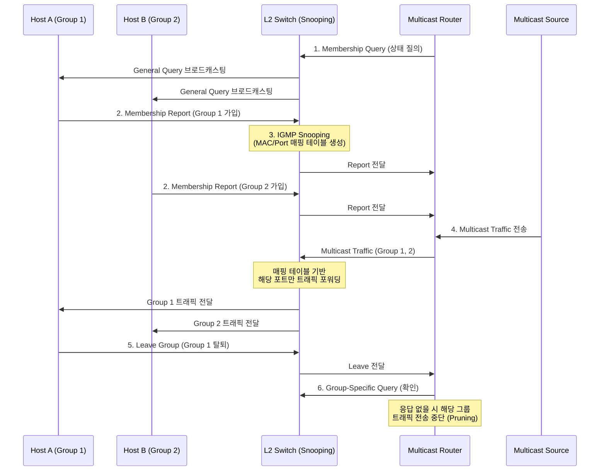

# IGMP

---

## I. 멀티캐스트 트래픽 최적화를 위한, IGMP의 개요

* **정의**: [[IPv4]] 네트워크 환경에서 호스트(Host)와 인접 멀티캐스트 [[라우터]](Router) 간에 멀티캐스트 그룹의 멤버십(가입, 유지, 탈퇴)을 동적으로 구성하고 관리하기 위한 [[네트워크 계층]](L3) 표준 [[프로토콜]]
* **등장 배경 및 필요성**:
* 유니캐스트(서버 부하 증가) 및 브로드캐스트(네트워크 대역폭 낭비) 방식의 한계 극복 필요
* IPTV, 화상회의 등 다대다(N:M) 스트리밍 서비스에서 원하는 수신자에게만 트래픽을 전송하는 멀티캐스트(Class D IP) 효율성 요구

* **특징**: IGMP Snooping을 통한 L2 트래픽 제어, [[PIM]](Protocol Independent Multicast) 등 라우팅 프로토콜과 연동, 버전 진화(v1 → v2 → v3)에 따른 세밀한 트래픽 제어 지원

---

## II. IGMP의 개념도 및 핵심 기술 요소

### 가. IGMP의 동작 개념도

* 호스트의 Report/Leave 메시지와 라우터의 Query 메시지를 통해 상태를 동기화하며, L2 스위치는 IGMP Snooping을 통해 필요한 포트에만 멀티캐스트 트래픽을 전달함.

### 나. IGMP의 핵심 기술 요소

| 구분 | 요소기술(키워드) | 세부 설명 |
| --- | --- | --- |
| **질의 메시지** | **General Query** | 라우터가 서브넷 내의 모든 호스트에게 멀티캐스트 그룹 가입 여부를 주기적으로 확인 (목적지 IP: 224.0.0.1) |
| **질의 메시지** | **Group-Specific Query** | 특정 그룹에 속한 멤버가 아직 네트워크에 남아있는지 확인하기 위해 라우터가 전송 (IGMPv2 이상) |
| **응답/요청** | **Membership Report** | 호스트가 특정 멀티캐스트 그룹에 가입하거나, 라우터의 Query에 응답할 때 전송하는 메시지 |
| **탈퇴 요청** | **Leave Group** | 호스트가 멀티캐스트 수신을 중단하고자 할 때 명시적으로 라우터에 알리는 메시지 (IGMPv2 이상) |
| **L2 최적화** | **IGMP Snooping** | L2 스위치가 IGMP 메시지를 엿보고(Snooping), [[MAC]]/포트 매핑 테이블을 생성하여 트래픽 플러딩(Flooding) 방지 |
| **라우터 제어** | **Querier Election** | 동일 서브넷에 멀티캐스트 라우터가 여러 대일 경우, 가장 낮은 IP 주소를 가진 라우터를 질의자(Querier)로 선출 |
| **보안/필터링** | **SSM (Source-Specific)** | IGMPv3에서 도입된 기능으로, 특정 소스(Source)의 트래픽만 선택적으로 수신하거나 차단(INCLUDE/EXCLUDE) |
| **[[스위치 (Layer 3 Switch)|스위치]] 연동** | **CGMP** | 스위치가 IGMP Snooping을 지원하지 못할 때 라우터가 스위치에게 멀티캐스트 정보를 제공하는 Cisco 전용 프로토콜 |

---

## III. IGMP의 버전별 비교 및 IPv6 환경의 MLD 동향

### 가. IGMP 버전(v1, v2, v3) 특성 비교

| 비교 항목 | IGMP v1 (RFC 1112) | IGMP v2 (RFC 2236) | IGMP v3 (RFC 3376) |
| --- | --- | --- | --- |
| **그룹 탈퇴 방식** | **Silent Leave** (Time-out) | **명시적 Leave Group** 전송 | 명시적 상태 변경 (State Change) |
| **탈퇴 시 지연** | 매우 긺 (약 3분 소요) | 짧음 (즉시 차단 및 확인 가능) | 매우 짧음 (신속한 처리) |
| **Query 방식** | General Query | General + Group-Specific Query | General + Group/Source-Specific |
| **질의자 선출 방식** | 멀티캐스트 라우팅 프로토콜에 의존 | IGMP 자체적으로 선출 (가장 낮은 IP) | IGMP 자체적으로 선출 |
| **SSM (특정 소스 지정)** | 미지원 | 미지원 | **지원 (INCLUDE, EXCLUDE 필터)** |
| **활용 환경** | 초기 멀티캐스트 환경 | 일반적인 엔터프라이즈 환경 | 고화질 IPTV, 강력한 보안 요구 환경 |

### 나. IPv6 환경에서의 진화 및 동향

* **MLD (Multicast Listener Discovery) 프로토콜로 대체**: [[IPv6]] 환경에서는 IGMP 대신 ICMPv6 메시지를 기반으로 동작하는 MLD가 멀티캐스트 그룹을 관리함.
* **버전 매핑**: IPv4의 IGMPv2 기능은 IPv6의 **MLDv1**(RFC 2710)에 대응하며, IGMPv3의 핵심 기능(SSM 등)은 **MLDv2**(RFC 3810)에 대응하여 차세대 네트워크 멀티캐스트 인프라를 구성함.

---

### 🔗 연관 토픽

- **소속 도메인**: [[00_네트워크_MOC|🌐 네트워크]]
- **세부 분류**: `1. OSI 7계층 & 데이터링크 계층 (L1/L2)`
- **핵심 연관 토픽**:
  - [[네트워크 계층|네트워크 계층 (Network Layer)]]
  - [[라우터]]
  - [[스위치 (Layer 3 Switch)]]
  - [[IPv6]]
  - [[IPv4]]
