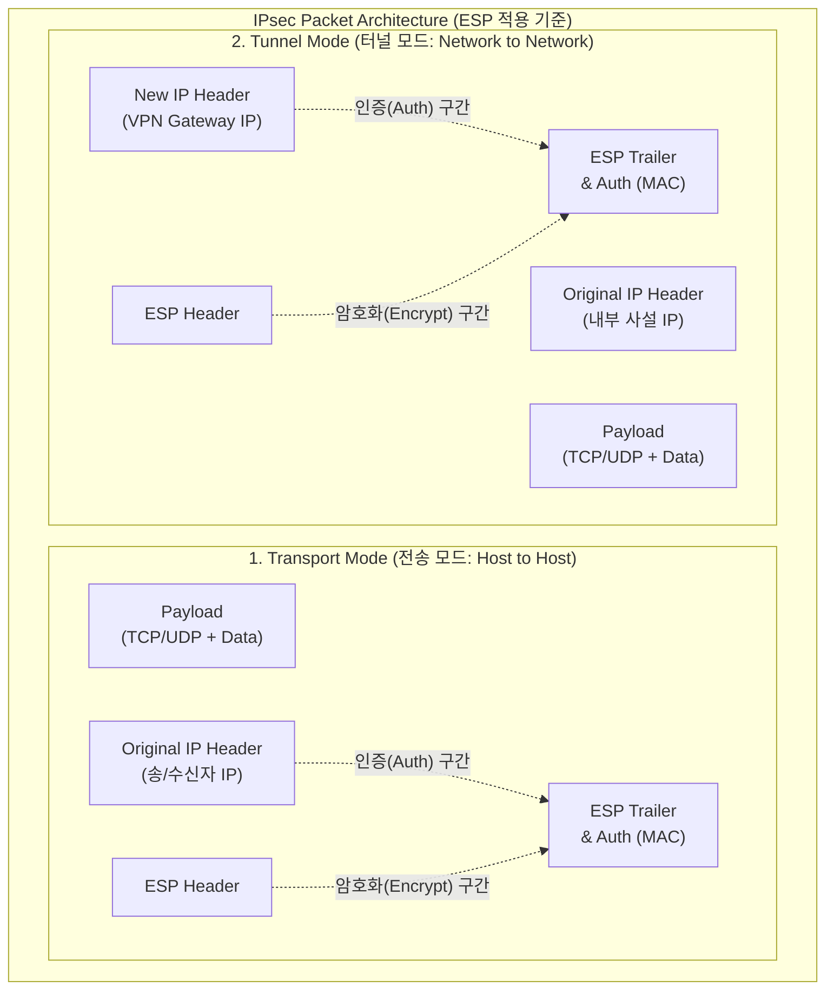

# IPsec (IP Security)

---

## I. 네트워크 계층의 종단 간 기밀성 및 무결성 보장, IPsec의 개요

* **정의**: [[네트워크 계층]](L3)인 IP 망에서 송수신 호스트 또는 [[라우터]] 간 데이터의 [[기밀성]], [[무결성]], 인증, 재생 공격 방지를 제공하기 위해 IETF에서 표준화한 개방형 보안 [[프로토콜]] 스위트
* **등장 배경 및 필요성**:
* **[[IPv4]]의 내재적 보안 취약성**: 설계 초기 보안을 고려하지 않아 평문 전송에 따른 스니핑(Sniffing), 스푸핑(Spoofing) 등 공격에 무방비 노출
* **표준화된 터널링 및 [[암호화]] 요구**: 안전한 원격 접속 및 본사-지사 간 지점 연결(Site-to-Site) [[VPN|VPN(Virtual Private Network)]] 구축을 위한 범용적 L3 보안 인프라 필요

* **특징**: 상위 애플리케이션([[TCP]]/UDP) 변경 없이 투명한(Transparent) 보안 제공, 단방향 기반의 보안 연관(SA, Security Association) 설정, [[IPv6]]에서는 기본 보안 규격으로 통합 권고

---

## II. IPsec의 아키텍처 및 핵심 기술 요소

### 가. IPsec의 동작 모드 및 패킷 구조 아키텍처

* **Transport Mode**는 원본 IP 헤더를 유지한 채 페이로드만 보호하며 주로 단말 간 통신에 쓰이고, **Tunnel Mode**는 패킷 전체를 캡슐화하고 [[게이트웨이]] IP(New IP)를 붙여 Site-to-Site VPN 구간 암호화에 사용함.

### 나. IPsec의 핵심 구성 요소

| 분류 | 핵심 기술 (키워드) | 세부 설명 |
| --- | --- | --- |
| **보안 프로토콜** | **AH (Authentication Header)** | 데이터의 무결성(Integrity)과 발신자 인증(Authentication)을 제공 (암호화 미제공, Protocol ID: 51) |
| **보안 프로토콜** | **ESP (Encapsulating Security Payload)** | 데이터 기밀성(Confidentiality, 암호화)을 추가로 제공하며, 무결성과 인증도 지원 (Protocol ID: 50) |
| **동작 모드** | **Transport Mode** | IP 페이로드 영역만 보호하며, 종단([[End-to-End]]) 간 연결에 적합 (오버헤드 적음) |
| **동작 모드** | **Tunnel Mode** | IP 패킷 전체를 암호화하고 새로운 IP 헤더 추가, 라우터/게이트웨이 간(VPN) 터널링에 사용 |
| **키 관리 체계** | **IKE (Internet Key Exchange)** | IPsec 통신을 위한 암호화 키, [[알고리즘]] 등의 보안 매개변수를 안전하게 교환하고 협상하는 프로토콜 (UDP 500) |
| **연결 단위** | **SA (Security Association)** | 통신 주체 간 협상된 보안 정책의 묶음(단방향 논리적 연결), SPI(보안 매개변수 색인)로 식별 |
| **정책/DB** | **SPD / SAD** | SPD(Security Policy DB)는 패킷 처리 정책(Drop/Bypass/Protect) 정의, SAD(SA DB)는 활성화된 SA 정보 저장 |
| **재생 방지** | **Anti-Replay** | 송신자가 패킷에 순서 번호(Sequence Number)를 부여하여, 해커의 재전송(Replay) 공격 패킷을 수신측에서 폐기 |

---

## III. IPsec VPN과 SSL VPN 비교 및 최신 동향

### 가. 범용 VPN 기술인 IPsec VPN과 SSL/TLS VPN 비교

| 비교 항목 | IPsec VPN | SSL/TLS VPN |
| --- | --- | --- |
| **동작 계층** | 3계층 (Network Layer) | 4 ~ 7계층 (Transport/Application Layer) |
| **적용 범위** | Site-to-Site (네트워크 간 연결) | Client-to-Site (원격 사용자 접속) |
| **접근 제어 단위** | 네트워크/서브넷 단위의 접근 허용 | 애플리케이션 서비스 단위의 세밀한 접근 제어 |
| **S/W 설치 여부** | 전용 VPN 클라이언트 소프트웨어 필수 설치 | 웹 브라우저 내장 기능 활용 (Clientless 가능) |
| **장/단점** | 장점: 강력한 보안성, 투명성 / 단점: 설정 복잡 | 장점: 뛰어난 접근성(이동 근무) / 단점: 애플리케이션 종속성 |

### 나. 향후 전망 및 기술 진화 동향

* **[[SD-WAN (Software-Defined Wide Area Network)|SD-WAN]] 아키텍처의 핵심 인프라**: 클라우드 확산에 따라 지점망 라우팅을 가상화하는 SD-WAN 환경에서, 언더레이(Underlay) 망 위로 오버레이 터널을 안전하게 구축하기 위해 IPsec 터널링 기반의 자동화 배포 기술이 주력으로 사용됨.
* **PQC(양자 내성 암호)의 IKEv2 도입 연구**: 양자 컴퓨터의 'Shor 알고리즘'에 의한 키 교환(Diffie-Hellman) 무력화 위협에 대응하여, IETF를 중심으로 IKEv2 프로토콜에 양자 내성 암호(Post-Quantum Cryptography) 알고리즘을 혼합 적용하는 하이브리드 키 교환 표준화가 활발히 진행 중임.

---

### 🔗 연관 토픽

- **소속 도메인**: [[00_보안_MOC|🛡️ 보안]]
- **세부 분류**: `1. 정보보안 원칙 & 거버넌스 · 인증`
- **핵심 연관 토픽**:
  - [[암호화|암호화 (Encryption)]]
  - [[VPN|VPN(Virtual Private Network)]]
  - [[IPv6]]
  - [[IPv4]]
  - [[SD-WAN (Software-Defined Wide Area Network)]]
