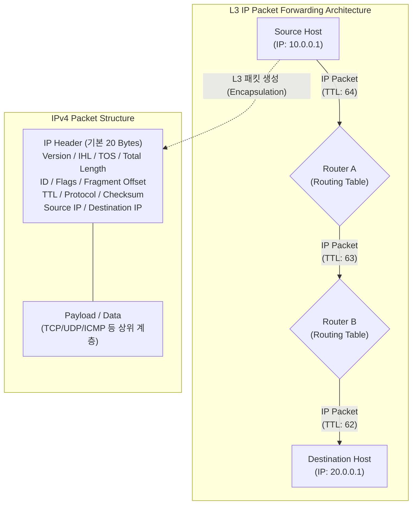

# IP (Internet Protocol)

---

## I. 인터넷 통신의 기반 라우팅 및 주소 지정 체계, IP의 개요

* **정의**: 패킷 교환 네트워크 환경에서 송신 호스트로부터 목적지 호스트까지 데이터를 전달하기 위해, 논리적 주소 할당 및 경로 지정(Routing) 기능을 수행하는 OSI 7계층 중 [[네트워크 계층]](L3)의 핵심 범용 [[프로토콜]]
* **등장 배경 및 필요성**:
* L2([[MAC]] 주소) 브로드캐스트 도메인의 물리적 종속성 및 확장성 한계 탈피 필요
* 이기종 네트워크 연동 및 글로벌 스케일의 통신을 위한 논리적, 계층적 주소 체계 요구

* **특징**:
* **최선형 서비스(Best-Effort)**: 패킷의 도달이나 순서를 보장하지 않으며(신뢰성은 [[TCP]] 등 상위 계층에 위임), 네트워크 상태에 따라 최선을 다해 전달
* **비연결형(Connectionless)**: 송수신 호스트 간의 사전 [[세션]](경로) 수립 없이 독립적인 데이터그램(Datagram) 단위로 패킷을 분할 전송

---

## II. IP의 아키텍처 및 핵심 구성요소

### 가. IP 패킷의 전달 아키텍처 및 구조

* 송신지에서 캡슐화된 IP 패킷은 경로상의 라우터를 거칠 때마다 목적지 IP를 검사하여 최적 경로로 포워딩되며, 이 과정에서 무한 루프를 막기 위해 TTL(Time to Live) 값이 1씩 감소함.

### 나. IP의 핵심 기능 및 구성 요소

| 분류 | 핵심 기술 (키워드) | 세부 설명 |
| --- | --- | --- |
| **주소 할당** | **Addressing (논리적 주소)** | 네트워크 식별자(Net ID)와 호스트 식별자(Host ID)로 구성된 계층적 주소 체계 부여 ([[IPv4]]: 32비트, [[IPv6]]: 128비트) |
| **경로 제어** | **Routing (라우팅)** | 패킷 헤더의 목적지 IP 주소와 라우터의 라우팅 테이블(Routing Table)을 기반으로 최적의 넥스트 홉(Next Hop)을 결정 |
| **크기 제어** | **Fragmentation ([[단편화]])** | 통신 경로상 네트워크의 MTU(최대 전송 단위) 제약에 맞게 패킷을 분할하고, 목적지 호스트에서 재조립(Reassembly) 수행 |
| **순환 방지** | **TTL (Time to Live)** | 패킷이 네트워크 상에서 무한히 순환하는 루핑(Looping)을 방지하기 위해 홉(Hop)을 지날 때마다 값을 1씩 차감하여 0이 되면 폐기 |
| **품질 제어** | **TOS / DSCP ([[QoS]])** | 패킷의 서비스 유형 및 우선순위를 마킹하여, [[DiffServ (Differentiated Services)|DiffServ]] 망 등에서 음성/영상 등 지연 민감 트래픽의 우선 처리(QoS) 지원 |
| **상위 식별** | **Protocol [[다중화]]** | IP 페이로드에 캡슐화된 상위 프로토콜 종류를 명시하여 올바른 [[프로세스]] 처리 유도 (TCP: 6, UDP: 17, [[ICMP]]: 1 등) |
| **오류 검증** | **Header Checksum** | 전송 중 발생하는 IP 헤더부의 비트 훼손 여부를 검사 (헤더 오버헤드 축소를 위해 IPv6에서는 해당 필드 제거됨) |

---

## III. 프로토콜 진화에 따른 IPv4와 IPv6 비교 및 동향

### 가. IPv4와 IPv6 핵심 항목 비교

| 비교 항목 | IPv4 (Internet Protocol v4) | IPv6 (Internet Protocol v6) |
| --- | --- | --- |
| **주소 체계 및 길이** | 32 비트 (약 43억 개 주소) / 10진수 점(.) 표기 | 128 비트 (무한대에 가까운 주소) / 16진수 콜론(:) 표기 |
| **헤더 크기 및 구조** | 가변적 길이 (20 ~ 60 Bytes) / 복잡한 구조 | **고정적 길이 (40 Bytes)** / 라우팅 오버헤드 최소화 (단순화) |
| **보안([[IP Sec|IPsec]]) 지원** | 선택적 적용 (별도의 프로토콜 설치 및 설정 필요) | **기본 내재화** (IPsec 장착 기본 권고, 패킷 [[암호화]] 강화) |
| **단편화 수행 주체** | 송신 호스트 및 경로상의 [[라우터]] 모두 수행 가능 | **송신 호스트에서만 수행** (경로상 라우터 부하 대폭 감소) |
| **주소 할당 방식** | [[DHCP]]를 통한 동적 할당 또는 수동 설정 | **SLAAC(상태 비저장 자동 주소 설정)** 및 DHCPv6 지원 |

### 나. 차세대 IP 네트워크 동향 및 시사점

* **SRv6 (Segment Routing over IPv6) 도입 가속**: 기존의 복잡한 MPLS 인프라를 걷어내고, IPv6의 확장 헤더(Extension Header)를 활용한 소스 라우팅(Source Routing) 기술인 SRv6가 차세대 5G/6G 코어망 및 클라우드 데이터센터 네트워크의 네트워크 프로그래밍(Network Programming) 표준으로 자리잡고 있음.
* **보안 및 QoS 내재화**: 모든 기기가 Public IP를 가지는 IoT 및 초연결 환경으로 진입함에 따라 NAT(네트워크 주소 변환)의 의존도를 낮추고, [[End-to-End]] 단말 간 IPsec 기반의 제로 트러스트([[제로 트러스트 보안모델|Zero Trust]]) 암호화 통신망 구축이 필수적으로 요구됨.

---

### 🔗 연관 토픽

- **소속 도메인**: [[00_네트워크_MOC|🌐 네트워크]]
- **세부 분류**: `1. OSI 7계층 & 데이터링크 계층 (L1/L2)`
- **핵심 연관 토픽**:
  - [[프로토콜]]
  - [[TCP]]
  - [[라우터]]
  - [[네트워크 계층|네트워크 계층 (Network Layer)]]
  - [[IPv6]]
