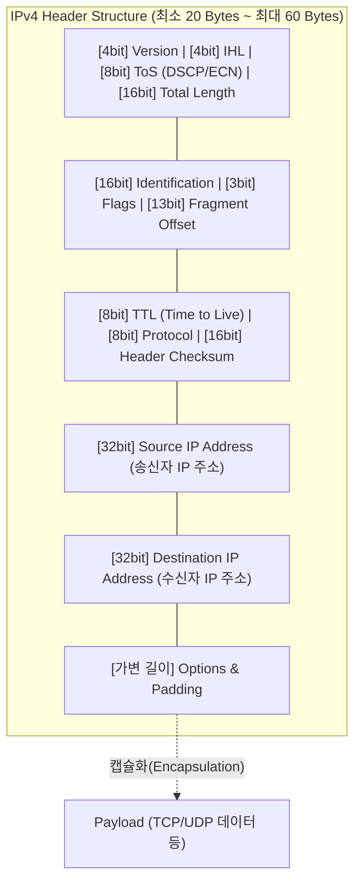

# IPv4 (Internet Protocol version 4)

---

## I. 인터넷 데이터 통신의 핵심 논리 주소 체계, IPv4의 개요

* **정의**: 패킷 교환 네트워크 환경에서 송신 호스트로부터 목적지 호스트까지 데이터를 전달하기 위해, 32비트(4바이트) 길이의 논리적 주소를 사용하는 [[네트워크 계층]](L3)의 핵심 인터넷 [[프로토콜]]
* **등장 배경 및 특징**:
* **글로벌 통신 인프라 요구**: ARPANET 시절 이기종 네트워크 간의 원활한 라우팅과 호스트 식별을 위해 고안(RFC 791)
* **전송 특성**: 비연결형(Connectionless), 도달 순서 및 신뢰성을 보장하지 않는 최선형(Best-Effort) 전송 메커니즘 채택
* **표기 방식**: 8비트씩 4개의 옥텟(Octet)으로 나누어 점(.)으로 구분하는 점박이 10진수(Dotted-decimal) 표기법 사용 (예: 192.168.0.1)

---

## II. IPv4의 헤더 아키텍처 및 핵심 기술 요소

### 가. IPv4의 패킷 헤더 구조 및 동작 원리

* 32비트(4바이트) 단위의 워드(Word) 배열로 구성되며, MTU(최대 전송 단위) 제약에 따른 [[단편화]]/재조립, 무한 루핑 방지(TTL)를 수행하여 패킷의 최적 경로 라우팅을 지원함.

### 나. IPv4의 핵심 기술 요소

| 분류 | 핵심 기술 (키워드) | 세부 설명 |
| --- | --- | --- |
| **주소 체계** | **Classful / CIDR** | 초기 네트워크 규모에 따른 [[클래스]](A~E) 기반 할당에서, 주소 낭비를 막기 위해 서브넷 마스크(Prefix)를 활용하는 CIDR(Classless Inter-Domain Routing)로 진화 |
| **패킷 제어** | **TTL (Time to Live)** | 패킷이 네트워크 상에서 무한 순환(Looping)하는 것을 막기 위해 라우터를 거칠 때마다(Hop) 값을 1씩 차감, 0이 되면 패킷 폐기 |
| **품질 보장** | **ToS / DSCP** | 패킷의 우선순위(음성, 영상, 일반 데이터)를 마킹하여 [[DiffServ (Differentiated Services)|DiffServ]] 기반의 서비스 품질([[QoS]]) 차등화 지원 |
| **단편화** | **Fragment Offset & Flags** | 패킷 크기가 네트워크 MTU보다 클 경우 쪼개서(Fragmentation) 전송하고, 목적지에서 원래 순서대로 재조립하기 위한 식별 정보 |
| **주소 고갈 극복** | **NAT / PAT** | 사설 IP를 공인 IP로 변환(Network Address Translation) 및 포트 기반 변환(PAT)을 통해 한정된 공인 주소 공간을 다수의 기기가 공유 |
| **프로토콜 식별** | **Protocol Field** | 상위 계층(L4) 데이터가 어떤 프로토콜인지 명시하여 수신 측 처리 지원 ([[TCP]]: 6, UDP: 17, [[ICMP]]: 1) |

---

## III. IPv4와 IPv6 비교 및 향후 전망

### 가. IPv4와 IPv6 핵심 기술 비교

| 비교 항목 | IPv4 | [[IPv6]] |
| --- | --- | --- |
| **주소 길이 및 공간** | **32비트** (약 43억 개 주소 공간) | **128비트** (거의 무한대에 가까운 주소 공간) |
| **표기 방식** | 10진수 점(.) 표기 (예: 192.168.1.1) | 16진수 콜론(:) 표기 (예: 2001:0db8::8a2e) |
| **헤더 구조 및 크기** | 가변 길이 (20 ~ 60 Bytes) / 복잡함 | **고정 길이 (40 Bytes)** / 라우팅 오버헤드 최소화 |
| **단편화 (Fragmentation)** | 송신지 및 경로 상의 중간 [[라우터]] 모두 수행 | **송신지(Source)에서만 수행** (라우터 부하 경감) |
| **보안 기능 ([[IP Sec|IPsec]])** | 선택적 적용 (별도 프로토콜 추가 필요) | **기본 내재화** (표준 스펙에 IPsec 장착 필수) |
| **주소 할당 방식** | 수동 설정 또는 [[DHCP]](동적 할당) 의존 | **SLAAC(상태 비저장 자동 주소 설정)** 지원 |

### 나. 향후 전망 및 기술 동향

* **IPv6로의 전환 가속화**: IANA의 IPv4 공인 주소 할당이 전면 고갈됨에 따라, 5G/6G 모바일 망 및 IoT 디바이스 확산을 감당하기 위해 **Dual [[Stack]](듀얼 스택), 터널링(Tunneling), 변환(Translation)** 기술을 통한 IPv6 전환이 글로벌 표준으로 정착됨.
* **IPv4의 제한적 생명력 유지**: 레거시(Legacy) 시스템의 호환성 유지 및 사설망 내부(Private Network) 환경에서는 IPv4가 계속 사용될 것이며, 통신사([[ISP (Information Strategy Plan)|ISP]])는 CGNAT(Carrier-Grade NAT)를 도입하여 남은 IPv4 자원의 생명 주기를 연장하고 있음.

---

### 🔗 연관 토픽

- **소속 도메인**: [[00_네트워크_MOC|🌐 네트워크]]
- **세부 분류**: `1. OSI 7계층 & 데이터링크 계층 (L1/L2)`
- **핵심 연관 토픽**:
  - [[네트워크 계층|네트워크 계층 (Network Layer)]]
  - [[IPv6]]
  - [[ICMP]]
  - [[DiffServ (Differentiated Services)]]
  - [[IP Sec]]
