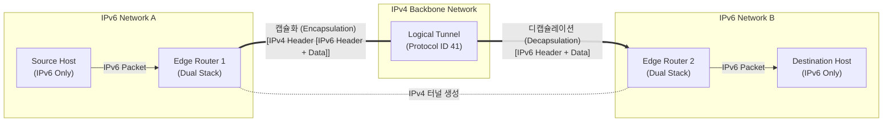

# IPv4와 IPv6 터널링

---

## I. 이기종 네트워크망의 단절 없는 연결, IPv4와 IPv6 터널링의 개요

* **정의**: [[IPv4]]와 [[IPv6]] 망이 혼재된 네트워크 과도기 환경에서, 하나의 [[프로토콜]] 패킷을 다른 프로토콜의 패킷 안에 [[캡슐화]](Encapsulation)하여 전송함으로써 이기종 프로토콜 간의 원활한 종단 간([[End-to-End]]) 통신을 지원하는 IPv6 전환 기술
* **등장 배경 및 필요성**:
* **점진적 전환 인프라 확보**: 기존 IPv4 인프라를 일시에 IPv6로 교체(Dual-[[Stack]] 등)하기 어려운 현실적인 구축 비용 및 물리적 한계 극복
* **네트워크 고립(Island) 방지**: 광범위한 IPv4 백본망을 사이에 두고 분리된 IPv6 네트워크 섬(Island)들 간의 상호 연결성 및 라우팅 보장

---

## II. IPv4/IPv6 터널링의 개념도 및 핵심 기술 요소

### 가. IPv4 망을 경유하는 IPv6 터널링 개념도 및 동작 원리

* 터널 양 끝단의 장비([[EDGE|Edge]] Router)는 반드시 듀얼 스택(Dual Stack)을 지원해야 하며, IPv6 패킷을 IPv4 페이로드에 캡슐화(Protocol 41)하여 기존 IPv4 망을 통과함.

### 나. IPv4/IPv6 터널링의 핵심 기술 요소

| 분류 | 요소기술 (키워드) | 세부 설명 |
| --- | --- | --- |
| **기반 요건** | **Dual Stack (듀얼 스택)** | 터널링을 구성하는 양 끝단(End-point)의 라우터나 호스트가 IPv4와 IPv6 패킷을 모두 처리할 수 있는 구조 |
| **핵심 원리** | **Encapsulation (캡슐화)** | 기존 프로토콜(IPv6) 패킷 전체를 전송망 프로토콜(IPv4)의 데이터(Payload) 영역에 포장하여 라우팅 처리 |
| **수동 방식** | **Configured (설정) 터널링** | 관리자가 수동으로 터널 양단 장비의 IPv4/IPv6 주소를 정적으로 매핑 및 설정하는 방식 (예: 6Bone) |
| **자동 방식** | **6to4 (RFC 3056)** | 공인 IPv4 주소를 기반으로 `2002::/16` 프리픽스(Prefix)를 자동 생성하여 별도 설정 없이 터널링 수행 |
| **자동 방식** | **Teredo (RFC 4380)** | IPv4 사설망(NAT) 환경 내의 호스트를 위해 IPv6 패킷을 **UDP(포트 3544)** 패킷으로 캡슐화하여 NAT를 통과 |
| **자동 방식** | **ISATAP (RFC 5214)** | 특정 조직 내부(Intra-site)의 네트워크망에서 호스트와 [[라우터]] 간 IPv4 망을 경유한 자동 IPv6 터널링 지원 |
| **자동 방식** | **Tunnel Broker** | 별도의 중개 서버(Broker)를 두어, 사용자가 터널 설정 요청 시 서버가 터널 양단의 설정을 자동으로 할당 |
| **식별자** | **Protocol 41** | 캡슐화된 IPv4 헤더의 프로토콜 필드에 '41'을 마킹하여 페이로드에 IPv6 패킷이 들어있음을 명시 |

---

## III. IPv6 주요 전환 기술 비교 및 활용 시 고려사항

### 가. IPv6 주요 전환(Transition) 기술 3종 비교

| 비교 항목 | Dual Stack (듀얼 스택) | Tunneling (터널링) | Translation (주소 변환) |
| --- | --- | --- | --- |
| **핵심 개념** | 단일 기기에 IPv4/IPv6 프로토콜 스택을 모두 탑재 | 기존망(IPv4) 경유를 위해 패킷을 캡슐화하여 전송 | IPv4 ↔ IPv6 간의 IP 헤더 자체를 상호 변환 |
| **적용 계층** | 3계층 ([[네트워크 계층]]) | 3계층 ~ 4계층 | 3계층 ~ 7계층 (NAT-PT, NAT64) |
| **장점** | 완벽한 호환성 제공, 전환 용이 | 기존 인프라(IPv4) 재활용, 망 구축 비용 절감 | IPv4 Only 노드와 IPv6 Only 노드 간 직접 통신 가능 |
| **단점/한계** | 모든 장비가 두 개의 주소를 소모, 시스템 자원(메모리) 부담 | 캡슐화에 따른 패킷 오버헤드, MTU [[단편화]] 부하 발생 | 헤더 변환으로 인한 지연(Latency) 발생, 종단 간 보안 취약 |

### 나. 활용 시 고려사항 및 향후 전망

* **보안 취약점 대비**: 터널링 수행 시 방화벽에서 Protocol 41 및 UDP 3544 등을 일괄 허용해야 하므로, [[IP Sec|IPsec]]을 결합하여 터널링 구간 내의 패킷 위·변조 및 스니핑(Sniffing) 위협을 통제해야 함.
* **단편화(Fragmentation) 부하 관리**: 헤더 추가로 인한 패킷 크기 증가로 네트워크 MTU를 초과하여 라우터의 단편화 부하가 발생할 수 있으므로, 경로 MTU 탐색(PMTUD)의 적절한 활용 필수.
* **향후 전망**: 터널링은 IPv6 도입 초·중기의 '과도기적 브릿지' 역할을 수행하는 필수 기술이나, 5G/6G 모바일 망과 클라우드 확산에 따라 궁극적으로는 터널링 오버헤드가 없는 **Native IPv6 (IPv6 Only)** 네트워크 환경으로 진화할 전망임.

---

### 🔗 연관 토픽

- **소속 도메인**: [[00_네트워크_MOC|🌐 네트워크]]
- **세부 분류**: `1. OSI 7계층 & 데이터링크 계층 (L1/L2)`
- **핵심 연관 토픽**:
  - [[프로토콜]]
  - [[라우터]]
  - [[네트워크 계층|네트워크 계층 (Network Layer)]]
  - [[IPv6]]
  - [[IPv4]]
